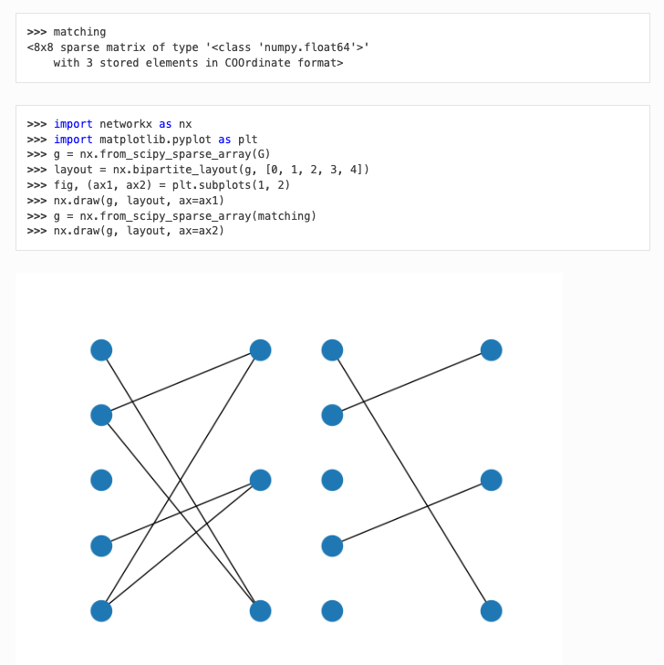

gurobi-optimods -- optimization easy to use
===========================================

The idea in one sentence: we will create open-source Python repository of
implemented optimization use cases, each with clear, informative, and pretty
documentation that explains how to use it, the mathematical model behind it,
and the implementation in code.

- A plethora of useful optimization models, in- and outside classical OR
- Data driven APIs
- Intuitive for Python users
- `Documentation! <https://gurobi-optimization-gurobi-optimods.readthedocs-hosted.com/en/latest/#>`_

The built documentation on readthedocs is not currently visible to everyone.
You can build and view it yourself locally (see `CONTRIBUTING.md <CONTRIBUTING.md>`_
for instructions on setting up a development environment). As a quick reference,
here are the key components:

1. A Mod provides background information for the topic and a formal statement
of the problem in the domain language of the target user:

.. image:: assets/l1-regression.png
  :width: 800
  :alt: L1 regression mod introduction

2. A Mod has a simple interface which shields the user from interacting with
gurobipy, a clean data-in data-out style using sensible data types, and demos
usage via a runnable example in the documentation:

.. image:: assets/matching-usage.png
  :width: 400
  :alt: Bipartite matching mod usage

3. Mod documentation presents results of an example using familiar packages:

Contributing
------------

See `CONTRIBUTING.md <CONTRIBUTING.md>`_ for instructions on how to propose and implement new mods.
