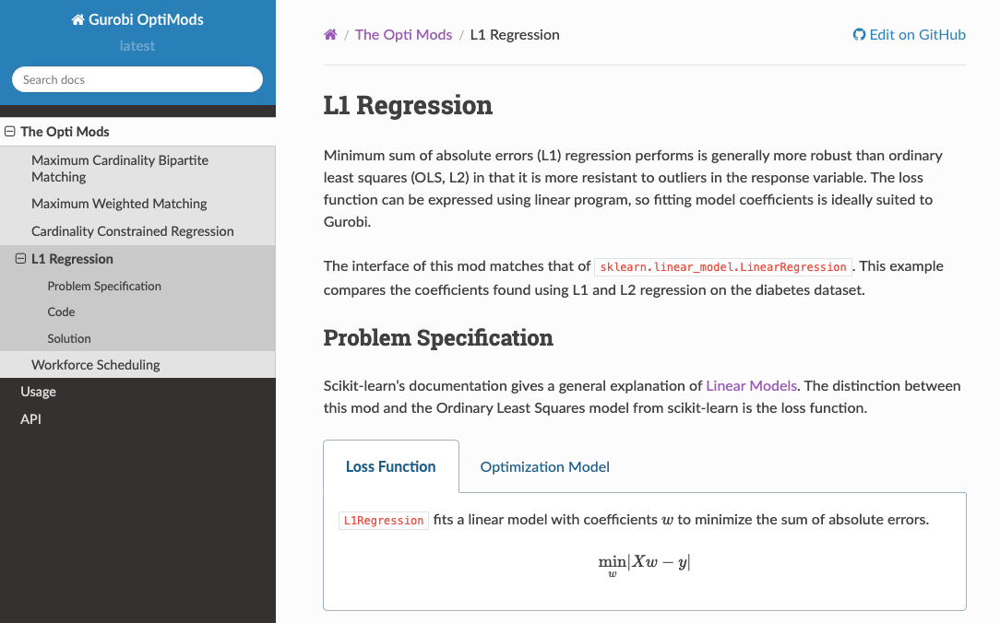
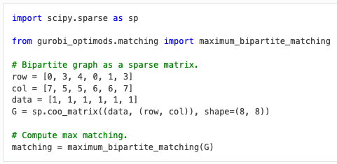

gurobi-optimods -- optimization easy to use
===========================================

The idea in one sentence: we will create open-source Python repository of implemented optimization use cases, each with clear, informative, and pretty documentation that explains how to use it, the mathematical model behind it, and the implementation in code.

- A plethora of useful optimization models, in- and outside classical OR
- Data driven APIs
- Intuitive for Python users
- `Documentation! <https://gurobi-optimization-gurobi-optimods.readthedocs-hosted.com/en/latest/#>`_

The built documentation on readthedocs is not currently visible to everyone. You can build and view it yourself locally (see `CONTRIBUTING.md <CONTRIBUTING.md>`_). Here are a few snippets in the meantime.

Contributing
------------

See `CONTRIBUTING.md <CONTRIBUTING.md>`_ for instructions on how to propose and implement new mods.
