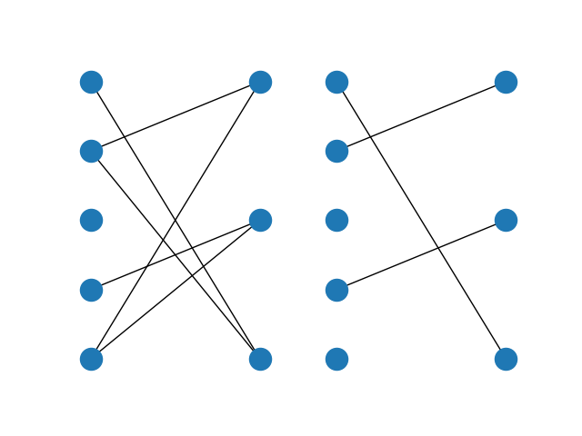

Maximum Cardinality Bipartite Matching
======================================

Something about specific graph algorithms vs mathprog formulations?

Problem Specification
---------------------

You are given a bipartite graph :math:`G` containing :math:`n` vertices and
:math:`m` edges. Find the maximum matching, i.e. select as many edges as
possible so that no selected edge shares a vertex with any other selected edge.

.. tabs::

    .. tab:: Domain-Specific Description

        A matching is a set of pairwise non-adjacent edges ...

    .. tab:: Optimization Model

        Use a network max-flow model ...

        Note that for the bipartite case, simplex is sufficient, we do not
        need to use binary variables, just :math:`[0, 1]` bounds. Gurobi uses
        a network simplex algorithm to solve such models.

|

Code
----

.. testcode:: bipartite_matching

    import numpy as np
    import scipy.sparse as sp

    from gurobi_optimods.matching import maximum_bipartite_matching

    # Bipartite graph as a sparse matrix.
    nodes1 = np.array([0, 1, 2, 3, 4])
    nodes2 = np.array([5, 6, 7])
    row = [0, 3, 4, 0, 1, 3]
    col = [7, 5, 5, 6, 6, 7]
    data = [1, 1, 1, 1, 1, 1]
    adjacency = sp.coo_array((data, (row, col)), shape=(8, 8))

    # Compute max matching.
    matching = maximum_bipartite_matching(adjacency, nodes1, nodes2)

.. testoutput:: bipartite_matching
    :hide:

    ...
    Optimal objective -3.000000000e+00

Both codes construct the same model and give the same result. The model is
solved as a LP/MIP/QP/etc by Gurobi.

.. collapse:: View Gurobi logs

    .. code-block:: text

        Solving maximum matching n1=5 n2=3 |E|=6
        Maximum matching formulated as min-cost flow with 10 nodes and 15 arcs
        Restricted license - for non-production use only - expires 2024-10-28
        Gurobi Optimizer version 10.0.1 build v10.0.1rc0 (mac64[x86])

        CPU model: Intel(R) Core(TM) i5-1038NG7 CPU @ 2.00GHz
        Thread count: 4 physical cores, 8 logical processors, using up to 8 threads

        Optimize a model with 10 rows, 15 columns and 30 nonzeros
        Model fingerprint: 0xb08809c2
        Coefficient statistics:
          Matrix range     [1e+00, 1e+00]
          Objective range  [1e+00, 1e+00]
          Bounds range     [1e+00, 1e+00]
          RHS range        [0e+00, 0e+00]
        Presolve removed 4 rows and 4 columns
        Presolve time: 0.00s
        Presolved: 6 rows, 11 columns, 22 nonzeros

        Iteration    Objective       Primal Inf.    Dual Inf.      Time
               0   -3.0000000e+00   1.000000e+00   0.000000e+00      0s
               1   -3.0000000e+00   0.000000e+00   0.000000e+00      0s

        Solved in 1 iterations and 0.00 seconds (0.00 work units)
        Optimal objective -3.000000000e+00
        Done: max bipartite matching has 3 edges

|

Solution
--------

Show the solution. Use doctests if possible (i.e. the solution must be stable
enough). Otherwise, just display it somehow.

.. doctest:: bipartite_matching
    :options: +NORMALIZE_WHITESPACE

    >>> print(matching)
      (0, 7)        1.0
      (1, 6)        1.0
      (3, 5)        1.0
      (5, 3)        1.0
      (6, 1)        1.0
      (7, 0)        1.0

.. doctest:: bipartite_matching
    :options: +NORMALIZE_WHITESPACE

    >>> import networkx as nx
    >>> import matplotlib.pyplot as plt
    >>> g = nx.from_scipy_sparse_array(adjacency)
    >>> layout = nx.bipartite_layout(g, [0, 1, 2, 3, 4])
    >>> fig, (ax1, ax2) = plt.subplots(1, 2)
    >>> nx.draw(g, layout, ax=ax1)
    >>> g = nx.from_scipy_sparse_array(matching)
    >>> nx.draw(g, layout, ax=ax2)

