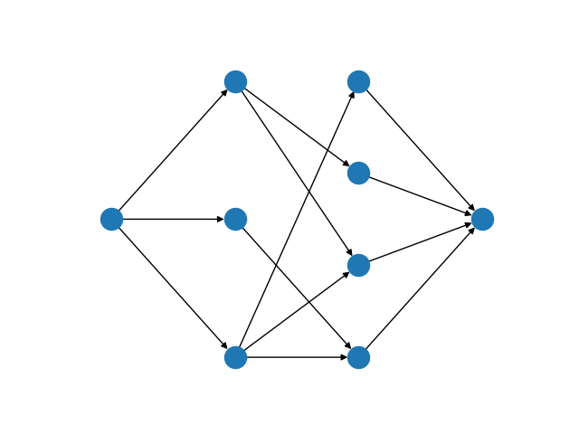

Maximum Bipartite Matching
==========================

The maximum matching problem is a fundamental problem in graph theory (ref).
Given a graph, as a set of nodes connected to one another by edges, a matching
is any subset of those edges which have no vertex in common. The goal of
maximum matching is to find the largest possible such matching of a given
graph.

In this mod we consider the special case of maximum cardinality matching on
bipartite graphs. This problem can be applied to solve exclusive assignment
problems in practice, such as the assignment of workers or resources to tasks.
To give a brief example, if we construct a bipartite graph where one of the
bipartite sets represents tasks, and the other workers, then a matching is a
set of edges each of which assigns one worker to one task. By the properties
of a matching, each worker is assigned at most one task and each task is
completed by at most one worker. The maximum cardinality matching is one which
maximises the number of completed tasks (and workers given work).

.. Figure generated using networkx, see bipartite-matching-figs.py
.. figure:: figures/bipartite-matching-example.png
    :width: 400
    :alt: Bipartite matching example

    A bipartite graph (left) and its maximum matching (right)

Problem Specification
---------------------

Consider a bipartite graph :math:`G(U, V, E)`, where :math:`U` and :math:`V`
are disjoint vertex sets, and the edge set :math:`E \subseteq U \times V`
joins only between, not within, the sets. A matching on this graph is any
subset of edges such that no vertex is incident to more than one edge.
Equivalently, the matching is a subgraph of :math:`G` where all vertices
have degree at most one. A maximum matching is the largest possible matching
on :math:`G`.

Algorithm
---------

The bipartite matching problem can be reduced to a maximum flow problem by
introducing a source vertex as a predecessor to all vertices in :math:`U`,
and a sink vertex as a successor to all vertices in :math:`V`. Giving every
edge unit capacity, a maximum matching is found by maximizing flow from the
source to the sink. All edges with non-zero flow in the max flow solution
are part of the matching.

.. Figure generated using networkx, see bipartite-matching-figs.py

    A maximum flow network for the bipartite matching problem

We do not describe the mathematical formulation here, see the max flow mod (ref)
for details. The important point to note is that when this continuous model is
solved using the simplex algorithm, we are guaranteed to get an integral solution
and thus the solution can be used to select a set of edges for the matching.

Interface
---------

The ``maximum_bipartite_matching`` function supports scipy sparse arrays, pandas
dataframes, and networkx graphs as possible inputs. The user must also provide
the bipartite partitioning of the input graph. In all cases, the matching is
returned as a sub-graph of the input data structure.

.. tabs::

    .. group-tab:: scipy

        When given a scipy sparse array representing the adjacency matrix of
        the graph, the user must also provide the two disjoint node sets as
        numpy arrays. The mod will return the adjacency matrix of the matching
        as a scipy sparse array.

        .. testcode:: bipartite_matching_sp

            import numpy as np
            import scipy.sparse as sp

            from gurobi_optimods.bipartite_matching import maximum_bipartite_matching

            # Create a simple bipartite graph as a sparse matrix
            nodes1 = np.array([0, 1, 2, 3, 4])
            nodes2 = np.array([5, 6, 7])
            row = [0, 3, 4, 0, 1, 3]
            col = [7, 5, 5, 6, 6, 7]
            data = [1, 1, 1, 1, 1, 1]
            adjacency = sp.coo_array((data, (row, col)), shape=(8, 8))

            # Compute the maximum matching
            matching = maximum_bipartite_matching(adjacency, nodes1, nodes2)

        .. testoutput:: bipartite_matching_sp
            :hide:

            ...
            Optimal objective -3.000000000e+00

    .. group-tab:: networkx

        When given a networkx graph as input, the user must also provide the
        two disjoint node sets as numpy arrays. The mod will return the matching
        as a networkx graph (a subgraph of the input).

        .. testcode:: bipartite_matching_nx

            import networkx as nx
            import numpy as np
            from gurobi_optimods.bipartite_matching import maximum_bipartite_matching

            # Create a random bipartite graph
            graph = nx.bipartite.random_graph(n=5, m=4, p=0.2, seed=123)
            nodes1 = np.arange(5)
            nodes2 = np.arange(5, 5 + 4)

            # Compute the maximum matching
            matching = maximum_bipartite_matching(graph, nodes1, nodes2)

        .. testoutput:: bipartite_matching_nx
            :hide:

            ...
            Optimal objective  2.000000000e+00

    .. group-tab:: pandas

        The mod accepts pandas dataframes as input, where two columns in the
        dataframe describe the source and target vertices of an edge. The user
        must also provide the source and target column names as inputs to the
        mode. The matching will be returned as a subset of the rows in the
        original dataframe, including all columns present in the original
        dataframe, but only those rows corresponding to the maximum matching.

        .. testcode:: bipartite_matching_pd

            import pandas as pd
            from gurobi_optimods.bipartite_matching import maximum_bipartite_matching

            # Read in some task-worker assignment data
            frame = pd.DataFrame([
                {"expert": "Jill", "task": "uphill"},
                {"expert": "Jack", "task": "uphill"},
                {"expert": "Jill", "task": "fetchpail"},
            ])

            # Compute the maximum matching
            matching = maximum_bipartite_matching(frame, "expert", "task")

        .. testoutput:: bipartite_matching_pd
            :hide:

            ...
            Optimal objective  2.000000000e+00

The ``maximum_bipartite_matching`` function formulates a linear program for the
the network flow model corresponding to the given bipartite graph. Since the
model is formulated as a network flow, Gurobi will in most cases solve the model
using a network primal simplex algorithm.

.. collapse:: View Gurobi logs

    .. code-block:: text

        Solving maximum matching n1=5 n2=3 |E|=6
        Maximum matching formulated as min-cost flow with 10 nodes and 15 arcs
        Restricted license - for non-production use only - expires 2024-10-28
        Gurobi Optimizer version 10.0.1 build v10.0.1rc0 (mac64[x86])

        CPU model: Intel(R) Core(TM) i5-1038NG7 CPU @ 2.00GHz
        Thread count: 4 physical cores, 8 logical processors, using up to 8 threads

        Optimize a model with 10 rows, 15 columns and 30 nonzeros
        Model fingerprint: 0xb08809c2
        Coefficient statistics:
          Matrix range     [1e+00, 1e+00]
          Objective range  [1e+00, 1e+00]
          Bounds range     [1e+00, 1e+00]
          RHS range        [0e+00, 0e+00]
        Presolve removed 4 rows and 4 columns
        Presolve time: 0.00s
        Presolved: 6 rows, 11 columns, 22 nonzeros

        Iteration    Objective       Primal Inf.    Dual Inf.      Time
               0   -3.0000000e+00   1.000000e+00   0.000000e+00      0s
               1   -3.0000000e+00   0.000000e+00   0.000000e+00      0s

        Solved in 1 iterations and 0.00 seconds (0.00 work units)
        Optimal objective 3.000000000e+00
        Done: max bipartite matching has 3 edges

|

Solution
--------

.. tabs::

    .. group-tab:: scipy

        The maximum matching is returned as a subgraph of the original bipartite
        graph, as a ``scipy.sparse`` array. Inspecting the result, it is clear that
        this is a maximum matching, since no two edges share a node in common, and
        all nodes in the second set are incident to an edge in the matching.

        .. doctest:: bipartite_matching_sp
            :options: +NORMALIZE_WHITESPACE

            >>> print(sp.triu(matching))
              (0, 7)        1.0
              (1, 6)        1.0
              (3, 5)        1.0

    .. group-tab:: networkx

        The maximum matching is returned as a subgraph of the original bipartite
        graph, as a ``nx.Graph`` graph. Inspecting the result, it is clear that
        this is a maximum matching, since no two edges share a node in common, and
        all nodes in the second set are incident to an edge in the matching.

        .. testcode:: bipartite_matching_nx

            import matplotlib.pyplot as plt
            fig, (ax1, ax2) = plt.subplots(1, 2)
            layout = nx.bipartite_layout(graph, nodes1)
            nx.draw(graph, layout, ax=ax1)
            nx.draw(matching, layout, ax=ax2)

        FIXME this is not the right figure

        .. image:: figures/bipartite-result.png
          :width: 600
          :alt: Bipartite matching result

    .. group-tab:: pandas

        The maximum matching returns a subset of the original dataframe. We can
        see in this case that each expert is assigned exactly one task, and each
        task is only to be completed once.

        .. doctest:: bipartite_matching_pd
            :options: +NORMALIZE_WHITESPACE

            >>> matching
              expert       task
            0   Jack     uphill
            1   Jill  fetchpail
