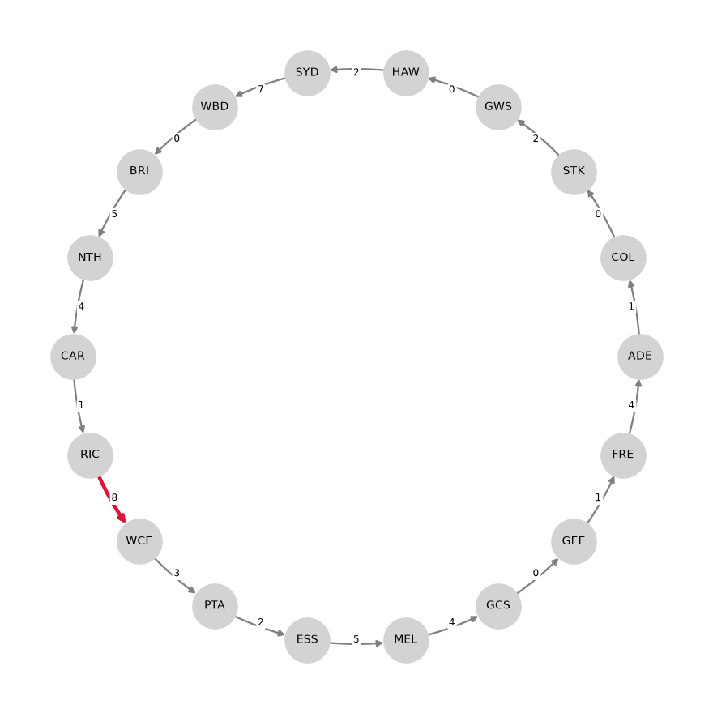

Bottleneck Hamiltonian Cycle
============================

A Hamiltonian cycle visits every node of a graph exactly once before returning
to where it started. When the arcs carry weights, a natural question is which
Hamiltonian cycle has the smallest *largest* arc. This is the bottleneck (or
min-max) Hamiltonian cycle problem, also known as the bottleneck traveling
salesman problem (:footcite:t:`garfinkel1978bottleneck`).

Note that this is not the classical traveling salesman problem, which
minimizes the *total* weight of the tour. Minimizing the largest arc and
minimizing the sum of the arcs generally select different cycles, and the two
answer quite different questions.

There are two useful ways to read the weights.

**Weights as distances.** Minimizing the longest single leg of a tour answers
the question "what is the smallest range a vehicle needs in order to visit
every location and come home?". A tour is feasible for a vehicle exactly when
its longest leg is within range, so the bottleneck of the best cycle is the
minimum range that makes the trip possible at all.

**Weights as availability times.** If the weight of an arc is the moment that
arc comes into existence, then a cycle only exists once *all* of its arcs
exist, which is the moment its latest arc appears. Minimizing the maximum
therefore answers "how early can a cycle be completed?". The example on
this page is of the second kind.

Problem Specification
---------------------

Consider a directed graph :math:`G = (V, A)` with :math:`n = |V| \geq 3` nodes,
where each arc :math:`(i, j) \in A` has a weight :math:`w_{ij}`. Find a
directed Hamiltonian cycle :math:`C` --- a closed walk entering and leaving
every node exactly once --- which minimizes

.. math::

    \max_{(i, j) \in C} w_{ij}.

Note that the weight values are not important --- only their relative
*ordering*. Any strictly increasing transformation of every weight leaves the
optimal cycle unchanged, since it cannot alter which arc of a cycle is the
largest. This is why dates, round numbers and distances are all equally valid
inputs.

.. dropdown:: Background: Optimization Model

    This Mod is implemented by formulating a Mixed Integer Programming (MIP)
    model and solving it using Gurobi. For each arc :math:`(i, j) \in A`,
    define a binary decision variable

    .. math::
        x_{ij} = \begin{cases}
            1 & \text{if the cycle goes directly from}\,i\,\text{to}\,j\,\\
            0 & \text{otherwise,} \\
        \end{cases}

    and let :math:`z` be the largest weight used by the cycle. The model is

    .. math::
        \begin{alignat}{2}
        \min \quad        & z \\
        \mbox{s.t.} \quad & \sum_{j : (i, j) \in A} x_{ij} = 1 & \quad \forall i \in V \\
                          & \sum_{i : (i, j) \in A} x_{ij} = 1 & \quad \forall j \in V \\
                          & z \geq w_{ij} x_{ij} & \quad \forall (i, j) \in A \\
                          & \sum_{(i, j) \in A(S)} x_{ij} \leq |S| - 1 & \quad \forall S \subset V,\, 2 \leq |S| \leq n - 1 \\
                          & x_{ij} \in \lbrace 0, 1 \rbrace & \quad \forall (i, j) \in A
        \end{alignat}

    The first two constraints require every node to be left exactly once and
    entered exactly once. On their own they permit a solution to fall apart
    into several disjoint cycles, so the third family, the subtour elimination
    constraints of :footcite:t:`dantzig1954solution`, forbids any proper subset
    of the nodes from closing a cycle among themselves. There are exponentially
    many of these, so the Mod adds them lazily: it solves without them and,
    whenever a candidate solution turns out to be several disjoint cycles, cuts
    each one off and continues. The compact formulation of
    :footcite:t:`miller1960integer` avoids the callback at the cost of a
    considerably weaker relaxation.

    The constraint :math:`z \geq w_{ij} x_{ij}` makes :math:`z` at least as
    large as every arc the cycle actually uses, and since :math:`z` is
    minimized it settles exactly on the largest of them.

    Two refinements are worth mentioning, both used by the implementation.
    Because only the ordering of the weights matters, the model is built on the
    ranks of the distinct weight values rather than the values themselves,
    which keeps the objective integral and small and lets dates be used
    directly. And since every node must use one of its outgoing arcs and one of
    its incoming arcs, the bound

    .. math::

        z \geq \max_{i \in V} \max \left(
            \min_{j : (i, j) \in A} w_{ij},\;
            \min_{j : (j, i) \in A} w_{ji}
        \right)

    is valid and free to compute. It is often surprisingly strong; in the
    example below it is exactly the optimal value.

.. dropdown:: Background: when does a Hamiltonian cycle exist?

    Deciding whether a directed graph contains a Hamiltonian cycle at all is
    NP-complete, which is why an optimization solver is a reasonable tool here
    even before any weights are involved.

    There is a classical special case worth knowing. A *tournament* is a
    directed graph in which every pair of nodes is joined by exactly one arc,
    that is, a complete undirected graph with an orientation chosen for each
    edge. And a directed graph is *strongly connected* when every node can be
    reached from every other by following arcs.

    :footcite:t:`camion1959chemins` showed that every strongly connected
    tournament contains a Hamiltonian cycle. Strong connectivity is necessary
    in any directed graph, since a Hamiltonian cycle itself reaches everything
    from everywhere, and for a tournament it is also sufficient. A linear-time
    check therefore decides the question outright: if the graph is strongly
    connected a cycle exists, and if it is not, for instance because some node
    has no outgoing arc, no cycle can exist. That is a strong statement about
    tournaments specifically, since strong connectivity is far from sufficient
    in general.

    Coverage is what earns that conclusion, not uniqueness. The argument needs
    only that every pair of nodes be joined by *at least* one arc, so it
    survives unchanged when some pairs are joined in both directions; extra
    arcs cannot destroy a cycle. A pair joined by *no* arc is another matter,
    and then the graph really does fall outside the class and existence is a
    genuine question again. Knowing that some cycle exists says nothing about
    which one is best in any case.

    One necessary condition is checked before the model is built: every node
    needs at least one incoming and one outgoing arc. If some node has neither,
    the Mod raises a ``ValueError`` naming it, rather than reporting an
    unhelpful infeasible model.

Interface
---------

The ``min_bottleneck_hamiltonian_cycle`` function accepts a scipy sparse array,
a networkx graph, or a pandas dataframe. Weights are optional in all three
cases and default to one, in which case the Mod simply returns some Hamiltonian
cycle if one exists.

.. tabs::

    .. group-tab:: pandas

        The graph is a dataframe indexed by ``("source", "target")`` with a
        ``weight`` column. Columns of those names are accepted too.

        .. doctest:: interface_pd
            :options: +NORMALIZE_WHITESPACE

            >>> import pandas as pd
            >>> from gurobi_optimods.hamiltonian_cycle import min_bottleneck_hamiltonian_cycle
            >>> arcs = pd.DataFrame(
            ...     [("a", "b", 1), ("b", "c", 6), ("c", "d", 2), ("d", "a", 3),
            ...      ("a", "c", 4), ("c", "b", 3), ("b", "d", 5)],
            ...     columns=["source", "target", "weight"],
            ... ).set_index(["source", "target"])
            >>> min_bottleneck_hamiltonian_cycle(arcs, verbose=False)
            HamiltonianCycleResult(cycle=['a', 'c', 'b', 'd'], weights=[4, 3, 5, 3], bottleneck=5)

    .. group-tab:: scipy.sparse

        The graph is a square sparse array whose stored entries are the arc
        weights. Note that a stored zero is a genuine arc of weight zero, so
        take care not to let it be dropped, for example by
        ``eliminate_zeros()``.

        .. doctest:: interface_sp
            :options: +NORMALIZE_WHITESPACE

            >>> import numpy as np
            >>> import scipy.sparse as sp
            >>> from gurobi_optimods.hamiltonian_cycle import min_bottleneck_hamiltonian_cycle
            >>> rows = np.array([0, 1, 2, 3, 0, 2, 1])
            >>> cols = np.array([1, 2, 3, 0, 2, 1, 3])
            >>> data = np.array([1, 6, 2, 3, 4, 3, 5])
            >>> graph = sp.coo_array((data, (rows, cols)), shape=(4, 4))
            >>> min_bottleneck_hamiltonian_cycle(graph, verbose=False)
            HamiltonianCycleResult(cycle=[0, 2, 1, 3], weights=[4, 3, 5, 3], bottleneck=5)

    .. group-tab:: networkx

        The graph is a networkx graph whose edges carry a ``weight``
        attribute. An undirected graph is read as a directed one in which every
        edge may be traveled either way.

        .. doctest:: interface_nx
            :options: +NORMALIZE_WHITESPACE

            >>> import networkx as nx
            >>> from gurobi_optimods.hamiltonian_cycle import min_bottleneck_hamiltonian_cycle
            >>> graph = nx.DiGraph()
            >>> graph.add_weighted_edges_from(
            ...     [("a", "b", 1), ("b", "c", 6), ("c", "d", 2), ("d", "a", 3),
            ...      ("a", "c", 4), ("c", "b", 3), ("b", "d", 5)]
            ... )
            >>> min_bottleneck_hamiltonian_cycle(graph, verbose=False)
            HamiltonianCycleResult(cycle=['a', 'c', 'b', 'd'], weights=[4, 3, 5, 3], bottleneck=5)

Whatever the input type, the result is a data class holding the nodes in
visiting order, the weight of each arc of the cycle, and the largest of those
weights. In the example above the cycle ``a -> c -> b -> d -> a`` uses arcs of
weight 4, 3, 5 and 3, so its bottleneck is 5. The other Hamiltonian cycle in
that graph, ``a -> b -> c -> d -> a``, uses weights 1, 6, 2 and 3: its total is
smaller, at 12 against 15, but its largest arc is 6. A model minimizing total
weight would return that cycle instead.

Example: the Circle of Parity
-----------------------------

In sports, a **circle of parity** is a chain in which every team in the
competition beats the next, looping all the way back to the start. Team A beat
team B, who beat team C, and so on through every team until the chain closes
back on team A. It is a nice illustration of how little a single result tells
you about who is better, and it is exactly a directed Hamiltonian cycle on the
graph whose nodes are teams and whose arcs point from winner to loser.

Simply finding such a chain is not much of a question. There is only one way it
can fail: some group of teams never beats anyone outside the group, so a chain
that enters can never leave. A team that never won is the smallest case, and a
team that never lost is its mirror image. Absent something of that kind, the
"has beaten" graph of a completed season is dense enough that chains are not
merely present but abundant, and exhibiting one says almost nothing.

The interesting question is **how early in the season one could have been
completed**. An arc "u has beaten v" comes into existence the moment u first
beats v, so labeling each arc with when that game was played turns the question
into exactly the bottleneck problem above: the circle is complete as soon as
its latest link is established, and we want that moment to be as early as
possible.

Since only the ordering of the weights matters, "when" can be recorded in
whatever unit suits the answer wanted: a round number answers to the nearest
round, a calendar date to the nearest day. Every game in a round is played
before every game in the next, so the two orderings never disagree and the two
answers differ only in resolution. Both labels are carried in the dataset, and
both are used below.

The Mod ships with the results of the `2026 AFL season
<https://en.wikipedia.org/wiki/2026_AFL_season>`_, in which 18 teams played 207
games between March and August, spread over 25 rounds.

.. testsetup:: parity

    import pandas as pd
    pd.options.display.max_rows = 10

.. doctest:: parity
    :options: +NORMALIZE_WHITESPACE

    >>> from gurobi_optimods import datasets
    >>> season = datasets.load_afl_season()
    >>> season.head()
       round       date home away winner
    0      0 2026-03-05  SYD  CAR    SYD
    1      0 2026-03-06  GCS  GEE    GCS
    2      0 2026-03-07  GWS  HAW    GWS
    3      0 2026-03-07  BRI  WBD    WBD
    4      0 2026-03-08  STK  COL    COL

Building the graph from a season is a short transformation, and it is where all
of the modeling happens:

* a **decided** game contributes one arc, from the winner to the loser, weighted
  by when it was played;
* a game the season records **no winner** for has not been decided yet, so it
  could go either way and contributes *both* orientations, weighted by when it
  is scheduled;
* a **drawn** game contributes no arc at all, since nobody beat anybody;
* if the same team beats the same opponent twice, only the earlier win matters,
  because one win is enough to establish the link.

The blanks are the only thing that says where the present is, and nothing else
needs to. A season in progress carries results as far as they are known and
leaves the rest of the fixture empty; the completed season below is simply the
case where nothing is empty.

Adding both orientations of an undecided game needs no extra care: a
Hamiltonian cycle on three or more nodes can never use both directions of the
same pair, because that would be a two-node subtour. The solver therefore picks
up links that already exist for free, and reaches into the future only when it
has to.

The graph built below is not quite a tournament, since teams can meet twice and
some pairs therefore end up joined in both directions, but by the note above
that is harmless. A pair who drew *every* time they met is not: they contribute
no arc at all. Exactly one pair did so in 2026, COL and HAW drawing both of
their meetings, and that single missing pair is the whole reason the completed
season falls outside the guarantee. Every partial-season graph on this page is
still inside it, since a pair with a game still to come always contributes both
orientations.

.. testcode:: parity

    import pandas as pd

    def build_arcs(season, by="round"):
        """Arcs of the "has beaten" graph implied by the results so far.

        A game the season records no winner for has not been decided yet.
        ``by`` names the column that dates a game and weights the arcs, so
        ``by="round"`` dates the links by round and ``by="date"`` by day.
        """
        undecided = season["winner"].isna()
        decided = season[~undecided & (season["winner"] != "draw")]
        loser = decided["away"].where(
            decided["winner"] == decided["home"], decided["home"]
        )
        known = pd.DataFrame(
            {"source": decided["winner"], "target": loser, "weight": decided[by]}
        )

        # A game with no result yet could still go either way
        later = season[undecided]
        possible = pd.concat([
            pd.DataFrame({
                "source": later["home"], "target": later["away"],
                "weight": later[by],
            }),
            pd.DataFrame({
                "source": later["away"], "target": later["home"],
                "weight": later[by],
            }),
        ])

        # One win is enough, so keep only the earliest for each ordered pair
        return (
            pd.concat([known, possible])
            .groupby(["source", "target"])["weight"]
            .min()
            .to_frame()
        )

Looking back at the completed season
^^^^^^^^^^^^^^^^^^^^^^^^^^^^^^^^^^^^

With every result known, each game contributes at most one arc, and 204 decided
games collapse to 172 distinct links:

.. doctest:: parity
    :options: +NORMALIZE_WHITESPACE

    >>> arcs = build_arcs(season)
    >>> len(arcs)
    172

Those 172 links admit over a hundred million distinct circles of parity ---
ample confirmation that existence is not the interesting question here.

Before solving anything, the free bound from the model description already says
something. No team can appear in the circle until it has both a win and a loss,
and RIC did not win a game until round 8, so the circle cannot possibly have
closed earlier than that. The solve shows the bound is achieved:

.. doctest:: parity
    :options: +NORMALIZE_WHITESPACE

    >>> from gurobi_optimods.hamiltonian_cycle import min_bottleneck_hamiltonian_cycle
    >>> result = min_bottleneck_hamiltonian_cycle(arcs, verbose=False)
    >>> result.bottleneck
    8

So the 2026 circle of parity was complete as soon as round 8 had been played.
Putting the same question to the calendar pins it to a day:

.. doctest:: parity
    :options: +NORMALIZE_WHITESPACE

    >>> by_date = build_arcs(season, by="date")
    >>> min_bottleneck_hamiltonian_cycle(by_date, verbose=False).bottleneck
    Timestamp('2026-05-02 00:00:00')

Nothing separates the two solves but the labels: 2 May 2026 is a round 8
fixture, so both name the same moment, one to the round and one to the day.
Reading the chain off, with the round in which each link was established:

.. doctest:: parity
    :options: +NORMALIZE_WHITESPACE

    >>> for position, team in enumerate(result.cycle):
    ...     beaten = result.cycle[(position + 1) % len(result.cycle)]
    ...     print(f"{team} beat {beaten} in round {result.weights[position]}")
    ADE beat COL in round 1
    COL beat STK in round 0
    STK beat GWS in round 2
    GWS beat HAW in round 0
    HAW beat SYD in round 2
    SYD beat WBD in round 7
    WBD beat BRI in round 0
    BRI beat NTH in round 5
    NTH beat CAR in round 4
    CAR beat RIC in round 1
    RIC beat WCE in round 8
    WCE beat PTA in round 3
    PTA beat ESS in round 2
    ESS beat MEL in round 5
    MEL beat GCS in round 4
    GCS beat GEE in round 0
    GEE beat FRE in round 1
    FRE beat ADE in round 4

Every other link was in place well before round 8. The single arc holding the
whole circle back is ``RIC beat WCE``, Richmond's first win of the season, and
the game played on the very day the calendar solve returned.

Looking forward from mid-season
^^^^^^^^^^^^^^^^^^^^^^^^^^^^^^^

The same model answers the live version of the question. Suppose we are five
rounds in, and want to know the earliest the circle could *still* be completed
and which results would have to go our way. Only the input changes, and since
this page has a completed season to hand, the results that had not happened yet
have to be taken back out of it:

.. testcode:: parity

    def as_at(season, played_through):
        """The season as it stood at the end of ``played_through``: the later
        games are still on the fixture, but their results are not known yet."""
        return season.assign(
            winner=season["winner"].mask(season["round"] > played_through)
        )

.. doctest:: parity
    :options: +NORMALIZE_WHITESPACE

    >>> partial = min_bottleneck_hamiltonian_cycle(
    ...     build_arcs(as_at(season, 5)), verbose=False
    ... )
    >>> partial.bottleneck
    6

After five rounds it still looked possible to close the circle in round 6. That
would have needed seven specific results, which the solution names:

.. doctest:: parity
    :options: +NORMALIZE_WHITESPACE

    >>> for position, team in enumerate(partial.cycle):
    ...     if partial.weights[position] > 5:
    ...         beaten = partial.cycle[(position + 1) % len(partial.cycle)]
    ...         print(f"{team} must beat {beaten} in round {partial.weights[position]}")
    COL must beat CAR in round 6
    RIC must beat NTH in round 6
    ESS must beat GCS in round 6
    GEE must beat WBD in round 6
    WCE must beat FRE in round 6
    MEL must beat BRI in round 6
    STK must beat ADE in round 6

They did not all go that way, and the answer drifted later as the season wore
on. This is not a coincidence: learning a result only ever *removes* arcs, as
two possible orientations collapse into the one that actually happened, or into
none at all if the game was drawn. The set of available cycles can only shrink,
so the earliest possible completion can only move later:

.. doctest:: parity
    :options: +NORMALIZE_WHITESPACE

    >>> for played_through in range(-1, 8):
    ...     answer = min_bottleneck_hamiltonian_cycle(
    ...         build_arcs(as_at(season, played_through)), verbose=False
    ...     ).bottleneck
    ...     print(f"after round {played_through:2d}:  earliest completion is round {answer}")
    after round -1:  earliest completion is round 3
    after round  0:  earliest completion is round 3
    after round  1:  earliest completion is round 4
    after round  2:  earliest completion is round 4
    after round  3:  earliest completion is round 5
    after round  4:  earliest completion is round 5
    after round  5:  earliest completion is round 6
    after round  6:  earliest completion is round 7
    after round  7:  earliest completion is round 8

The first line is the pre-season case, where nothing has been played and every
game in the fixture offers both orientations. Purely as a matter of scheduling,
the 2026 fixture could not have produced a circle of parity before round 3, no
matter how the results fell. By round 7 the answer had settled on round 8,
which is where it stayed.

The circle can be drawn with the teams laid out in cycle order:

.. code-block:: Python

    import matplotlib.pyplot as plt
    import networkx as nx

    graph = nx.DiGraph()
    for position, team in enumerate(result.cycle):
        beaten = result.cycle[(position + 1) % len(result.cycle)]
        graph.add_edge(team, beaten, when=result.weights[position])

    layout = nx.circular_layout(graph)
    latest = [
        (u, v) for u, v, w in graph.edges(data="when") if w == result.bottleneck
    ]

    fig, ax = plt.subplots(figsize=(8, 8))
    nx.draw_networkx_nodes(graph, layout, ax=ax, node_size=1300, node_color="lightgray")
    nx.draw_networkx_labels(graph, layout, ax=ax, font_size=9)
    nx.draw_networkx_edges(graph, layout, ax=ax, node_size=1300, width=1.5,
                           edge_color="gray", connectionstyle="arc3,rad=0.08")
    nx.draw_networkx_edges(graph, layout, ax=ax, node_size=1300, width=3.0,
                           edgelist=latest, edge_color="crimson",
                           connectionstyle="arc3,rad=0.08")
    nx.draw_networkx_edge_labels(
        graph, layout, ax=ax, font_size=8, rotate=False,
        bbox={"boxstyle": "round,pad=0.15", "fc": "white", "ec": "none"},
        edge_labels=nx.get_edge_attributes(graph, "when"),
    )
    ax.set_axis_off()
    fig.tight_layout()
    plt.show()

Each arrow points from the winner to the loser and is labeled with the weight
of that link, here the round in which the result occurred. The red arrow is the
bottleneck: the last link to fall into place, and the one that determines when
the circle closed.

.. footbibliography::
