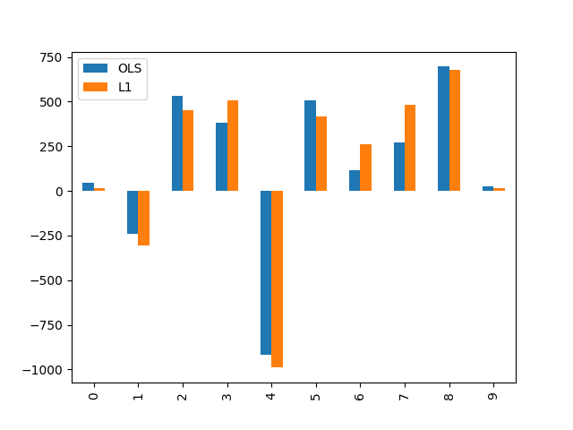

L1 Regression
=============

Minimum sum of absolute errors (L1) regression performs is generally more robust than ordinary least squares (OLS, L2) in that it is more resistant to outliers in the response variable. The loss function can be expressed using linear program, so fitting model coefficients is ideally suited to Gurobi.

The interface of this mod matches that of :code:`sklearn.linear_model.LinearRegression`. This example compares the coefficients found using L1 and L2 regression on the diabetes dataset.

Problem Specification
---------------------

Scikit-learn's documentation gives a general explanation of `Linear Models <https://scikit-learn.org/stable/modules/linear_model.html>`_. The distinction between this mod and the Ordinary Least Squares model from scikit-learn is the loss function.

.. tabs::

    .. tab:: Loss Function

        :code:`L1Regression` fits a linear model with coefficients :math:`w` to minimize the sum of absolute errors.

        .. math::

            \min_w \lvert Xw - y \rvert

    .. tab:: Optimization Model

        To model the L1 regression loss function using linear programming, we need to introduce a number of auxiliary variables. Here :math:`I` is the set of data points and :math:`J` the set of fields. Response values :math:`y_i` are predicted from predictor values :math:`x_{ij}` by fitting coefficients :math:`w_j`. To handle the absolute value, non-negative variables :math:`u_i` and :math:`v_i` are introduced.

        .. math::

            \begin{alignat}{2}
            \min \quad        & \sum_i u_i + v_i \\
            \mbox{s.t.} \quad & \sum_j w_j x_{ij} + u_i - v_i = y_i \quad & \forall i \in I \\
                              & u_i, v_i \ge 0                      \quad & \forall i \in I \\
                              & w_j \,\, \text{free}                \quad & \forall j \in J \\
            \end{alignat}

*TODO: add data examples here (ndarrays)*

Code
----

This mod implements the fit-predict interface of scikit-learn. The example below reads in the diabetes dataset from scikit-learn, performs a train-test split, fits the L1 regression model to the training data, and creates predictions for the testing data.

.. testcode:: l1_regression

    from sklearn import datasets
    from sklearn.model_selection import train_test_split

    from gurobi_optimods.regression import L1Regression

    # Load the diabetes dataset
    diabetes_X, diabetes_y = datasets.load_diabetes(return_X_y=True)

    # Split data for fit assessment
    X_train, X_test, y_train, y_test = train_test_split(
        diabetes_X, diabetes_y, random_state=42
    )

    # Create and fit parameterised model
    reg = L1Regression()
    reg.fit(X_train, y_train)
    y_pred = reg.predict(X_test)

.. testoutput:: l1_regression
    :hide:

    ...
    Optimal objective  4.372590220e+01

The model is solved as a linear program by Gurobi. Logs provided for interested parties:

.. collapse:: View Gurobi logs

    .. code-block:: text

        Gurobi Optimizer version 9.5.1 build v9.5.1rc2 (mac64[x86])
        Thread count: 4 physical cores, 8 logical processors, using up to 8 threads
        Optimize a model with 331 rows, 673 columns and 4303 nonzeros
        Model fingerprint: 0x6983ca17
        Coefficient statistics:
        Matrix range     [6e-05, 1e+00]
        Objective range  [3e-03, 3e-03]
        Bounds range     [0e+00, 0e+00]
        RHS range        [2e+01, 3e+02]
        Presolve time: 0.00s
        Presolved: 331 rows, 673 columns, 4303 nonzeros

        Iteration    Objective       Primal Inf.    Dual Inf.      Time
            0      handle free variables                          0s
            354    4.3725902e+01   0.000000e+00   0.000000e+00      0s

        Solved in 354 iterations and 0.01 seconds (0.01 work units)
        Optimal objective  4.372590220e+01

|

Solution
--------

Here we extract the coefficients of the fitted model and compare them with the coefficients found using OLS. Not a super informative plot at this stage...

.. testcode:: l1_regression

    import pandas as pd
    from sklearn.linear_model import LinearRegression
    ols = LinearRegression()
    ols.fit(X_train, y_train)
    pd.DataFrame(data={"OLS": ols.coef_, "L1": reg.coef_}).plot.bar()

To gasps of shock and awe, the L1 regression produces a *smaller mean absolute error* on the training set than the OLS model, while the OLS model does better in terms of mean squared error.

.. doctest:: l1_regression

    >>> from sklearn.metrics import mean_absolute_error, mean_squared_error
    >>> mean_absolute_error(y_train, reg.predict(X_train))
    43.72590219712541
    >>> mean_absolute_error(y_train, ols.predict(X_train))
    44.054803735772055
    >>> mean_squared_error(y_train, reg.predict(X_train))
    2960.7450234433813
    >>> mean_squared_error(y_train, ols.predict(X_train))
    2907.257764010109
