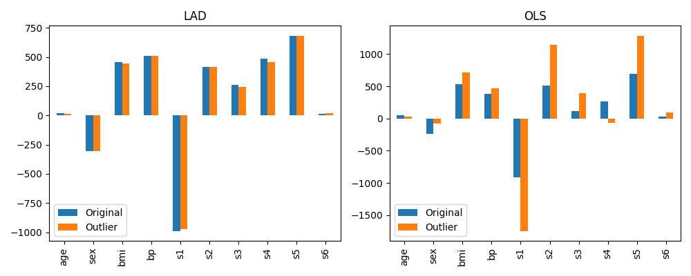

Least Absolute Deviation Regression
===================================

Least Absolute Deviation (LAD) regression is an alternative to the more commonly
used Ordinary Least Squares (OLS) regression method. The distinction between the
two is the error metric used to fit the predictive model to training data. LAD
minimizes the sum of absolute residuals, while OLS minimizes the sum of
squares of residuals.

Though most machine learning practitioners are probably more familiar with OLS,
LAD was proposed around 50 years earlier :footcite:p:`birkes2011alternative`.
OLS gained more popularity partly due to the fact that the computations required
were simpler. It was the development of linear programming that made
LAD computationally manageable :footcite:p:`bloomfield1980least`.

LAD is more robust than OLS in that it is more resistant to outliers
in the response variable :footcite:p:`birkes2011alternative`. In OLS, a large residual
for a single data point makes an outsized contribution to the loss function
since the residuals are squared. As a result, a single outlier can have a
large effect on the fitted coefficients and skew the resulting model. By
contrast, a large deviation in an individual point has a less extreme effect on
the linear loss function of LAD.

Problem Specification
---------------------

Scikit-learn's documentation gives a general explanation of `Linear Models
<https://scikit-learn.org/stable/modules/linear_model.html>`_. The distinction
between this Mod and the Ordinary Least Squares regression algorithm from scikit-learn is the
loss function. ``LADRegression`` chooses coefficients :math:`w` of a linear model
:math:`y = Xw` so as to minimize the sum of absolute errors on a training
dataset :math:`(X, y)`. In other words, it aims to minimize the
following loss function:

.. math::

    \min_w \lvert Xw - y \rvert

.. dropdown:: Background: Mathematical Model

    The fitting algorithm of the LAD regression Mod is implemented by
    formulating the loss function as a Linear Program (LP), which is then solved
    using Gurobi. Here :math:`I` is the set of observations and :math:`J` the
    set of fields. Response values :math:`y_i` are predicted from predictor
    values :math:`x_{ij}` by fitting coefficients :math:`w_j`. To handle the
    absolute value in the loss function, auxiliary non-negative variables
    :math:`u_i` and :math:`v_i` are introduced.

    .. math::

        \begin{alignat}{2}
        \min \quad        & \sum_i u_i + v_i \\
        \mbox{s.t.} \quad & \sum_j w_j x_{ij} + u_i - v_i = y_i \quad & \forall i \in I \\
                          & u_i, v_i \ge 0                      \quad & \forall i \in I \\
                          & w_j \,\, \text{free}                \quad & \forall j \in J \\
        \end{alignat}

Example Code
------------

This Mod implements the fit-predict API used by all predictive models in
scikit-learn (including the :code:`sklearn.linear_model.LinearRegression`
class). The example below reads in the diabetes dataset from scikit-learn,
performs a train-test split, fits a LAD regression model to the training data,
and creates predictions for the testing data.

.. testcode:: lad_regression

    from sklearn import datasets
    from sklearn.model_selection import train_test_split

    from gurobi_optimods.regression import LADRegression

    # Load the diabetes dataset
    diabetes = datasets.load_diabetes()

    # Split data for fit assessment
    X_train, X_test, y_train, y_test = train_test_split(
        diabetes["data"], diabetes["target"], random_state=42
    )

    # Fit model and obtain predictions
    lad = LADRegression()
    lad.fit(X_train, y_train)
    y_pred = lad.predict(X_test)

.. testoutput:: lad_regression
    :hide:

    ...
    Optimize a model with 331 rows, 673 columns and 4303 nonzeros...
    ...
    Optimal objective  1.44...

Note that the input data is provided as numpy arrays. For a dataset containing
``n`` observations and ``m`` independent variables, feature datasets ``X_train``
and ``X_test`` have shape ``(n, m)``, while response variable datasets
``y_train`` and ``y_test`` have shape ``(n,)``.

.. doctest:: lad_regression

    >>> X_train.shape
    (331, 10)
    >>> y_train.shape
    (331,)
    >>> X_test.shape
    (111, 10)
    >>> y_test.shape
    (111,)

Comparison with Ordinary Least Squares
--------------------------------------

Here we extract the coefficients of the fitted model and compare them with the
coefficients found using Ordinary Least Squares (OLS).

.. testcode:: lad_regression

    import pandas as pd
    import matplotlib.pyplot as plt
    from sklearn.linear_model import LinearRegression

    ols = LinearRegression()
    ols.fit(X_train, y_train)
    coefficients = pd.DataFrame(
        data={"OLS": ols.coef_, "LAD": lad.coef_},
        index=diabetes["feature_names"],
    )

    plt.figure(figsize=(8, 4))
    coefficients.plot.bar(ax=plt.gca())

At this stage there isn't much to observe; the chosen coefficients are
similar:

.. figure:: figures/lad-regression-coeffs.png
    :width: 600
    :align: center
    :alt: Comparison of LAD and OLS coefficients

    Comparison of regression coefficients fitted by LAD and OLS

Things get more interesting when we analyze the impact of outliers in the
training dataset on the resulting coefficients and performance of the model. In
this contrived test, outliers are introduced into the training data by scaling a
small number of entries in ``y_train`` (4 of 331 response variables values are
scaled by a factor of 5). Both LAD and OLS models are fitted to this altered
training set, and the resulting models are compared to the original fitted
models.

.. collapse:: View the code: resistance to outliers comparison figures

    .. testcode:: lad_regression

        from sklearn.metrics import mean_absolute_error, mean_squared_error

        # Introduce some (admittedly absurd) scaling to produce
        # outliers in one training set
        y_train_outliers = y_train.copy()
        y_train_outliers[[14, 78, 234, 123]] *= 5

        # Fit both model types to both training sets, and evaluate
        # test set errors
        models = [
            {"regressor": cls(), "y_train": y, "name": name, "label": label}
            for cls, name in [(LADRegression, "LAD"), (LinearRegression, "OLS")]
            for y, label in [(y_train, "Original"), (y_train_outliers, "Outlier")]
        ]
        for model in models:
            model["regressor"].fit(X_train, model["y_train"])
            y_pred = model["regressor"].predict(X_test)
            model["mae-test"] = mean_absolute_error(y_test, y_pred)
            model["mse-test"] = mean_squared_error(y_test, y_pred)

        # Plot coefficients trained on the original and outlier sets
        coeffs = pd.DataFrame(
            data={
                (model["name"], model["label"]): model["regressor"].coef_
                for model in models
            },
            index=diabetes['feature_names'],
        )
        fig, (ax1, ax2) = plt.subplots(1, 2, figsize=(10, 4))
        coeffs["LAD"].plot.bar(ax=ax1, title="LAD")
        ax1.legend(loc='lower left')
        coeffs["OLS"].plot.bar(ax=ax2, title="OLS")
        ax2.legend(loc='lower left')

        # Plot test set errors
        errors = pd.DataFrame(models)
        fig, (ax1, ax2) = plt.subplots(1, 2, figsize=(10, 4))
        errors.set_index(["name", "label"])["mae-test"].unstack().plot.bar(
            ax=ax1, xlabel="", title="Mean Absolute Error (test set)"
        )
        ax1.legend(loc='lower left')
        errors.set_index(["name", "label"])["mse-test"].unstack().plot.bar(
            ax=ax2, xlabel="", title="Mean Squared Error (test set)"
        )
        ax2.legend(loc='lower left')

    .. testoutput:: lad_regression
        :hide:

        ...
        Optimal objective  1.44...
        ...
        Optimal objective  1.82...

|

The figure below compares the model coefficients trained on the original set and
the outlier training set for each model type. We can see that the OLS model is
much more significantly affected by the introduction of outliers. The dominant
coefficients have approximately doubled in some cases, and some smaller
coefficients have even reversed their sign. By comparison, the LAD model is
almost unchanged by the introduction of these few outliers.

    Effect of training set outliers on LAD and OLS model coefficients

Finally, we compare the mean absolute error (MAE) and mean squared error (MSE)
metrics of each fitted model on the test set. This measures the ability of each
model to generalise to data points not part of the training set. Of note here is
that the OLS model shows significantly higher errors on the test set when
trained on the outlier dataset. By comparison, LAD model performance is almost
unchanged. Thus, as expected, the LAD model is much more robust to training set
outliers than the OLS model.

    Effect of training set outliers on LAD and OLS test set errors

.. footbibliography::
