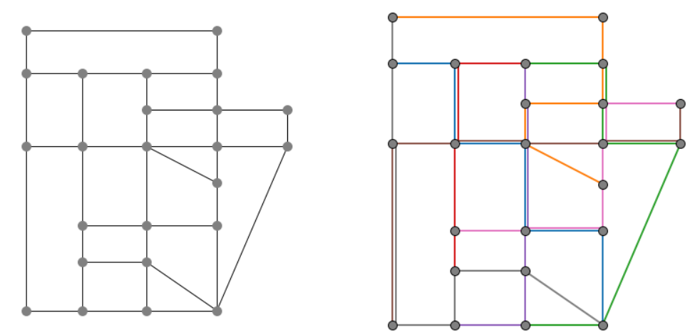

Line Optimization in Public Transport
=====================================

The line optimization problem in public transport is to choose a set of lines
(routes in the transportation network) with associated frequencies (how often
the lines are operated) such that a given transportation demand can be
satisfied. This problem is an example of a classical network design problem.
There are different approaches and models to solve the line optimization
problem. A general overview on models and methods is given by Schoebel
:footcite:p:`schoebel2012`.

For this optimod we assume we are given a public transportation network: a set
of stations and the direct links between them. We are given the
origin-destination (OD) *demand*, i.e., it is known how many passengers want to
travel from one station to another in the network within the considered time
horizon. We are also given a set of possible *lines*. A line is a path in a
public transportation network. We call *line plan* a subset of these lines where
each line is associated with a frequency. The optimod computes a line plan with
minimum cost such that the capacity of the chosen lines is sufficient to
transport all passengers.

We provide two different strategies to find a line plan with minimum cost:

#. The first approach assumes that passengers only travel from their origin to
   their destination along the path with the shortest travel time.  For this
   purpose, all shortest paths are computed for each OD pair and it is only
   allowed to route passengers along these paths.
#. The second approach does not restrict the passenger paths, but instead
   applies a multi-objective approach.  In the first objective the cost of the
   line plan is minimized such that all passenger demand can be satisfied.  In
   the second objective the travel time for the passengers is minimized such
   that the cost of the line plan increases by at most 20% over the minimum cost
   line plan.

Problem Specification
---------------------

Let a graph :math:`G=(V,E)` represent the transportation network. The set of
vertices :math:`V` represent the stations and the set of edges :math:`E`
represent all possibilities to travel from one station to another without an
intermediate station. A directed edge :math:`(u,v)\in E` has the attribute time
:math:`\tau_{uv}\geq 0` that represents the amount of time needed to travel from
:math:`u` to :math:`v`. For each pair of nodes :math:`u,v\in V` a demand
:math:`d_{uv}\geq 0` is given. The demand represents the number of passengers
who want to travel from :math:`u` to :math:`v` in the considered time horizon.
Let :math:`D` be the set of all node pairs with positive demand. This set is
also called OD pairs. Further given is a set of lines :math:`L`. A line
:math:`l\in L` contains the stations it traverses in the given order. If a line
runs in both directions, it needs to be repeated in reverse order.

A line has the following additional attributes:

- fixed cost: :math:`C_{l}\geq 0` for installing the line
- operating cost: :math:`c_{l}\geq 0` for operating the line once in the given time horizon
- capacity: :math:`\kappa_{l}\geq 0` when operating the line :math:`l` once in the given time horizon

Additionally, we are given a list of frequencies. The frequencies define the
possible number of operations for the lines in the given time horizon. If a line
:math:`l` is operated with frequency :math:`f` the overall cost for the line is
:math:`C_{lf}=C_l + c_{lf}\cdot f` and the total capacity provided by the line
is :math:`\kappa_{l,f}=\kappa_l\cdot f`.

The problem can be stated as finding a subset of lines and associated
frequencies with minimal total cost such that all passengers can be transported.

.. dropdown:: Background: Optimization Model with Approach 1

    In an initial step the all-shortest-paths algorithm of networkx is used to compute all
    travel time shortest paths for each OD pair.
    Let :math:`P_{st}` be the set of all such shortest paths for OD pair :math:`(s,t)`.
    Then variables :math:`y^{st}_{p}` are defined for each path :math:`p\in P_{st}`.
    We have binary variables :math:`x_{l,f}` for each line frequency combination indicating if line :math:`l`
    is operated with frequency :math:`f`.

    This Mod is implemented by formulating a mixed integer linear program and
    solving it using Gurobi. The formulation can be stated as follows:

    .. math::

        \begin{alignat}{2}
            \min \quad        & \sum_{l \in L}\sum_{f \in F} C_{lf} x_{lf} \\
            \mbox{s.t.} \quad & \sum_{f\in F} x_{lf} \leq 1\\
                      & \sum_{l \in L:(u,v)\in l}\sum_{f\in F}\kappa_{l,f}\ x_{lf} \geq \sum_{(s,t)\in D} \sum_{p\in P_{st}:(u,v)\in p} y^{st}_{p} & \forall (u,v) \in E \\
                      & \sum_{p\in P_{st}} y^{st}_{p} = d_{st} & \forall (s,t)\in D\\
                            & x_{lf} \in \{0,1\} & \forall l\in L\, \forall f\in F\\
                            & y^{st}_{p} \geq 0 & \forall (s,t)\in D\, \forall p \in P_{st}
        \end{alignat}

    The objective minimizes the total cost of a line plan.
    The first constraint ensures that a line is associated with at most one frequency.
    The second constraint ensures that the line capacities can serve the passenger routing on shortest paths.
    The third constraint requires that the demand is routed on the precomputed shortest paths.
    The last two constraints ensure non-negativity of the variables and the line-frequency
    variables to be binary.

.. dropdown:: Background: Optimization Model with Approach 2

    This Mod is implemented by formulating a mixed integer linear program and
    solving it using Gurobi. We have binary variables :math:`x_{l,f}` for each
    line frequency combination indicating if line :math:`l` is operated with
    frequency :math:`f`. We define continuous variables :math:`y_{suv}\geq 0`
    for the number of passengers starting their trip in station :math:`s` and
    traveling on edge :math:`(u,v)`.

    The formulation can be stated as follows:

    .. math::

        \begin{alignat}{2}
            \min \quad        & \sum_{l \in L}\sum_{f \in F} C_{lf} x_{lf} \\
            \min \quad        & \sum_{s\in V} \sum_{(u,v)\in E} \tau_{uv} y_{suv}\\
            \mbox{s.t.} \quad & \sum_{f\in F} x_{lf} \leq 1\\
                      & \sum_{l \in L:(u,v)\in l}\sum_{f\in F}\kappa_{l,f}\ x_{lf} \geq \sum_{s\in V} y_{suv} & \forall (u,v) \in E \\
                      & \sum_{(s,u)\in E} y_{ssu} = \sum_{v\in V} d_{sv} & \forall s\in V\\
                      & \sum_{(u,v)\in E} y_{suv} = d_{sv} + \sum_{(v,w)\in E} y_{svw} & \forall s,v\in V\\
                            & x_{lf} \in \{0,1\} & \forall l\in L\, \forall f\in F\\
                            & y_{suv} \geq 0 & \forall s\in V\, \forall (u,v) \in E
        \end{alignat}

    The objective minimizes the total cost for the chosen lines in a first objective and minimizes the
    total travel times for all passengers in the second objective.

    The first constraint ensures that a line is associated with at most one frequency.
    The second constraint ensures that the line capacities can serve the passenger routing.
    The third and fourth constraints define a passenger flow for the given demands.

    The last two constraints ensure non-negativity of the variables and the line-frequency
    variables to be binary.

Code and Inputs
---------------

This Mod can be used with pandas using a ``pd.DataFrame``.
An example of the inputs with the respective requirements is shown below.

.. tabs::
    .. group-tab:: pandas

      .. doctest:: load_graph
          :options: +NORMALIZE_WHITESPACE

          >>> from gurobi_optimods import datasets
          >>> node_data, edge_data, line_data, linepath_data, demand_data = (
          ...     datasets.load_siouxfalls_network_data()
          ... )
          >>> node_data.head(4)
            number	posx	  posy
            0	1	50000.0	  510000.0
            1	2	320000.0  510000.0
            2	3	50000.0	  440000.0
            3	4	130000.0  440000.0
          >>> edge_data.head(4)
           	source	target	length	time
            0	1	2	0.010	360
            1	2	1	0.010	360
            2	1	3	0.006	240
            3	3	1	0.006	240
          >>> line_data.head(4)
            linename	capacity	fix_cost	operating_cost
            0	new7_B	600	15	3
            1	new15_B	600	15	2
            2	new23_B	600	15	6
            3	new31_B	600	15	6
          >>> linepath_data.head(4)
            linename	edge_source	edge_target
            0	new7_B	1	2
            1	new7_B	2	6
            2	new7_B	6	8
            3	new7_B	8	6
          >>> demand_data.head(4)
            source	target	demand
            0	1	2	5
            1	1	3	5
            2	1	4	25
            3	1	5	10
          >>> frequencies = [1,3]

      For the example we used data of the Sioux-Falls network. It is not
      considered as a realistic one. However, this network can be found on
      different websites when considering traffic problems (originally by Hillel
      Bar-Gera http://www.bgu.ac.il/~bargera/tntp/). We added a set of line
      routes. Note that the output shown above contains some additional
      information that is not required for computation, for example the property
      length in the edge data. Also, ``posx`` and ``posy`` in the ``node_data``
      is not used for computation. But it can be used to visualize the network
      as done below. It is important that all data is consistant. For example,
      ``edge_source``, ``edge_target`` in the ``linepath_data`` must correspond
      to a ``number`` in the node_data. The same holds for ``source`` and
      ``target`` in ``edge_data`` and ``demand_data``. In the code it is checked
      that all tables provide the relevant columns. Note that the edges are
      assumed to be directed and both direction need to be defined if an edge
      can be traversed in both directions. In the same way, a line is a directed
      path. If a line is turning at the end point and goes back the same way,
      the nodes need to be added again in reverse order.

Solution
--------

The solution consists of two information

- the total cost of the optimal line plan
- the optimal line plan as a list of linename-frequency tuples.

The strategy can be defined via a Boolean parameter ``shortest_paths``. This
parameter has a default value (True) which uses approach 1, i.e., routing
passengers on shortest paths only. Note that strategy 1 needs the python package
networkx. If this is not available, the second approach is used. The second
approach is also used if the parameter ``shortest_paths`` is set to False.

.. tabs::

  .. group-tab:: pandas

      .. doctest:: solve
          :options: +NORMALIZE_WHITESPACE

          >>> from gurobi_optimods import datasets
          >>> from gurobi_optimods.line_optimization import line_optimization
          >>> node_data, edge_data, line_data, linepath_data, demand_data = (
          ...     datasets.load_siouxfalls_network_data()
          ... )
          >>> frequencies = [1,3]
          >>> obj_cost, final_lines = line_optimization(
          ...     node_data,
          ...     edge_data,
          ...     line_data,
          ...     linepath_data,
          ...     demand_data,
          ...     frequencies,
          ...     True,
          ...     verbose=False,
          ... )
          >>> obj_cost
          211.0
          >>> final_lines
          [('new271_B', 1),
           ('new31_B', 1),
           ('new407_B', 1),
           ('new415_B', 3),
           ('new423_B', 3),
           ('new535_B', 3),
           ('new551_B', 3),
           ('new71_B', 1)]

We provide a basic method to plot a line plan that has at most 20 lines using
networkx and matplotlib. In order to use this functionality, it is necessary to
install both packages if not already available as follows::

    pip install matplotlib
    pip install networkx

Additionally, the node_data must include coordinates for the node positions,
i.e., the columns  ``posx`` and ``posy`` must be available. The plot function
generates a matplot that is opened in a browser::

    from gurobi_optimods.line_optimization import plot_lineplan
    plot_lineplan(node_data, edge_data, linepath_data, final_lines)

The Sioux-Falls transportation network (left) and the optimal line plan (right)
for this example is shown in the figure below. The lines are shown as different
colored paths in the network.

.. footbibliography::
