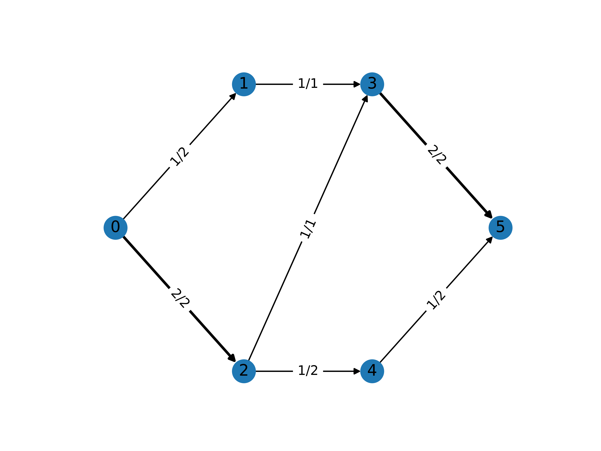
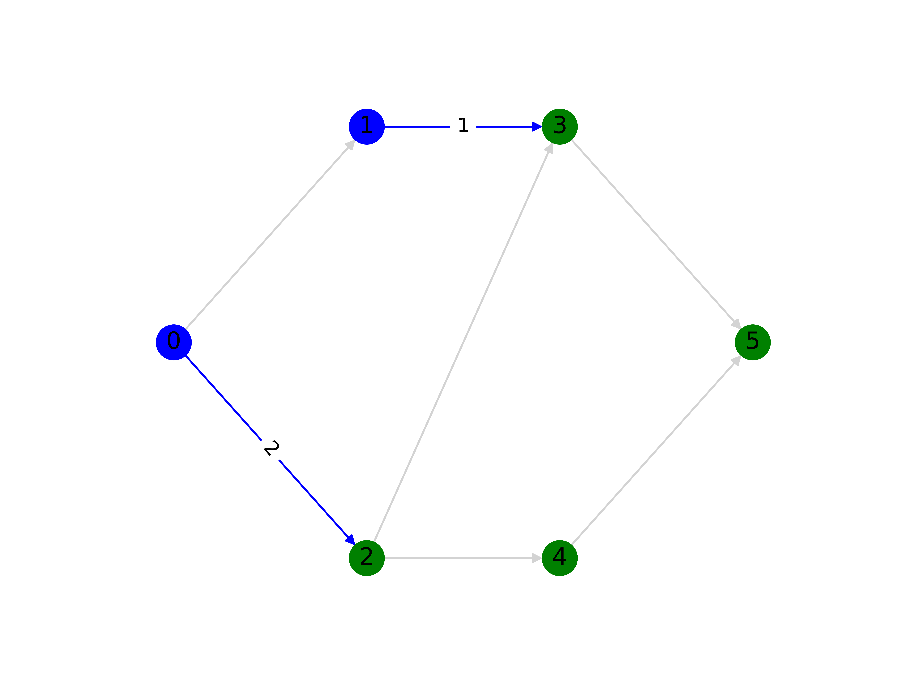

Maximum Flow / Minimum Cut
==========================

The maximum flow problem finds the total flow that can be routed through a
capacitated network from a given source vertex to a given sink vertex. The
minimum cut problem finds a set of edges in the same graph with minimal combined
capacity that, when removed, would disconnect the source from the sink. The two
problems are related through duality: the maximum flow is equal to the capacity
of the minimum cut.

The first algorithm proposed to solve this problem was the Ford-Fulkerson
algorithm :footcite:p:`ford1956maximal`. :footcite:t:`goldberg1988new` later
proposed the famous push-relabel algorithm, and more recently,
:footcite:t:`orlin2013max` and other authors have proposed polynomial-time
algorithms. The maximum flow problem is a special case of the minimum cost flow
problem, so it can also be solved efficiently using the network simplex
algorithm :footcite:p:`caliskan2012faster` making a linear programming (LP)
solver a suitable approach.

Problem Specification
---------------------

Let :math:`G` be a graph with set of vertices :math:`V` and edges :math:`E`.
Each edge :math:`(i,j)\in E` has capacity :math:`B_{ij}\in\mathbb{R}`. Given a
source vertex :math:`s\in V` and a sink vertex :math:`t\in V` the two problems
can be stated as follows:

- Maximum Flow: Find the flow with maximum value from source to sink such that
  the flow is capacity feasible.
- Minimum Cut: Find the set of edges which disconnects the source and sink such
  that the total capacity of the cut is minimised.

.. dropdown:: Background: Optimization Model

    Let us define a set of continuous variables :math:`x_{ij}` to represent
    the amount of non-negative (:math:`\geq 0`) flow going through an edge
    :math:`(i,j) \in E`.

    The mathematical formulation for the maximum flow can be stated as:

    .. math::

        \begin{alignat}{2}
          \max \quad        & \sum_{j \in \delta^+(s)} x_{sj} \\
          \mbox{s.t.} \quad & \sum_{j \in \delta^-(i)} x_{ji} = \sum_{j \in \delta^+(i)} x_{ij} & \quad\forall i \in V\setminus\{s,t\} \\
                            & 0 \leq x_{ij} \le B_{ij} & \forall (i, j) \in E \\
        \end{alignat}

    where :math:`\delta^+(\cdot)` (:math:`\delta^-(\cdot)`) denotes the
    outgoing (incoming) neighbours of a given vertex.

    The objective maximises the total outgoing flow from the source vertex. The
    first set of constraint ensure flow balance for all vertices. That is, for a
    given node that is neither the source or the sink, the outgoing flow must be
    equal to the incoming flow. The last set of constraints ensure
    non-negativity of the variables and that the capacity of each edge is not
    exceeded.

    The minimum cut problem formulation is the dual of the maximum flow
    formulation. The minimum cut is found by solving the maximum flow problem
    and extracting the constraint dual values.

    Particularly, we can get the edges in the cutset by checking the non-zero
    dual values of the capacity constraints (the last constraints), with these,
    we can find the partions by checking the predecessors and successors
    vertices of these edges.

|

Code and Inputs
---------------

This Mod accepts input graphs of any of the following types:

* pandas: using a ``pd.DataFrame``;
* NetworkX: using a ``nx.DiGraph`` or ``nx.Graph``;
* SciPy.sparse: using a ``sp.sparray`` matrix.

An example of these inputs with their respective requirements is shown below.

.. tabs::

  .. group-tab:: pandas

      .. doctest:: pandas
          :options: +NORMALIZE_WHITESPACE

          >>> from gurobi_optimods import datasets
          >>> edge_data, _ = datasets.simple_graph_pandas()
          >>> edge_data[["capacity"]]
                         capacity
          source target
          0      1              2
                 2              2
          1      3              1
          2      3              1
                 4              2
          3      5              2
          4      5              2

      The ``edge_data`` DataFrame is indexed by ``source`` and ``target`` nodes
      and contains columns labelled ``capacity`` with the edge attributes.

  .. group-tab:: NetworkX

      .. doctest:: networkx
          :options: +NORMALIZE_WHITESPACE

          >>> from gurobi_optimods import datasets
          >>> G = datasets.simple_graph_networkx()
          >>> for u, v, capacity in G.edges.data("capacity"):
          ...     print(f"{u} -> {v}: {capacity = }")
          0 -> 1: capacity = 2
          0 -> 2: capacity = 2
          1 -> 3: capacity = 1
          2 -> 3: capacity = 1
          2 -> 4: capacity = 2
          3 -> 5: capacity = 2
          4 -> 5: capacity = 2

      Edges have attributes ``capacity``.

  .. group-tab:: scipy.sparse

      .. doctest:: scipy
          :options: +NORMALIZE_WHITESPACE

          >>> from gurobi_optimods import datasets
          >>> G, capacities, _, _ = datasets.simple_graph_scipy()
          >>> G.data = capacities.data # Copy capacity data
          >>> G
          <5x6 sparse array of type '<class 'numpy.int64'>'
                  with 7 stored elements in COOrdinate format>
          >>> print(G)
            (0, 1)    2
            (0, 2)    2
            (1, 3)    1
            (2, 3)    1
            (2, 4)    2
            (3, 5)    2
            (4, 5)    2

      We only need the adjacency matrix for the graph (as a sparse array) where
      each each entry contains the capacity of the edge.

|

Solution
--------

Maximum Flow
^^^^^^^^^^^^

Let us use the data to solve the maximum flow problem.

.. tabs::

  .. group-tab:: pandas

      .. doctest:: pandas
          :options: +NORMALIZE_WHITESPACE

          >>> from gurobi_optimods.max_flow import max_flow
          >>> obj, flow = max_flow(edge_data, 0, 5, verbose=False) # Find max-flow between nodes 0 and 5
          >>> obj
          3.0
          >>> flow
          source  target
          0       1         1.0
                  2         2.0
          1       3         1.0
          2       3         1.0
                  4         1.0
          3       5         2.0
          4       5         1.0
          Name: flow, dtype: float64

      The ``max_flow`` function returns the cost of the solution as well
      as ``pd.Series`` with the flow per edge. Similarly as the input
      DataFrame the resulting series is indexed by ``source`` and ``target``.
      In this case, the resulting maximum flow has value 3.

  .. group-tab:: NetworkX

      .. doctest:: networkx
          :options: +NORMALIZE_WHITESPACE

          >>> from gurobi_optimods.max_flow import max_flow
          >>> obj, sol = max_flow(G, 0, 5, verbose=False)
          >>> obj
          3.0
          >>> type(sol)
          <class 'networkx.classes.digraph.DiGraph'>
          >>> list(sol.edges(data=True))
          [(0, 1, {'flow': 1.0}), (0, 2, {'flow': 2.0}), (1, 3, {'flow': 1.0}), (2, 3, {'flow': 1.0}), (2, 4, {'flow': 1.0}), (3, 5, {'flow': 2.0}), (4, 5, {'flow': 1.0})]

      The ``max_flow`` function returns the cost of the solution
      as well as a dictionary indexed by edge with the non-zero flow.

  .. group-tab:: scipy.sparse

      .. doctest:: scipy
          :options: +NORMALIZE_WHITESPACE

          >>> from gurobi_optimods.max_flow import max_flow
          >>> obj, sol = max_flow(G, 0, 5, verbose=False)
          >>> obj
          3.0
          >>> sol
          <5x6 sparse array of type '<class 'numpy.float64'>'
              with 6 stored elements in COOrdinate format>
          >>> print(sol)
            (0, 1)    1.0
            (0, 2)    2.0
            (1, 3)    1.0
            (2, 4)    2.0
            (3, 5)    1.0
            (4, 5)    2.0

      The ``max_flow`` function returns the value of the maximum flow as well a
      sparse array with the amount of non-zero flow in each edge in the
      solution.

The solution for this example is shown in the figure below. The edge labels
denote the edge capacity and resulting flow: :math:`x^*_{ij}/B_{ij}`. All
edges in the maximum flow solution carry some flow, totalling at 3.0 at the
sink.

Minimum Cut
^^^^^^^^^^^

Let us use the data to solve the minimum cut problem.

.. tabs::

  .. group-tab:: pandas

      .. doctest:: pandas
          :options: +NORMALIZE_WHITESPACE

          >>> from gurobi_optimods.min_cut import min_cut
          >>> res = min_cut(edge_data, 0, 5, verbose=False)
          >>> res
          MinCutResult(cut_value=3.0, partition=({0, 1}, {2, 3, 4, 5}), cutset={(0, 2), (1, 3)})
          >>> res.cut_value
          3.0
          >>> res.partition
          ({0, 1}, {2, 3, 4, 5})
          >>> res.cutset
          {(0, 2), (1, 3)}

      The ``min_cut`` function returns a ``MinCutResult`` which contains the
      cutset value, the partition of the nodes and the edges in the cutset.

  .. group-tab:: NetworkX

      .. doctest:: networkx
          :options: +NORMALIZE_WHITESPACE

          >>> from gurobi_optimods.min_cut import min_cut
          >>> res = min_cut(G, 0, 5, verbose=False)
          >>> res
          MinCutResult(cut_value=3.0, partition=({0, 1}, {2, 3, 4, 5}), cutset={(0, 2), (1, 3)})
          >>> res.cut_value
          3.0
          >>> res.partition
          ({0, 1}, {2, 3, 4, 5})
          >>> res.cutset
          {(0, 2), (1, 3)}

      The ``min_cut`` function returns a ``MinCutResult`` which contains the
      cutset value, the partition of the nodes and the edges in the cutset.

  .. group-tab:: scipy.sparse

      .. doctest:: scipy
          :options: +NORMALIZE_WHITESPACE

          >>> from gurobi_optimods.min_cut import min_cut
          >>> res = min_cut(G, 0, 5, verbose=False)
          >>> res
          MinCutResult(cut_value=3.0, partition=({0, 1}, {2, 3, 4, 5}), cutset={(0, 2), (1, 3)})
          >>> res.cut_value
          3.0
          >>> res.partition
          ({0, 1}, {2, 3, 4, 5})
          >>> res.cutset
          {(0, 2), (1, 3)}

      The ``min_cut`` function returns a ``MinCutResult`` which contains the
      cutset value, the partition of the nodes and the edges in the cutset.

The solution for the minimum cut problem is shown in the figure below. The edges
in the cutset are shown in blue (with their capacity values shown), and the
nodes in the partitions are shown in blue (nodes 0 and 1) and in green (nodes 2,
3, 4 and 5). The capacity of the minimum cut is :math:`B_{0,2}+B_{1,3}=2+1=3`
which is also the value of the maximum flow. We can also see that if we remove
the blue edges we would be left with a disconnected graph with the two
partitions.

.. footbibliography::
