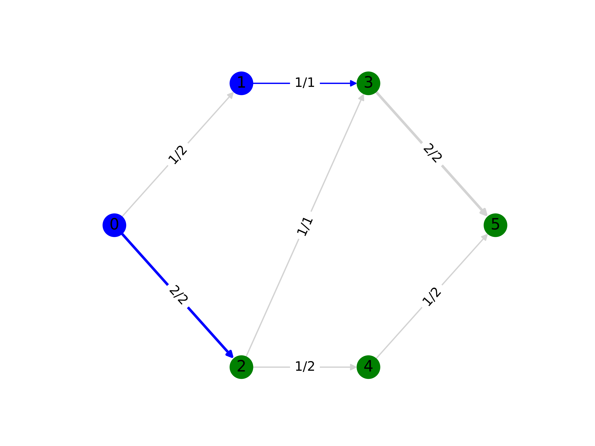

Maximum Flow / Minimum Cut
==========================

The maximum flow and minimum cut problems are closely related due to their
mathematical properties. In the former, we are aiming to find the maximum flow
that can be routed through a given network from source vertex to sink vertex
subject to some edge capacities. The latter finds a set of edges, or a cut, that
minimises the total capacity of the edges which if removed would disconnect the
source from the sink.

The first algorithm to solve this problem was proposed
:footcite:t:`ford1956maximal`, called the Ford-Fulkerson algorithm.  Later on
:footcite:t:`goldberg1988new` proposed the famous push-relabel algorithm, and
more recently :footcite:t:`orlin2013max` and other authors have proposed
polynomial-time algorithms for this problem.

Problem Specification
---------------------

We provide the graph theory and mathematical definition of this problem.

.. tabs::

    .. tab:: Graph Theory

        For a given graph :math:`G` with set of vertices :math:`V` and edges
        :math:`E`. Each edge :math:`(i,j)\in E` has a capacity attribute
        :math:`B_{ij}\in\mathbb{R}`.

        Given a source and sink vertices :math:`s\in V` and :math:`t\in V`,
        respectively, the problem can be stated as finding the flow with maximum
        value from :math:`s` to :math:`t` such that the flow is capacity
        feasible.

    .. tab:: Optimization Model

        Let us define a set of continuous variables :math:`x_{ij}` to represent
        the amount of non-negative (:math:`\geq 0`) flow going through an edge
        :math:`(i,j)\in E`.

        The mathematical formulation can be stated as follows:

        .. math::

            \begin{alignat}{2}
              \max \quad        & \sum_{j \in \delta^+(s)} x_{sj} \\
              \mbox{s.t.} \quad & \sum_{j \in \delta^-(i)} x_{ji} = \sum_{j \in \delta^+(i)} x_{ij} & \quad\forall i \in V\setminus\{s,t\} \\
                                & 0 \leq x_{ij} \le B_{ij} & \forall (i, j) \in E \\
            \end{alignat}

        Where :math:`\delta^+(\cdot)` (:math:`\delta^-(\cdot)`) denotes the
        outgoing (incoming) neighbours.

        The objective maximises the total flow outgoing from the source vertex.

        The first constraints ensure flow balance for all vertices (other than
        the source or sink). That is, for a given node, the outgoing flow must
        be equal to the incoming flow.

        The last constraints ensure non-negativity of the variables and that the
        capacity per edge is not exceeded.

        The mathematical relationship between the maximum-flow and the
        minimum-cut is as follows: the minimum-cut formulation is the dual of
        the maximum flow formulation.

|

Code and Inputs
---------------

For this mod, one can use input graphs of different types:

* pandas: using a ``pd.DataFrame``;
* NetworkX: using a ``nx.DiGraph`` or ``nx.Graph``;
* SciPy.sparse: using some ``sp.sparray`` matrices and NumPy's ``np.ndarray``.

An example of these inputs with their respective requirements is shown below.

.. tabs::

  .. group-tab:: pandas

      .. doctest:: load_graph
          :options: +NORMALIZE_WHITESPACE

          >>> from gurobi_optimods import datasets
          >>> edge_data, _ = datasets.load_graph(cost=False, demand=False)
          >>> edge_data
                         capacity
          source target
          0      1              2
                 2              2
          1      3              1
          2      3              1
                 4              2
          3      5              2
          4      5              2

      The ``edge_data`` DataFrame is indexed by ``source`` and ``target`` nodes
      and contains columns labelled ``capacity`` with the edge attributes.

      The ``node_data`` DataFrame is indexed by node and contains columns
      labelled ``demand``.

  .. group-tab:: NetworkX

      .. doctest:: load_graph_networkx
          :options: +NORMALIZE_WHITESPACE

          >>> from gurobi_optimods import datasets
          >>> G = datasets.load_graph_networkx(cost=False, demand=False)
          >>> for e in G.edges(data=True):
          ...     print(e)
          ...
          (0, 1, {'capacity': 2})
          (0, 2, {'capacity': 2})
          (1, 3, {'capacity': 1})
          (2, 3, {'capacity': 1})
          (2, 4, {'capacity': 2})
          (3, 5, {'capacity': 2})
          (4, 5, {'capacity': 2})

      Edges have attributes ``capacity``.

  .. group-tab:: scipy.sparse

      .. doctest:: load_graph_scipy
          :options: +NORMALIZE_WHITESPACE

          >>> from gurobi_optimods import datasets
          >>> G, capacities, _, _ = datasets.load_graph_scipy(cost=False, demand=False)
          >>> G
          <5x6 sparse matrix of type '<class 'numpy.int64'>'
                  with 7 stored elements in COOrdinate format>
          >>> print(G)
            (0, 1)        1
            (0, 2)        1
            (1, 3)        1
            (2, 3)        1
            (2, 4)        1
            (3, 5)        1
            (4, 5)        1
          >>> print(capacities)
            (0, 1)        2
            (0, 2)        2
            (1, 3)        1
            (2, 3)        1
            (2, 4)        2
            (3, 5)        2
            (4, 5)        2

      Three separate sparse matrices including the adjacency matrix, edge
      capacity and cost, and a single array with the demands per node.

|

Solution
--------

Depending on the input of choice, the solution also comes with different
formats.

.. tabs::

  .. group-tab:: pandas

      .. doctest:: max_flow_min_cut
          :options: +NORMALIZE_WHITESPACE

          >>> from gurobi_optimods import datasets
          >>> from gurobi_optimods.max_flow import max_flow
          >>> edge_data, _ = datasets.load_graph(cost=False, demand=False)
          >>> obj, flow = max_flow(edge_data, 0, 5, silent=True) # Find max-flow between nodes 0 and 5
          >>> obj
          3.0
          >>> flow
          source  target
          0       1         1.0
                  2         2.0
          1       3         1.0
          2       3         1.0
                  4         1.0
          3       5         2.0
          4       5         1.0
          dtype: float64
          >>> from gurobi_optimods.min_cut import min_cut
          >>> obj, partition, cutset = min_cut(edge_data, 0, 5, silent=True)
          >>> obj
          3.0
          >>> partition
          ({0, 1}, {2, 3, 4, 5})
          >>> cutset
          {(0, 2), (1, 3)}

      The ``max_flow`` function returns the cost of the solution as well
      as ``pd.Series`` with the flow per edge. Similarly as the input
      DataFrame the resulting series is indexed by ``source`` and ``target``.
      In this case, the resulting maximum flow has value 3.

      The ``min_cut`` function returns the mimimum cutset value, the partition
      of the nodes and the edges in the cutset.

  .. group-tab:: NetworkX

      .. doctest:: max_flow_min_cut_networkx
          :options: +NORMALIZE_WHITESPACE

          >>> from gurobi_optimods import datasets
          >>> from gurobi_optimods.max_flow import max_flow
          >>> G = datasets.load_graph_networkx(cost=False, demand=False)
          >>> obj, sol = max_flow(G, 0, 5, silent=True)
          >>> obj
          3.0
          >>> sol
          {(0, 1): 1.0, (0, 2): 2.0, (1, 3): 1.0, (2, 3): 1.0, (2, 4): 1.0, (3, 5): 2.0, (4, 5): 1.0}
          >>> from gurobi_optimods.min_cut import min_cut
          >>> obj, part, cut = min_cut(G, 0, 5, silent=True)
          >>> obj
          3.0
          >>> part
          ({0, 1}, {2, 3, 4, 5})
          >>> cut
          {(0, 2), (1, 3)}

      The ``max_flow`` function returns the cost of the solution
      as well as a dictionary indexed by edge with the non-zero flow.

      The ``min_cut`` function returns the mimimum cutset value, the partition
      of the nodes and the edges in the cutset.

  .. group-tab:: scipy.sparse

      .. doctest:: max_flow_min_cut_scipy
          :options: +NORMALIZE_WHITESPACE

          >>> from gurobi_optimods import datasets
          >>> from gurobi_optimods.max_flow import max_flow
          >>> G, capacities, _, _ = datasets.load_graph_scipy(cost=False, demand=False)
          >>> G.data = capacities.data
          >>> obj, sol = max_flow(G, 0, 5, silent=True)
          >>> obj
          3.0
          >>> sol
          <5x6 sparse matrix of type '<class 'numpy.float64'>'
                  with 7 stored elements in COOrdinate format>
          >>> print(sol)
            (0, 1)        1.0
            (0, 2)        2.0
            (1, 3)        1.0
            (2, 3)        1.0
            (2, 4)        1.0
            (3, 5)        2.0
            (4, 5)        1.0
          >>> from gurobi_optimods.min_cut import min_cut
          >>> obj, part, cutset = min_cut(G, 0, 5, silent=True)
          >>> obj
          3.0
          >>> part
          ({0, 1}, {2, 3, 4, 5})
          >>> cutset
          {(0, 2), (1, 3)}

      The ``max_flow`` function returns the flow of the solution as
      well as a ``sp.sparray`` with the edges where the data is the amount of
      non-zero flow in the solution.

      The ``min_cut`` function returns the mimimum cutset value, the partition
      of the nodes and the edges in the cutset.

The solution for this example is shown in the figure below. The edge labels
denote the edge capacity and resulting flow: :math:`(B_{ij}, x^*_{ij})`. All
edges in the maximum flow solution carry some flow. The cutset from the minimum
solution is shown with the edges in blue, and the nodes in the partitions are
shown in blue and in green.

In all these cases, the model is solved as an LP by Gurobi.

.. collapse:: View Gurobi Logs

    .. code-block:: text

        Solving min-cost flow with 6 nodes and 7 edges
        Gurobi Optimizer version 10.0.1 build v10.0.1rc0 (mac64[arm])

        CPU model: Apple M1
        Thread count: 8 physical cores, 8 logical processors, using up to 8 threads

        Optimize a model with 6 rows, 7 columns and 14 nonzeros
        Model fingerprint: 0xc6fc382e
        Coefficient statistics:
          Matrix range     [1e+00, 1e+00]
          Objective range  [1e+00, 1e+01]
          Bounds range     [1e+00, 2e+00]
          RHS range        [1e+00, 2e+00]
        Presolve removed 4 rows and 4 columns
        Presolve time: 0.00s
        Presolved: 2 rows, 3 columns, 6 nonzeros

        Iteration    Objective       Primal Inf.    Dual Inf.      Time
               0    2.7994000e+01   1.002000e+00   0.000000e+00      0s
               1    3.1000000e+01   0.000000e+00   0.000000e+00      0s

        Solved in 1 iterations and 0.00 seconds (0.00 work units)
        Optimal objective  3.100000000e+01

----

.. footbibliography::
