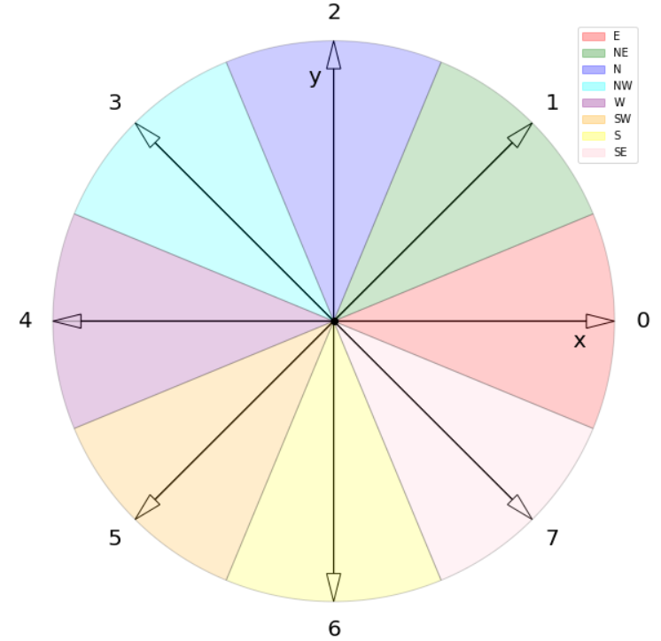
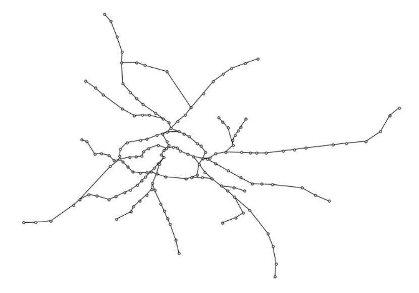
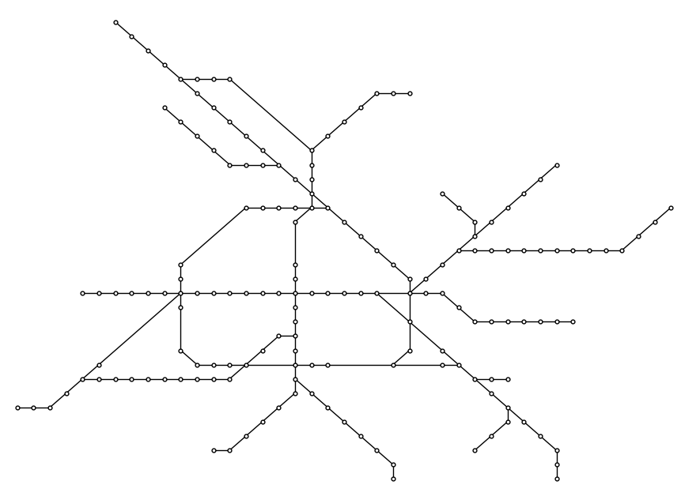

Metro Map: Computing an Octilinear Graph Representation
=======================================================

A metro map is a schematic drawing of metro lines with stations and transfer
stations. A schematic graph drawing aims to ease navigation, such as how to get
from A to B in a transportation network. There are several different
requirements for a schematic graph drawing. In this OptiMod, we will consider an
octilinear representation, i.e., the edges of the network are restricted to
horizontals, verticals, and diagonals at 45 degrees. Such a schematic drawing
is of special interest when showing metro lines, but could also be useful for general
transportation networks or graphs. Note that an octilinear representation
requires a maximum vertex degree of eight. If satisfied, this OptiMod computes
an octilinear representation for any undirected graph. The original geographical
information of the graph is included. More precisely, the geographical
information defines an input embedding, which is preserved in the schematic
representation. The mathematical formulation is based on the one given by
Nöllenburg :footcite:p:`noellenburg05`. This diploma thesis provides additional
detailed descriptions and explanations. However, we slightly changed some
variable types and, hence, some constraints.

Problem Specification
---------------------

Let :math:`G` be an undirected graph with a set of nodes :math:`V` and edges
:math:`E`. For each node, a geographical position is given as x- and y-coordinates.

In the octilinear representation, the edge can be drawn in eight different
directions when fixing one of its endpoints. Considering the edge
:math:`(u,v)\in E`, the node :math:`v` can be in the east, north-east, north,
north-west, west, south-west, south, or south-east of :math:`u`. We enumerate
these directions from 0 to 7, starting with the east and traversing the
directions counter-clockwise. The figure below shows the idea. Assume the node
:math:`u` is positioned in the center. The edge :math:`(u,v)` can follow the
directions 0 to 7 that represent the cardinal directions.

    Idea of the octilinear representation. Assuming a node :math:`u` in the
    center, an edge :math:`(u,v)` can be drawn in directions 0 to 7.

Based on the directions, we can determine conditions on the coordinates. For
example, if the direction of :math:`(u,v)` is 0, then :math:`u` and :math:`v`
have the same y-coordinate while the x-coordinate of :math:`v` must be at least
one larger than the one of :math:`u`.

In this OptiMod, an octilinear graph representation is computed. More precisely,
for each edge, a direction (0 to 7) is computed, and all nodes are assigned to x-
and y-coordinates that support the edge directions. Additionally, the following
is considered

* The original positions of the nodes are respected in the following way:

  * Only directions that align with the original direction or are directly
    neighbored are allowed. For example, if :math:`v` is north-east (1) from :math:`u`
    in the original positions, it is allowed to place v north, north-east, or
    east in the octilinear representation, i.e., for the edge :math:`(u,v)` the
    directions 2, 1, and 0 are allowed.
  * The ordering of all adjacent nodes of a node :math:`v` is preserved.
* The distance (difference in x- or y-coordinate) between each two nodes is at
  least one and as minimal as possible
* If a set of paths in the graph is given (representing, for example, metro lines),
  the bends along the lines are minimized.
* If possible, ensure planarity.

Some remarks about planarity: The number of constraints to ensure planarity is
quadratic in the number of edges of the graph. Hence, the planarity part is the
largest part of the model. Instead of adding all the constraints initially, we
use a callback approach and lazily add these constraints, i.e., only when they
are violated. Moreover, the planarity restrictions are included as soft
constraints, i.e., if there is no planar representation, an embedding with the
fewest planarity violations is computed. There is an option to turn off the
planarity requirement. The restrictions from the origin geographical positions
often imply a planar solution without including planarity constraints. In these
cases, the performance can be improved if planarity constraints are not
considered.

We consider three weights to balance the different parts of the objective. The
weight :math:`w_o` is a penalty for a direction of an edge :math:`(u,v)`. More
precisely, it penalizes the direction if :math:`v` is not placed in the original
but at a neighboring direction. The weight :math:`w_d` penalizes a distance of
an edge greater than a minimum distance of one, and :math:`w_b` penalizes the
line bends. These three weights have a default value of 1 but are parameterized
and can be adapted. Additionally, the planarity violations are included in the
objective. They are weighted with 1000. This should be considered when choosing
weights for :math:`w_o`, :math:`w_d`, and :math:`w_b`; we restrict the values to
be between 0 and 100.

Background: Mathematical Formulation
------------------------------------

This OptiMod is implemented by formulating a Linear Program (LP) and solving it
using Gurobi. Instead of presenting the complete formulation as a whole (which
is too bulky), the different aspects of the model are discussed below.

.. dropdown:: Variables

  We use the following variables:

  - :math:`d(u,v,r)\in\{0,1\}` for :math:`(u,v)\in E` and :math:`r\in\{0,1,\ldots,7\}`
    which indicates whether the direction from :math:`u` to :math:`v` is :math:`r`.
  - :math:`x(v) \geq 0` the x-coordinate of node :math:`v` in an octilinear representation
  - :math:`y(v) \geq 0` the y-coordinate of node :math:`v` in an octilinear representation
  - :math:`\delta(u,v)\geq 0` the distance of :math:`u` and :math:`v` for each edge
    :math:`(u,v)\in E` that is larger than the minimum required distance of 1
  - :math:`b(u,v,w,i)\in\{0,1\}` the bend of category :math:`i` on two adjacent edges
    :math:`(u,v), (v,w)\in E`. The category corresponds to the angle of the
    bend. The angle can be equal to 180 (=category 0), 135 (=category 1), 90
    (=category 2), and 45 degrees (=category 3).

.. dropdown:: Objective Function

  .. math::
      \begin{alignat}{2}
          \min \quad        & \sum_{(u,v) \in E} w_d\cdot \delta(u,v) \\
          & + \sum_{(u,v) \in E} \sum_{j\in J_{uv}} w_o\cdot d(u,v,j)\\
          &  + \sum_{v\in V} \sum_{u,w\in V:(u,v),(v,w)\in E} w_b\cdot |L_{u,v,w}| (b(u,v,w,1) + 2b(u,v,w,2) + 3b(u,v,w,3)) \\
      \end{alignat}

  The objective minimizes a weighted sum of

  - the distances,
  - the directions that do not correspond to the original directions
    (here indicated by the set :math:`J_{uv}` for an edge :math:`(u,v)\in E`),
  - and the bends for each line weighted by its bend category, i.e., the
    cost increases with the acuteness of the angle. Here
    :math:`|L_{u,v,w}|` amounts the number of lines traversing the
    adjacent edges :math:`(u,v),(v,w)\in E`.

  These three parts are weighted by :math:`w_d`, :math:`w_o`, and :math:`w_b`.
  Note that the direction variables :math:`d(u,v,j)` for all directions :math:`j`
  not equivalent to the original direction, or their direct neighbors are set to 0.

  The penalization of planarity violations is omitted here for ease of
  notation but briefly discussed in the planarity section.

.. dropdown:: Direction Variables and Coordinates

  We ensure that the direction from :math:`u` to :math:`v` matches the reverse
  direction from :math:`v` to :math:`u`.

  .. math::
        d(u,v,i) = d(v,u,i+4) \qquad \forall (u,v) \in E, i=0,\ldots,3\\
        d(u,v,i) = d(v,u,i-4) \qquad \forall (u,v) \in E, i=4,\ldots,7\\

  The next constraint requires that exactly one directions is chosen for each edge.

  .. math::
      \sum_{i=0}^7 d(u,v,i) = 1 \qquad \forall (u,v) \in E\\

  Finally, we have constraints to define the conditions on the x- and
  y-coordinates that need to be satisfied if a certain direction is chosen for
  the edge.

  .. math::
      \begin{alignat}{2}
                    & d(u,v,0) = 1 \Rightarrow y(v) = y(u)& \forall (u,v) \in E\\
                    & d(u,v,0) = 1 \Rightarrow x(v) - x(u) \geq 1& \forall (u,v) \in E\\
                    & d(u,v,1) = 1 \Rightarrow x(u) - y(u) = x(v) - y(v)& \forall (u,v) \in E\\
                    & d(u,v,1) = 1 \Rightarrow x(v) + y(v) - (x(u) + y(u)) \geq 2 \qquad& \forall (u,v) \in E\\
                    & d(u,v,2) = 1 \Rightarrow x(u) = x(v)& \forall (u,v) \in E\\
                    & d(u,v,2) = 1 \Rightarrow y(v) - y(u) \geq 1& \forall (u,v) \in E\\
                    & d(u,v,3) = 1 \Rightarrow x(u) + y(u) = x(v) + y(v)& \forall (u,v) \in E\\
                    & d(u,v,3) = 1 \Rightarrow x(u) - y(u) - (x(v) - y(v)) \geq 2& \forall (u,v) \in E\\
                    & d(u,v,4) = 1 \Rightarrow y(v) = y(u)& \forall (u,v) \in E\\
                    & d(u,v,4) = 1 \Rightarrow x(u) - x(v) \geq 1& \forall (u,v) \in E\\
                    & d(u,v,5) = 1 \Rightarrow x(u) - y(u) = x(v) - y(v)& \forall (u,v) \in E\\
                    & d(u,v,5) = 1 \Rightarrow x(u) + y(u) - (x(v) + y(v)) \geq 2& \forall (u,v) \in E\\
                    & d(u,v,6) = 1 \Rightarrow x(u) = x(v)& \forall (u,v) \in E\\
                    & d(u,v,6) = 1 \Rightarrow y(u) - y(v) \geq 1& \forall (u,v) \in E\\
                    & d(u,v,7) = 1 \Rightarrow x(u) + y(u) = x(v) + y(v)& \forall (u,v) \in E\\
                    & d(u,v,7) = 1 \Rightarrow x(v) - y(v) - (x(u) - y(u)) \geq 2& \forall (u,v) \in E\\
      \end{alignat}

  Note that the minimum distance between two different nodes need to be 1 in either x- or y-coordinate.
  To ensure this for diagonal directions we need to require a right-hand-side of 2.

.. dropdown:: Edge Order

  To ensure the preservation of the original edge order, it is sufficient to
  consider all nodes that have at least two adjacent nodes. We need auxiliary
  binary variables :math:`\beta_v^i` for each such node :math:`v` and each
  adjacent node :math:`i` of :math:`v`. Let the adjacent nodes of :math:`v` be
  ordered counter-clockwise and assume that :math:`w_0,\ldots, w_{\deg(v)}`
  fulfills this order. Then also in the octilinear representation the nodes need
  to have the same counter-clockwise order, i.e., the direction from neighbor
  node :math:`i` to :math:`i+1` increases with at most one exception (when
  switching from direction 7 to 0). For this exception we allow
  :math:`\beta_v^i` to be 1. The following constraints define the requirement.

  .. math::
    \begin{alignat}{2}
      &\sum_{i=0}^{\deg(v)} \beta_{v}^i \leq 1 \\
      &\beta_{v}^i = 0 \Rightarrow  \sum_{k=0}^7 k\cdot d(v,w_i,k) \leq \sum_{k=0}^7k\cdot d(v,w_{i+1},k) -1  \quad\forall i=\{0,\deg(v)-1\}\\
      &\beta_{v}^{\deg(v)} = 0 \Rightarrow  \sum_{k=0}^7 k\cdot d(v,w_{\deg(v)},k) \leq \sum_{k=0}^7k\cdot d(v,w_{0},k) -1
    \end{alignat}

.. dropdown:: Distance

  The minimum distance between two nodes of one edge is 1 in either x- or
  y-coordinate. This is ensured via constraints, see section on Direction
  Variables and Coordinates. The distance variables count every additional
  distance in x- and y-coordinates.

  .. math::
      \begin{alignat}{2}
        & \delta(u,v) = \delta(v,u) & \forall (u,v) \in E\\
        & \delta(u,v) \geq x(v) - x(u) - 1 \quad& \forall (u,v) \in E\\
        & \delta(u,v) \geq x(u) - x(v) - 1 & \forall (u,v) \in E\\
        & \delta(u,v) \geq y(v) - y(u) - 1 & \forall (u,v) \in E\\
        & \delta(u,v) \geq y(u) - y(v) - 1 & \forall (u,v) \in E\\
      \end{alignat}

.. dropdown:: Line Bends

  Whenever, a line traverses the adjacent edges :math:`(u,v)` and
  :math:`(v,w)`, we want to amount the bend of the two edges in the octilinear
  representation. There are four possibilities reflected by the variables
  :math:`b(u,v,w,0)` (no bend, 180 degrees), :math:`b(u,v,w,1)` (a bend of 135
  degrees), :math:`b(u,v,w,2)` (a bend of 90 degrees), and :math:`b(u,v,w,3)` (a
  bend of 45 degrees). The following constraints ensure that exactly one of
  these variables is chosen and that the bend in direction :math:`u,v,w` is
  equal to the bend in direction :math:`w,v,u`.

  .. math::
      \begin{alignat}{2}
        & b(u,v,w,0) + b(u,v,w,1) + b(u,v,w,2) + b(u,v,w,3) = 1 \\
        & b(u,v,w,i) = b(w,v,u,i) &  \forall i\in\{0,1,2,3\}\\
      \end{alignat}

  The angle or the bend category can be determined from the direction
  variables of the edges. The following constraints require that the
  directions of the edges :math:`(u,v)` and :math:`(v,u)` match the bend
  variable.

  .. math::
      \begin{alignat}{2}
        & b(u,v,w,0) \geq d(u,v,k) + d(v,w,k) - 1 &  \forall k\in\{0,\ldots,7\}\\
        & b(u,v,w,i) \geq d(u,v,k) + d(v,w,k+i) - 1 &  \forall i\in\{1,2,3\}, k\in\{0,\ldots,7-i\}\\
        & b(u,v,w,i) \geq d(u,v,k) + d(v,w,k-i) - 1 &  \forall i\in\{1,2,3\}, k\in\{i,\ldots,7\}\\
        & b(u,v,w,8-i) \geq d(u,v,k) + d(v,w,k+i) - 1 & \quad \forall i\in\{5,6,7\}, k\in\{0,\ldots,7-i\}\\
        & b(u,v,w,8-i) \geq d(u,v,k) + d(v,w,k-i) - 1 &  \forall i\in\{5,6,7\}, k\in\{i,\ldots,7\}\\
      \end{alignat}

.. dropdown:: Planarity

  To guarantee planarity we have to ensure that pairs of edges do not
  intersect. Again, we use the eight possible directions to express
  which direction an edge :math:`e2` is relative to an edge :math:`e1`. For
  example, fixing the position of edge :math:`e1` the second edge :math:`e2`
  must be placed east, east-north, north, north-west, west, south-west,
  south, or south-east of :math:`e1`.

  We define variables that express this positional relation between each two
  edges. Let :math:`\gamma(u1,v1,u2,v2,i) \in\{0,1\}` be a binary variable
  that indicate that edge :math:`(u2,v2)\in E` is positioned in direction
  :math:`i` from edge :math:`(u1,v1)`. We add an additional variable
  :math:`\gamma(u1,v1,u2,v2)^o \in\{0,1\}` to capture non-planarity for these
  two edges. This variable is added with a cost of 1000 to the objective function.

  In this way, either a planarity violation is counted or one of the other
  planarity variables need to be chosen which implies conditions on the
  positions of the nodes of the edges. As an example, we only present the
  constraints for the condition that edge :math:`(u2,v2)\in E` is positioned
  in direction 3 (north-west) from edge :math:`(u1,v1)`.

  .. math::
      \begin{alignat}{2}
        & \sum_{i=0}^7 \gamma(u1,v1,u2,v2,i) + \gamma(u1,v1,u2,v2)^o = 1\\
        &\cdots\\
        & \gamma(u1,v1,u2,v2,3) = 1 \Rightarrow x(u1) - y(u1) - (x(u2) - y(u2)) \geq 1\\
        & \gamma(u1,v1,u2,v2,3) = 1 \Rightarrow x(u1) - y(u1) - (x(v2) - y(v2)) \geq 1\\
        & \gamma(u1,v1,u2,v2,3) = 1 \Rightarrow x(v1) - y(v1) - (x(u2) - y(u2)) \geq 1\\
        & \gamma(u1,v1,u2,v2,3) = 1 \Rightarrow x(v1) - y(v1) - (x(v2) - y(v2)) \geq 1\\
        &\cdots
      \end{alignat}

  The constraints need to be defined for all directions and for each two
  non-adjacent edges. We include these constraints as lazy constraints in a
  callback function. Note that indicator constraints cannot be added in a
  callback function. Hence, we define these constraints as big-M constraints.

.. dropdown:: Improving Constraints

  The IP model is well-defined with the above-discussed constraints. However, we
  want to add some further constraints to slightly improve the LP relaxation and
  the performance of the optimization.

  The first constraint ensures that each direction is chosen only once
  for all edges adjacent to :math:`v`

  .. math::
      \sum_{w:(v,w)\in E} d(v,w,i) \leq 1 \qquad \forall v\in V, \forall i\in\{0,\ldots,7\}\\

  Inspired by the fact that geographical restrictions allow only three possible
  directions for each edge, we can observe the following. If, for example, only
  the directions 0, 1, and 2 are allowed for an edge :math:`(u,v)`, i.e.,
  :math:`d(u,v,3)=d(u,v,4)=d(u,v,5)=d(u,v,6)=d(u,v,7)=0`, we are in the positive
  part of the coordinate system and the following constraints must hold

  .. math::
    \begin{alignat}{2}
      x(v) & \geq x(u)\\
      y(v) & \geq y(u) \\
      x(v) + y(v) & > x(u) + y(u)
    \end{alignat}

  Similar constraints result when considering all other combinations of 3
  adjacent directions. We add these conditions as big-M constraints to the model
  and use an epsilon of 1e-6 (=feasibility tolerance) to handle the strict
  inequality.

  For the bend variables, the following constraint can be added

  .. math::
      \sum_{(v,w)\in E, w\neq u} b(u,v,w,0) \leq 1 \quad \forall (u,v) \in E

  The constraint states that edge :math:`(u,v)` can have a bend of 0 with at
  most one of its adjacent edges.

  All these improving constraints are added by default. However, a parameter
  ``improve_lp`` that can be set to False and then these improving
  constraints are not added.

Code and Inputs
---------------

For this OptiMod, the ``networkx`` package is needed. The input is a
``networkx`` graph for the network information and a ``pd.DataFrame`` for the line
information. The output is a ``networkx`` graph with node property ``pos_oct``
representing the x-and y-coordinates for the octilinear representation and a
Python dictionary for the direction of each edge.

An example of the inputs with the respective requirements is shown below.

.. doctest:: load_graph
    :options: +NORMALIZE_WHITESPACE

    >>> import networkx as nx
    >>> from gurobi_optimods import datasets
    >>> graph, linepath_data = datasets.load_sberlin_graph_data()
    >>> print(graph)
      Graph with 167 nodes and 175 edges
    >>> pos_orig = nx.get_node_attributes(graph, 'pos')
    >>> len(pos_orig)
      167
    >>> linepath_data.head(4)
      linename	edge_source	edge_target
      0	S1	100	78
      1	S1	78	23
      2	S1	23	20
      3	S1	20	60

For the example, we used data from the S-Bahn Berlin network. The graph includes
the node attribute ``pos`` that contains a tuple of x- and y-coordinates for
the original position. The linepath_data must be consistent with
the graph. For example, ``edge_source``, ``edge_target`` in the
``linepath_data`` must correspond to the node names in the graph.

Solution
--------

The output of the optimization is the following:

- A graph with the node attribute ``pos_oct`` containing the x- and
  y-coordinates for the octilinear representation. It also contains the original
  node attribute ``pos`` with the original positions.
- A Python dictionary providing the direction (0 to 7) for each edge. This
  information is needed for the plotting function provided in the OptiMod

The OptiMod can be run as follows:

.. doctest:: solve
    :options: +NORMALIZE_WHITESPACE

    >>> from gurobi_optimods import datasets
    >>> from gurobi_optimods.metromap import metromap
    >>> graph, linepath_data = datasets.load_sberlin_graph_data()
    >>> graph_out, edge_directions = metromap(
    ...     graph, linepath_data, include_planarity=False, verbose=False, time_limit=2
    ... )
    >>> # Show that input and output graphs are isomorphic (structural equivalent)
    >>> import networkx as nx
    >>> print(nx.is_isomorphic(graph, graph_out))
      True
    >>> # Show the first 4 nodes with their attributes
    >>> first_four_nodes_with_attrs = list(graph_out.nodes.data())[:4]
    >>> print(first_four_nodes_with_attrs)
      [(100, {'pos': (13.248432, 52.754362), 'pos_oct': (7.0, 33.0)}),
       (78, {'pos': (13.263191, 52.741273), 'pos_oct': (8.0, 32.0)}),
       (23, {'pos': (13.276771, 52.714491), 'pos_oct': (9.0, 31.0)}),
       (20, {'pos': (13.288417, 52.687871), 'pos_oct': (10.0, 30.0)})]

Note, for this demonstration the parameter ``include_planarity`` is set to
False, and we chose a time limit of 2 seconds. This is done to see results
faster. For this example, the planarity constraints are usually satisfied. If
the planarity constraints should be included in the computation, the parameter
``include_planarity`` can be omitted or set to True.
The ``time_limit`` parameter can also be omitted if no time limit shall be set.

The graph can be plotted using the networkx plotting function, for example, as
follows::

    pos_oct=nx.get_node_attributes(graph_out, "pos_oct")
    nx.draw(
        graph_out,
        pos_oct,
        with_labels=False,
        node_size=12,
        edgecolors="black",
        node_color="white",
    )

As a comparison the original node positions can be plotted as well::

    pos_orig=nx.get_node_attributes(graph, "pos")
    nx.draw(
        graph,
        pos_orig,
        with_labels=False,
        node_size=12,
        edgecolors="black",
        node_color="white",
    )

Below is a ``networkx`` plot of the graph with the original positions (left) and
the computed octilinear positions (right) for the S-Bahn Berlin network.

We provide a method to plot the lines in the octilinear representation using ``plotly``.
In order to use this functionality, the ``plotly`` package is needed.

The plot function generates a plot that is opened in a browser. The lines can be
turned off and on in this plot when clicking the respective name in the legend.
The plot function can be called as follows::

    from gurobi_optimods.metromap import plot_map
    plot_map(graph_out, edge_directions, linepath_data)

The following figure is an example of the above call, it shows the lines in the
octilinear representation of the S-Bahn Berlin network.
(Use `link <../_static/sbahn_berlin.html>`_ to open in full screen.)

.. raw:: html

    <iframe src="../_static/sbahn_berlin.html" width="100%" height="600"></iframe>

Note that plotting the lines in the octilinear network is an art or a further
optimization problem. If lines share an edge, it needs to be decided how to shift
the lines so that both can be distinguished, which is above, below, left, or
right, and which colors should be used.
The plotting function that is provided in this OptiMod is not very sophisticated.
Feel free to contribute with improvement ideas.

Parameter: Planarity and Objective Function
-------------------------------------------

As already mentioned, it is possible to change the weights in the objective or
omit the planarity restrictions. The planarity parameter was already considered
in the solve example. The default value is true, i.e., if the parameter is not
set when calling the ``metromap`` function, the planarity constraints are
included via a callback function.

Similar holds for the weights of the different parts in the objective. The
default value for all weights is 1. If a different weighting is requested, this
can be done as follows::

  graph_out, edge_directions = metromap(
      graph,
      linepath_data,
      penalty_edge_directions=2,
      penalty_line_bends=0,
      penalty_distance=1,
  )

Combination with Line Optimization OptiMod
------------------------------------------
After computing an optimal line plan with the Line Optimization OptiMode, an
octilinear representation and the corresponding metromap can be computed with
this OptiMod. Here is an example of how this could be done

.. testcode:: combine

  # import all requirements
  import networkx as nx
  from gurobi_optimods import datasets
  from gurobi_optimods.line_optimization import line_optimization
  from gurobi_optimods.metromap import metromap
  from gurobi_optimods.metromap import plot_map

  # load data for line optimization and compute line plan
  node_data, edge_data, line_data, linepath_data, demand_data = (
      datasets.load_siouxfalls_network_data()
  )
  frequencies = [1, 3]
  obj_cost, final_lines = line_optimization(
      node_data,
      edge_data,
      line_data,
      linepath_data,
      demand_data,
      frequencies,
      True,
      verbose=False,
  )
  # create a data frame containing only the linepaths of the solution
  linepath_data_sol = linepath_data.loc[
      linepath_data["linename"].isin([tuple[0] for tuple in final_lines])
  ]
  # create networkx graph
  graph = nx.from_pandas_edgelist(
      edge_data.reset_index(), create_using=nx.Graph()
  )
  # add x-, y-coordinates as node attribute
  for number, row in node_data.set_index("number").iterrows():
      graph.add_node(number, pos=(row["posx"], row["posy"]))
  # compute and plot metromap
  graph_out, edge_directions = metromap(graph, linepath_data_sol, verbose=False)
  plot_map(graph_out, edge_directions, linepath_data_sol)

Further Remarks
---------------

It is possible to compute an octilinear representation of a graph without
providing a set of lines. Of course, line bends are then not considered in the
objective. The ``linepath_data`` parameter can be omitted in this case::

  graph_out, edge_directions = map.metromap(graph)

It is also possible to provide a graph without any information about the
original positions, i.e., without the node attribute ``pos``. In this case, all
directions for an edge are allowed, and no direction is penalized. Moreover,
there is no given edge order that needs to be preserved. However, note that in
this case, the problem usually becomes much harder to solve. A different approach
or a strengthened model formulation might be necessary to solve medium-sized
problems to optimality if no further restrictions from original positions are
given.

.. footbibliography::
