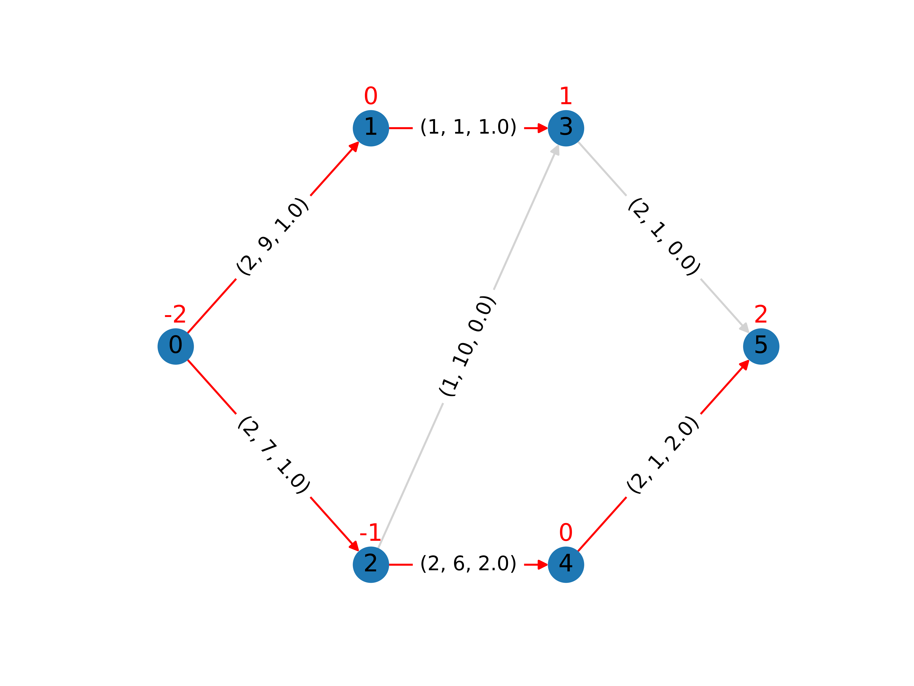

Minimum Cost Flow
=================

Minimum cost flow problems are defined on a graph or network where the goal is
to send an amount of flow. Other graph problems can be modelled using this
framework (with suitable alterations).

Problem Specification
---------------------

.. tabs::

    .. tab:: Graph Theory

        For a given graph :math:`G` with set of vertices :math:`V` and edges
        :math:`E`. For a given :math:`(i,j)\in E`, we have:

        - cost: :math:`c_{ij}\in \mathbb{R}`;
        - and capacity: :math:`B_{ij}\in\mathbb{R}`.

        Also, each vertex :math:`i\in V` has a demand :math:`d_i\in\mathbb{R}`.

        The problem can be stated as finding a capacity feasible flow such that
        the total cost is minimised and the demand at each vertex is met.

    .. tab:: Optimization Model

        For a given graph :math:`G` with set of vertices :math:`V` and edges
        :math:`E`. For a given :math:`(i,j)\in E`, we have:

        - cost: :math:`c_{ij}\in \mathbb{R}`;
        - and capacity: :math:`B_{ij}\in\mathbb{R}`.

        Also, each vertex :math:`i\in V` has a demand :math:`d_i\in\mathbb{R}`.
        A negative demand indicates a supply vertex whereas a positive demand
        indicates a consumer vertex.

        Let us define a set of continuous variables :math:`x_{ij}` to represent
        the amount of flow going through an edge.

        The mathematical formulation can be stated as follows:

        .. math::

            \begin{alignat}{2}
              \min \quad        & \sum_{(i, j) \in E} c_{ij} x_{ij} \\
              \mbox{s.t.} \quad & \sum_{j \in \delta^+(i)} x_{ij} - \sum_{j \in \delta^-(i)} x_{ji} = d_i & \forall i \in V \\
                                & 0 \leq x_{ij} \le B_{ij} & \forall (i, j) \in E \\
            \end{alignat}

        Where :math:`\delta^+(\cdot)` (:math:`\delta^-(\cdot)`) denotes the outgoing (incoming) neighours.

The input data for this mod includes interfaces for the following:

* pandas;
* Networkx ;
* SciPy.sparse.

|

Code and Inputs
---------------

.. tab-set::

    .. tab-item:: pandas
        :sync: pd

        .. doctest:: load_min_cost_flow
            :options: +NORMALIZE_WHITESPACE

            >>> from gurobi_optimods import datasets
            >>> edge_data, node_data = datasets.load_min_cost_flow()
            >>> edge_data
                           capacity  cost
            source target
            0      1              2     9
                   2              2     7
            1      3              1     1
            2      3              1    10
                   4              2     6
            3      5              2     1
            4      5              2     1
            >>> node_data
               demand
            0      -2
            1       0
            2      -1
            3       1
            4       0
            5       2

        The ``edge_data`` DataFrame is indexed by ``source`` and ``target``
        nodes contains columns labelled ``capacity`` and ``cost``.

        The ``node_data`` DataFrame is indexed by node and contains columns
        labelled ``demand``.

        We assume that nodes labels are integers.

    .. tab-item:: Networkx
        :sync: nx

        .. doctest:: load_min_cost_flow_networkx
            :options: +NORMALIZE_WHITESPACE

            >>> from gurobi_optimods import datasets
            >>> G = datasets.load_min_cost_flow_networkx()
            >>> for e in G.edges(data=True):
            ...     print(e)
            ...
            (0, 1, {'capacity': 2, 'cost': 9})
            (0, 2, {'capacity': 2, 'cost': 7})
            (1, 3, {'capacity': 1, 'cost': 1})
            (2, 3, {'capacity': 1, 'cost': 10})
            (2, 4, {'capacity': 2, 'cost': 6})
            (3, 5, {'capacity': 2, 'cost': 1})
            (4, 5, {'capacity': 2, 'cost': 1})
            >>> for n in G.nodes(data=True):
            ...     print(n)
            ...
            (0, {'demand': -2})
            (1, {'demand': 0})
            (2, {'demand': -1})
            (3, {'demand': 1})
            (4, {'demand': 0})
            (5, {'demand': 2})

        Edges have attributes ``capacity`` and ``cost`` and nodes have
        attributes ``demand``.

        We assume that nodes labels are integers.

    .. tab-item:: scipy.sparse
        :sync: sp

        .. doctest:: load_min_cost_flow_scipy
            :options: +NORMALIZE_WHITESPACE

            >>> from gurobi_optimods import datasets
            >>> G, capacities, cost, demands = datasets.load_min_cost_flow_scipy()
            >>> G
            <5x6 sparse matrix of type '<class 'numpy.int64'>'
                    with 7 stored elements in COOrdinate format>
            >>> print(G)
              (0, 1)        1
              (0, 2)        1
              (1, 3)        1
              (2, 3)        1
              (2, 4)        1
              (3, 5)        1
              (4, 5)        1
            >>> print(capacities)
              (0, 1)        2
              (0, 2)        2
              (1, 3)        1
              (2, 3)        1
              (2, 4)        2
              (3, 5)        2
              (4, 5)        2
            >>> print(cost)
              (0, 1)        9
              (0, 2)        7
              (1, 3)        1
              (2, 3)        10
              (2, 4)        6
              (3, 5)        1
              (4, 5)        1
            >>> print(demands)
            [-2  0 -1  1  0  2]

|

Solution
--------

.. tab-set::

    .. tab-item:: pandas
        :sync: pd

        .. doctest:: min_cost_flow
            :options: +NORMALIZE_WHITESPACE

            >>> from gurobi_optimods import datasets
            >>> from gurobi_optimods.min_cost_flow import min_cost_flow
            >>> edge_data, node_data = datasets.load_min_cost_flow()
            >>> obj, sol = min_cost_flow(edge_data, node_data, silent=True)
            >>> obj
            31.0
            >>> sol
            source  target
            0       1         1.0
                    2         1.0
            1       3         1.0
            2       3         0.0
                    4         2.0
            3       5         0.0
            4       5         2.0
            dtype: float64

        The ``min_cost_flow`` function returns the cost of the solution as well
        as ``pd.Series`` with the flow per edge. Similarly as the input
        DataFrame the resulting series is indexed by ``source`` and ``target``.

    .. tab-item:: Networkx
        :sync: nx

        .. doctest:: min_cost_flow_networkx
            :options: +NORMALIZE_WHITESPACE

            >>> from gurobi_optimods import datasets
            >>> from gurobi_optimods.min_cost_flow import min_cost_flow_networkx
            >>> G = datasets.load_min_cost_flow_networkx()
            >>> obj, sol = min_cost_flow_networkx(G, silent=True)
            >>> obj
            31.0
            >>> sol
            {(0, 1): 1.0, (0, 2): 1.0, (1, 3): 1.0, (2, 4): 2.0, (4, 5): 2.0}

        The ``min_cost_flow_networkx`` function returns the cost of the solution as well
        as a dictionary with the non-zero flow per edge.

    .. tab-item:: scipy.sparse
        :sync: sp

        .. doctest:: min_cost_flow_networkx
            :options: +NORMALIZE_WHITESPACE

            >>> from gurobi_optimods import datasets
            >>> from gurobi_optimods.min_cost_flow import min_cost_flow_scipy
            >>> G, capacities, cost, demands = datasets.load_min_cost_flow_scipy()
            >>> obj, sol = min_cost_flow_scipy(G, capacities, cost, demands, silent=True)
            >>> obj
            31.0
            >>> sol
            <5x6 sparse matrix of type '<class 'numpy.float64'>'
                    with 5 stored elements in COOrdinate format>
            >>> print(sol)
              (0, 1)        1.0
              (0, 2)        1.0
              (1, 3)        1.0
              (2, 4)        2.0
              (4, 5)        2.0

        The ``min_cost_flow_scipy`` function returns the cost of the solution as
        well as a ``sp.sparray`` with the edges where the data is the amount of
        flow in the solution.

The solution for this example is shown in the following figure below. The edge
labels denote the edge capacity, cost and resulting flow: :math:`(B_{ij},
c_{ij}, x^*_{ij})`.  Edges with non-zero flow are highlighted in red. The demand
for each vertex is shown on top of the vertex in red.

In all these cases, the model is solved as an LP by Gurobi.

.. collapse:: View Gurobi Logs

    .. code-block:: text

        Solving min-cost flow with 6 nodes and 7 edges
        Gurobi Optimizer version 10.0.1 build v10.0.1rc0 (mac64[arm])

        CPU model: Apple M1
        Thread count: 8 physical cores, 8 logical processors, using up to 8 threads

        Optimize a model with 6 rows, 7 columns and 14 nonzeros
        Model fingerprint: 0xc6fc382e
        Coefficient statistics:
          Matrix range     [1e+00, 1e+00]
          Objective range  [1e+00, 1e+01]
          Bounds range     [1e+00, 2e+00]
          RHS range        [1e+00, 2e+00]
        Presolve removed 4 rows and 4 columns
        Presolve time: 0.00s
        Presolved: 2 rows, 3 columns, 6 nonzeros

        Iteration    Objective       Primal Inf.    Dual Inf.      Time
               0    2.7994000e+01   1.002000e+00   0.000000e+00      0s
               1    3.1000000e+01   0.000000e+00   0.000000e+00      0s

        Solved in 1 iterations and 0.00 seconds (0.00 work units)
        Optimal objective  3.100000000e+01

----
