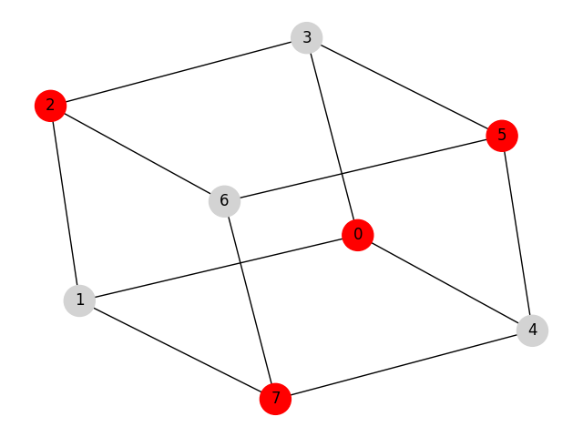

Maximum Weighted Independent Set
================================
The maximum independent set problem is one of the fundamental problems
in combinatorial optimization with ubiquitous applications and connections to
other problems. Maximum clique, minimum vertex cover, and maximum matching are
example problems that can be reduced to a maximum independent set problem.

In this mod, we consider the more general problem of the maximum weighted
independent set (MWIS) which has applications in various fields such as computer
vision, pattern recognition, molecular structure matching, social network analysis,
and genome data mapping. To better understand how a theoretical graph theory
problem can be used to address a real-world challenge, let us review one
application area in detail.

To measure the structural similarity between two molecules, the
molecules are first represented as labeled graphs where the vertices and the edges
correspond to the atoms of the molecule and its chemical bonds, respectively. To
find the largest substructure (subgraph) that appears in both molecular
graphs, it suffices to find the maximum weighted independent set of a third graph,
known as conflict graph. The vertices and the edges of the conflict
graph, in respective terms, represent the possible mappings and conflicts
between two molecules.

Problem Specification
---------------------

Consider an undirected graph :math:`G` with :math:`n` vertices and :math:`m`
edges where each vertex is associated with a positive weight :math:`w`. Find a
maximum weighted independent set, i.e., select a set of vertices in graph
:math:`G` where there is no edge between any pair of vertices and the sum of the
vertex weight is maximum.

Formally stated, let :math:`G = (V, E, w)` be an undirected graph where each
vertex :math:`i \in V` has a positive weight :math:`w_i`. Find a subset :math:`S
\subseteq V` such that:

* no two vertices in :math:`S` are connected by an edge; and
* among all such independent sets, the set :math:`S` has the maximum total
  vertex weight.

.. dropdown:: Background: Optimization Model

    This mod is implemented by formulating a Binary Integer Programming (BIP)
    model and solving it using Gurobi. For each vertex :math:`i \in V`, define a
    binary decision variable :math:`x_i` as below:

    .. math::
        x_i = \begin{cases}
            1 & \text{if vertex}\,i\,\text{belongs to set}\,S\,\\
            0 & \text{otherwise.} \\
        \end{cases}

    The formulation of the MWIS is then given below:

    .. math::
        \begin{align}
        \max \quad        & \sum_{i \in V} w_i x_i \\
        \mbox{s.t.} \quad & x_i + x_j \leq 1 & \forall (i, j) \in E \\
                            & x_i \in \{0, 1\} & \forall i \in V
        \end{align}

The input data for this mod includes a scipy sparse matrix in CSR format
representing the graph :math:`G` adjacency matrix (upper triangular) and a
numpy array representing the weights of the vertices.

Code
----

The example below finds the maximum weighted independent set for
a graph with 8 vertices and 12 edges known as the cube graph.

.. testcode:: mwis

    import scipy.sparse as sp
    import networkx as nx
    import numpy as np
    from gurobi_optimods.mwis import maximum_weighted_independent_set

    # Graph adjacency matrix (upper triangular) as a sparse matrix.
    g = nx.cubical_graph()
    adjacency_matrix = sp.triu(nx.to_scipy_sparse_array(g))
    # Vertex weights
    weights = np.array([2**i for i in range(8)])

    # Compute maximum weighted independent set.
    mwis = maximum_weighted_independent_set(adjacency_matrix, weights)

.. testoutput:: mwis
    :hide:

    ...
    Best objective 1.650000000000e+02, best bound 1.650000000000e+02, gap 0.0000%

Solution
--------

The solution is a numpy array containing the vertices in set :math:`S`.

.. doctest:: mwis
    :options: +NORMALIZE_WHITESPACE

    >>> mwis
    array([0, 2, 5, 7])
    >>> maximum_vertex_weight = sum(weights[mwis])
    >>> maximum_vertex_weight
    165

.. doctest:: mwis
    :options: +NORMALIZE_WHITESPACE

    >>> import networkx as nx
    >>> import matplotlib.pyplot as plt
    >>> layout = nx.spring_layout(g, seed=0)
    >>> color_map = ["red" if node in mwis else "lightgrey" for node in g.nodes()]
    >>> nx.draw(g, pos=layout, node_color=color_map, node_size=600, with_labels=True)

The vertices in the independent set are highlighted in red.

