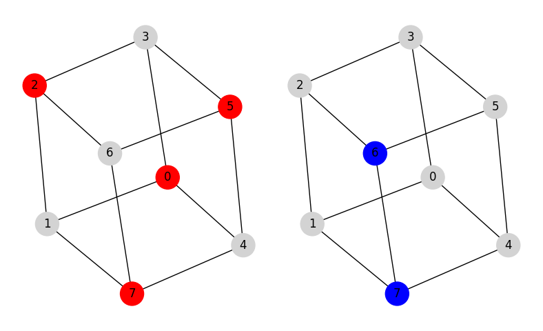

Maximum Weighted Independent Set
================================
The maximum independent set problem is one of the fundamental problems
in graph theory which was among the first batch of the 21 problems proved to
be NP-hard.

In this mod, we consider the more general problem of the maximum weighted
independent set (MWIS) which has applications in various fields such as molecular
structure matching, social network analysis, and genome data mapping.

Problem Specification
---------------------

Consider an undirected graph G with n vertices and m edges where each vertex is
associated with a positive weight w. Find a maximum weighted independent set, i.e.,
select a set of vertices in graph G where there is no edge between any pair of
vertices and the sum of the vertex weight is maximum.

.. tabs::

    .. tab:: Domain-Specific Description

        Let :math:`G = (V, E, w)` be an undirected graph where each vertex
        :math:`i \in V` has a positive weight :math:`w_i`. Find a
        subset :math:`S \subseteq V` such that:

        * no two vertices in :math:`S` are connected by an edge, and
        * among all such independent sets, the set :math:`S` has the maximum total vertex weight.

    .. tab:: Optimization Model

        For each vertex :math:`i \in V`, define a binary decision variable
        :math:`x_i` as below:

        .. math::
            x_i = \begin{cases}
                1 & \text{if vertex}\,i\,\text{belongs to set}\,S\,\\
                0 & \text{otherwise.} \\
            \end{cases}

        The binary integer programming model of the MWIS is then given below:

        .. math::
            \begin{align}
            \max \quad        & \sum_{i \in V} w_i x_i \\
            \mbox{s.t.} \quad & x_i + x_j \leq 1 & \forall (i, j) \in E \\
                              & x_i \in \{0, 1\} & \forall i \in V
            \end{align}

The input data for this mod includes a scipy sparse matrix in CSR format
representing the graph :math:`G` adjacency matrix (upper triangular) and a
numpy array representing the weights of the vertices.

Code
----

The example below finds the maximum weighted independent set for
a graph with 8 vertices and 12 edges known as the cube graph.

.. testcode:: mwis

    import scipy.sparse as sp
    import networkx as nx
    import numpy as np
    from gurobi_optimods.mwis import maximum_weighted_independent_set

    # Graph adjacency matrix (upper triangular) as a sparse matrix.
    g = nx.cubical_graph()
    adjacency_matrix = sp.triu(nx.to_scipy_sparse_array(g))
    # Vertex weights
    weights = np.array([2**i for i in range(8)])

    # Compute maximum weighted independent set.
    mwis = maximum_weighted_independent_set(adjacency_matrix, weights)

.. testoutput:: mwis
    :hide:

    ...
    Best objective 1.650000000000e+02, best bound 1.650000000000e+02, gap 0.0000%

The model is solved as a MIP by Gurobi.

.. collapse:: View Gurobi Logs

    .. code-block:: text

        Gurobi Optimizer version 10.0.1 build v10.0.1rc0 (mac64[arm])
        Thread count: 8 physical cores, 8 logical processors, using up to 8 threads
        Optimize a model with 12 rows, 8 columns and 24 nonzeros
        Model fingerprint: 0x31a65d0e
        Variable types: 0 continuous, 8 integer (8 binary)
        Coefficient statistics:
        Matrix range     [1e+00, 1e+00]
        Objective range  [1e+00, 1e+02]
        Bounds range     [1e+00, 1e+00]
        RHS range        [1e+00, 1e+00]
        Found heuristic solution: objective 165.0000000
        Presolve removed 12 rows and 8 columns
        Presolve time: 0.00s
        Presolve: All rows and columns removed

        Explored 0 nodes (0 simplex iterations) in 0.00 seconds (0.00 work units)
        Thread count was 1 (of 8 available processors)

        Solution count 1: 165

        Optimal solution found (tolerance 1.00e-04)
        Best objective 1.650000000000e+02, best bound 1.650000000000e+02, gap 0.0000%

|

Solution
--------

The solution is a numpy array containing the vertices in set :math:`S`.

.. doctest:: mwis
    :options: +NORMALIZE_WHITESPACE

    >>> mwis
    array([0, 2, 5, 7])
    >>> maximum_vertex_weight = sum(weights[mwis])
    >>> maximum_vertex_weight
    165

.. doctest:: mwis
    :options: +NORMALIZE_WHITESPACE

    >>> import networkx as nx
    >>> import matplotlib.pyplot as plt
    >>> layout = nx.spring_layout(g, seed=0)
    >>> color_map= ["red" if node in mwis else "lightgrey" for node in g.nodes()]
    >>> nx.draw(g, pos=layout, node_color=color_map, node_size=600, with_labels=True)

The vertices in the independent set are highlighted in red.

