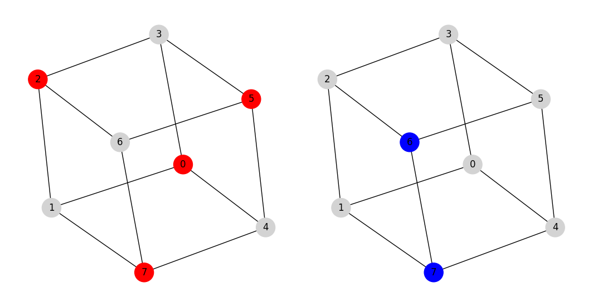

Maximum Weighted Independent Set/Clique
=========================================
The maximum independent set problem and its complement, the maximum
clique are among fundamental problems in combinatorial optimization with ubiquitous
applications and connections to other problems (:footcite:t:`bomze1999maximum,wu2015review`).

In this Mod, we consider the more general problems of the maximum weighted
independent set and maximum weighted clique which have applications
in various fields such as computer vision, pattern recognition,
molecular structure matching, social network analysis, and genome data mapping.
To better understand how a theoretical graph theory
problem can be used to address a real-world challenge, let us review one
application area for each problem in detail.

**Maximum weighted independent set**: To measure the structural similarity between
two molecules, the molecules are first represented as labeled graphs where the
vertices and the edges correspond to the atoms of the molecule and its chemical bonds,
respectively. To find the largest substructure (subgraph) that appears in both molecular
graphs, it suffices to find the maximum weighted independent set of a third graph,
known as conflict graph. The vertices and the edges of the conflict graph represent
possible mappings and conflicts between two molecules, respectively.

**Maximum weighted clique**: Consider a social network where the people and the
connections between them are respectively represented as vertices and the edges
of a graph. Different social and psychological behavior of people are also taken
into account as vertex weights. To find a group of people who all know each other
and have the maximum social/psychological harmony, it suffices to identify the maximum
weighted clique of the social graph.

Problem Specification
---------------------

**Maximum weighted independent set**:
Consider an undirected graph :math:`G` with :math:`n` vertices and :math:`m`
edges where each vertex is associated with a positive weight :math:`w`. Find a
maximum weighted independent set, i.e., select a set of vertices in graph
:math:`G` where there is no edge between any pair of selected vertices and the sum of the
vertex weights for this set is maximised.

More formally stated, let :math:`G = (V, E, w)` be an undirected graph where each
vertex :math:`i \in V` has a positive weight :math:`w_i`. Find a subset :math:`S
\subseteq V` such that:

* no two vertices in :math:`S` are connected by an edge; and
* among all such independent sets, the set :math:`S` has the maximum total
  vertex weight.

*Note*: In case all vertices have equal weights, the cardinality of
set :math:`S` represents the stability number of graph :math:`G`.

.. dropdown:: Background: Optimization Model

    This Mod is implemented by formulating a Binary Integer Programming (BIP)
    model and solving it using Gurobi. For each vertex :math:`i \in V`, define a
    binary decision variable :math:`x_i` as below:

    .. math::
        x_i = \begin{cases}
            1 & \text{if vertex}\,i\,\text{belongs to set}\,S\,\\
            0 & \text{otherwise.} \\
        \end{cases}

    The formulation of the MWIS is then given below:

    .. math::
        \begin{align}
        \max \quad        & \sum_{i \in V} w_i x_i \\
        \mbox{s.t.} \quad & x_i + x_j \leq 1 & \forall (i, j) \in E \\
                            & x_i \in \{0, 1\} & \forall i \in V
        \end{align}

The input data for this Mod includes a scipy sparse matrix in CSR (Compressed
SparseRow) format that captures the adjacency matrix of the
graph :math:`G` (upper triangle with zero diagonals only), plus a
numpy array that captures the weights of the vertices.

**Maximum weighted clique**: Given an undirected graph :math:`G = (V, E, w)`, finding
the maximum weighted clique of graph :math:`G` is equivalent tp finding the
maximum weighted independent set of the complement graph of :math:`G` known
as :math:`G^{\prime} = (V, E^{\prime}, w)` where

* for every edge :math:`(i, j)` in :math:`E`, there is no edge in :math:`E^{\prime}`, and
* for every edge :math:`(i, j)` not in :math:`E`, there is an edge in :math:`E^{\prime}`.

*Note*: In case all vertices have equal weights, the cardinality of
the maximum clique set represents the clique number of graph :math:`G`.

Code
----

The example below finds the maximum weighted independent set and
the maximum weighted clique for a graph with 8 vertices and 12 edges
known as the cube graph.

.. testcode:: mwis_mwc

    import scipy.sparse as sp
    import networkx as nx
    import numpy as np
    from gurobi_optimods.mwis_mwc import maximum_weighted_independent_set, maximum_weighted_clique

    # Graph adjacency matrix (upper triangular) as a sparse matrix.
    g = nx.cubical_graph()
    adjacency_matrix = sp.triu(nx.to_scipy_sparse_array(g))
    # Vertex weights
    weights = np.array([2**i for i in range(8)])

    # Compute maximum weighted independent set.
    mwis = maximum_weighted_independent_set(adjacency_matrix, weights)

    # Compute maximum weighted clique.
    mwc = maximum_weighted_clique(adjacency_matrix, weights)

.. testoutput:: mwis_mwc
    :hide:

    ...
    Best objective 1.650000000000e+02, best bound 1.650000000000e+02, gap 0.0000%
    ...
    Best objective 1.920000000000e+02, best bound 1.920000000000e+02, gap 0.0000%

Solution
--------

The solution is a data class including the numpy array of the vertices in the
independent set or clique as well as the its weight.

.. doctest:: mwis_mwc
    :options: +NORMALIZE_WHITESPACE

    >>> mwis
    Result(x=array([0, 2, 5, 7]), f=165)
    >>> mwis.x
    array([0, 2, 5, 7])
    >>> mwis.f
    165

    >>> mwc
    Result(x=array([6, 7]), f=192)
    >>> mwc.x
    array([6, 7])
    >>> mwc.f
    192

.. code-block:: Python

    import networkx as nx
    import matplotlib.pyplot as plt

    fig, (ax1, ax2) = plt.subplots(1, 2)
    layout = nx.spring_layout(g, seed=0)

    # Plot the maximum weighted independent set
    color_map = ["red" if node in mwis.x else "lightgrey" for node in g.nodes()]
    nx.draw(g, pos=layout, ax= ax1, node_color=color_map, node_size=600, with_labels=True)

    # Plot the maximum weighted clique
    color_map = ["blue" if node in mwc.x else "lightgrey" for node in g.nodes()]
    nx.draw(g, pos=layout, ax = ax2, node_color=color_map, node_size=600, with_labels=True)

    fig.tight_layout()
    plt.show()

The vertices in the independent set and in the clique are highlighted in red and
blue, respectively.

.. footbibliography::
