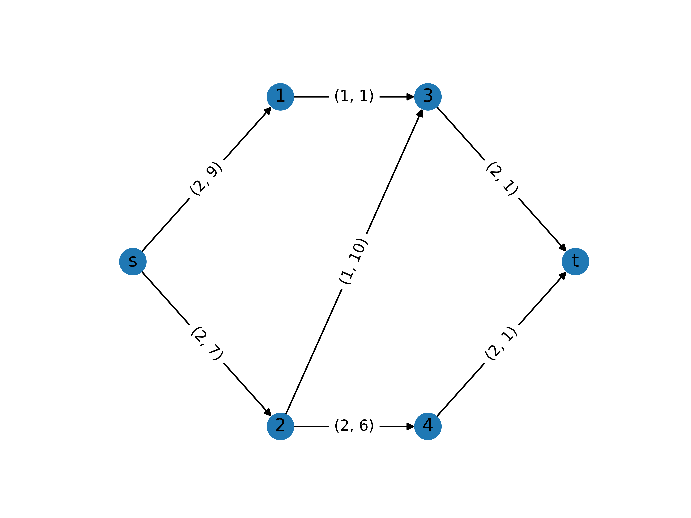

Network Flow
============

Network flow type problems are defined on a graph or network where the goal is
to send an amount of flow. Variants of this problem may include costs as part of
the objective and/or capacities as part of the constraints or restrictions.

Specific cases of network flow problems considered here are:

- min-cost flow;
- max-flow/min-cut;
- and, shortest path.

Problem Specification
---------------------

.. tabs::

    .. tab:: Graph Theory

        For a given graph :math:`G` with set of vertices :math:`V` and edges
        :math:`E`. Each edge may have different parameters associated to it for
        instance, for a given :math:`(i,j)\in E`, we may have:

        - costs :math:`c_{ij}\in \mathbb{R}`;
        - and capacities :math:`B_{ij}\in\mathbb{R}`.

        Similarly, each vertex :math:`i\in V` may have a demand :math:`d_i\in\mathbb{R}`.
        There may be a source and sink nodes.

        - Min-cost flow: minimize the cost subject to edge capacities and fulfil
          node demand.
        - Max-flow/min-cut: maximize flow through the graph subject to edge
          capacities.
        - Shortest path: find a path from source to sink that has the minimal
          cost.

    .. tab:: Optimization Model

        For a given graph :math:`G` with set of vertices :math:`V` and edges
        :math:`E`. Depending on the problem, each edge may have differnt
        parameters associated to it for instance, for a given :math:`(i,j)\in
        E`, we may have costs :math:`c_{ij}`, capacities :math:`B_{ij}` and each
        node :math:`i` may have a demand :math:`d_i`. The values for each case
        are specified below.

        We need a set of continuous variables :math:`x_{ij}` to denote the
        amount of flow going through an edge.

        .. math::

            \begin{alignat}{2}
              \min \quad        & \sum_{(i, j) \in E} c_{ij} x_{ij} \\
              \mbox{s.t.} \quad & \sum_{j \in \delta^+(i)} x_{ij} - \sum_{j \in \delta^-(i)} x_{ji} = d_i & \forall i \in V' \\
                                & 0 \leq x_{ij} \le B_{ij} & \forall (i, j) \in E \\
            \end{alignat}

        Where :math:`\delta^+(\cdot)` (:math:`\delta^-(\cdot)`) denotes the outgoing (incoming) neighours.
        Additionally, we

        .. csv-table:: Parameters for the three cases.
           :header: "Problem", ":math:`V'`",                ":math:`d_i`",    ":math:`B_{ij}`", ":math:`c_{ij}`"

           "1. Min-cost flow", ":math:`V`",                 ":math:`\geq 0`", ":math:`\geq 0`", ":math:`\geq 0`"
           "2. Max-flow",      ":math:`V\setminus\{s,t\}`", ":math:`\geq 0`", ":math:`\geq 0`", ":math:`=-1` if :math:`i=s, j\in\delta^+(s)`, :math:`0` otherwise"
           "3. Shortest path", ":math:`V`",                 ":math:`=1` if :math:`i=s`, :math:`=-1`, if :math:`i=t`, :math:`0` otherwise",     ":math:`=1`",     ":math:`\geq 0`"

.. tabs::

    .. tab:: ``load_network_flow_example_data``

        Let us load a sample `networkx` graph.

        .. doctest:: mod
            :options: +NORMALIZE_WHITESPACE

            >>> from gurobi_optimods import datasets
            >>> G, s, t = datasets.load_network_flow_example_data()
            >>> for n in G.nodes(data=True):
            ...     print(n)
            ...
            (0, {'demand': 20})
            (1, {'demand': 0})
            (2, {'demand': 0})
            (3, {'demand': -5})
            (4, {'demand': -15})
            >>> for e in G.edges(data=True):
            ...     print(e)
            ...
            (0, 1, {'capacity': 15, 'cost': 4})
            (0, 2, {'capacity': 8, 'cost': 4})
            (1, 3, {'capacity': 4, 'cost': 2})
            (1, 2, {'capacity': 20, 'cost': 2})
            (1, 4, {'capacity': 10, 'cost': 6})
            (2, 3, {'capacity': 15, 'cost': 1})
            (2, 4, {'capacity': 5, 'cost': 3})
            (3, 4, {'capacity': 20, 'cost': 2})
            (4, 2, {'capacity': 4, 'cost': 3})
            >>> s, t
            (0, 4)

    .. tab:: Graph

      TODO: add plot

|

Code
----

Self contained code example to run the mod from an example dataset. Example
datasets should bd included in the ``gurobi_optimods.datasets`` module for
easy access by users.

.. testcode:: network_flow

    from gurobi_optimods.datasets import load_network_flow_example_data
    from gurobi_optimods.network_flow import shortest_path

    G, source, sink = load_network_flow_example_data()
    sol, cost = shortest_path(G, source, sink)

..  A snippet of the Gurobi log output here won't show in the rendered page,
    but serves as a doctest to make sure the code example runs. The ... lines
    are meaningful here, they will match anything in the output test.

.. testoutput:: network_flow
    :hide:

    ...
    Optimal objective  7.000000000e+00

The model is solved as an LP by Gurobi.

.. collapse:: View Gurobi Logs

    .. code-block:: text

      Gurobi Optimizer version 10.0.1 build v10.0.1rc0 (mac64[arm])

      CPU model: Apple M1
      Thread count: 8 physical cores, 8 logical processors, using up to 8 threads

      WLS license - registered to david.torres-sanchez@gurobi.com
      Optimize a model with 5 rows, 9 columns and 18 nonzeros
      Model fingerprint: 0xce040fba
      Coefficient statistics:
        Matrix range     [1e+00, 1e+00]
        Objective range  [1e+00, 6e+00]
        Bounds range     [1e+00, 1e+00]
        RHS range        [1e+00, 1e+00]
      Presolve removed 1 rows and 1 columns
      Presolve time: 0.00s
      Presolved: 4 rows, 8 columns, 16 nonzeros

      Iteration    Objective       Primal Inf.    Dual Inf.      Time
             0    4.0000000e+00   2.000000e+00   0.000000e+00      0s
             2    7.0000000e+00   0.000000e+00   0.000000e+00      0s

      Solved in 2 iterations and 0.00 seconds (0.00 work units)
      Optimal objective  7.000000000e+00

|

Solution
--------

Show the solution. One way is to use doctests to display simple shell outputs
(see the workforce example). This can be done simply by pasting outputs
directly from a python shell. Another option is to include and display figures
(see the graph matching examples).
