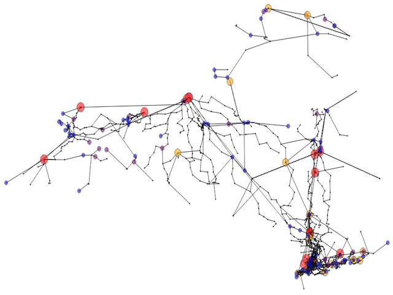

Optimal Power Flow
==================

The operation of power systems relies on a number of optimization tasks, known as *optimal power flow* (*OPF*) problems. The objective of a standard OPF problem is to minimize operation cost such that the underlying grid constraints, such as generation, demand, and voltage limits, are satisfied.

In this mod, we consider the cases of *alternating current* (*AC*) and *direct current* (*DC*) OPF formulations. The ACOPF problem in its natural form requires the introduction of complex numbers in order to formulate the voltage. We circumvent the usage of complex numbers by using the so-called cartesian-coordinates formulation where we introduce additional optimization variables to formulate the complex terms via nonconvex quadratic relationships. The DCOPF problem is an approximation of the ACOPF problem where additional assumptions are made in order to make the optimization model linear. While the additional assumptions result in potential loss of solution accuracy, they make the DCOPF problem a lot easier to solve. This is especially useful if the solution accuracy can be neglected in favor of solution time and problem size. For additional information regarding the formulations, please refer to the :doc:`opf_specification`.

Here we assume basic familiarity with concepts such as *voltage* (potential energy), *current* (charge flow), and *power* (instantaneous energy generation or consumption).  The engineering community also uses the terms *bus* (nodes in a network, with some simplification) and *branch* (arc in a network, a connection between two buses, typically a line or a transformer). For more details and more comprehensive descriptions of power systems and the underlying problems, please refer to the `Recommended Literature`_ section found further down below.

Problem Specification
---------------------

The problem specification of an OPF problem is quite involved and lengthy. Thus, we ask the reader to refer to the

.. toctree::
    :maxdepth: 1

    opf_specification

Solving an OPF Problem
----------------------

Input
~~~~~

This mod has multiple callable API and convenience functions. All of the main API functions take a so-called *case dictionary* as input. The case dictionary holds all essential information about the underlying network, i.e., information about buses, branch connections, and generators. The case dictionary is meant to follow the `MATPOWER Case Format conventions <https://matpower.org/docs/ref/matpower7.1/lib/caseformat.html>`_. We discuss all details of the case dictionary further down below in the `Case and Result Dictionaries`_ section.

In the below example code, we read in a pre-defined case dictionary for a small 9 bus grid from our dataset.

.. testcode:: opf

    from gurobi_optimods import opf
    from gurobi_optimods import datasets
    case = datasets.load_opf_example("case9")

Optimization Process
~~~~~~~~~~~~~~~~~~~~

After generating a case dictionary, we can solve an OPF problem defined by the given network data. For this task, we use the :func:`gurobi_optimods.opf.solve_opf` function. We can define the type of the OPF problem that we want to solve by defining the ``opftype`` argument when calling the function. Currently, the available options are ``AC``, ``AC_relax``, and ``DC``.

- The ``AC`` setting solves an ACOPF problem defined by the given network data. The ACOPF problem is formulated as a nonconvex bilinear model as described in the :ref:`ACOPF <acopf-label>` section of the :doc:`opf_specification`.

- The ``AC_relax`` setting solves a Second Order Cone (SOC) relaxation of the nonconvex bilinear ACOPF problem formulation defined by the given network data. The relaxation is constructed by dropping nonconvex bilinear terms but simultaneously keeping the convex JABR inequalities, see :ref:`JABR Relaxation <jabr-label>` for more details.

- The ``DC`` setting solves a DCOPF problem defined by the given network data. The DCOPF problem is a linear approximation of the ACOPF problem. Please refer to the :ref:`DCOPF <dcopf-label>` section of the :doc:`opf_specification` for more details.

The default value of the ``opftype`` argument is to solve an ``AC`` problem.

The function returns a so-called *result* dictionary which we discuss below.

.. testcode:: opf

    result = opf.solve_opf(case, opftype="AC")

.. testoutput:: opf
    :options: +NORMALIZE_WHITESPACE +ELLIPSIS

    ...
    Optimize a model with 73 rows, 107 columns and 208 nonzeros
    ...

    Model Status: optimal.

    Objective value = 5296....

It is worth mentioning that ACOPF and `Branch-Switching`_ models are most often very hard to solve to optimality. For this reason, it is best to pass specific solver settings such as, e.g., a `TimeLimit <https://www.gurobi.com/documentation/current/refman/timelimit.html>`_. This can be done by using the ``solver_params`` argument. For a full list of all Gurobi parameters please refer to `our documentation <https://www.gurobi.com/documentation/current/refman/parameter_descriptions.html>`_.

.. code-block::

    result = opf.solve_opf(case, opftype="AC", solver_params={"TimeLimit": 60})

Result
~~~~~~

We successfully solved an ACOPF problem and retrieved a so-called *result dictionary*. The result dictionary follows the same `MATPOWER Case Format conventions <https://matpower.org/docs/ref/matpower7.1/lib/caseformat.html>`_ as the case dictionary. However, in the result dictionary some object entries are modified compared to the input case dictionary. These modified fields hold the solution values of the optimization. In some cases, there are also additional fields to store the solution information. We discuss all details of the result dictionary in the `Case and Result Dictionaries`_ section below.

.. doctest:: opf

    >>> result['success']
    1

Branch-Switching
----------------

An important extension of the OPF problem is the so-called Branch-Switching, where we are allowed to turn off branches. Note that already turning off a single branch changes the whole power flow through the network. Thus in practice, it is rare that branches are turned off at all. If any are turned off, then it is usually only a small fraction of the overall power grid. For the mathematical formulation, please refer to the :ref:`Branch-Switching <branchswitching-label>` subsection of the :doc:`opf_specification`. In order to enable branch-switching in a given OPF problem, it is necessary to set the ``branchswitching`` argument to ``True`` when calling the :func:`gurobi_optimods.opf.solve_opf` function. The default value for the ``branchswitching`` argument is ``False`` (turned off). This mod additionally offers the possibility to control the number of branches that has to stay turned on via the ``minactivebranches`` argument. In practice, it is expected that only a very small fraction of branches are turned off. Thus, the default value of the ``minactivebranches`` argument is 0.9 (90%). Additionally, the argument ``usemipstart`` controls whether a trivial starting point for the Branch-Switching MIP is used. The default value is ``False``. In the following, we solve an artificially altered version of a small 9 bus network to see whether branches could be turned off.

.. testcode:: opf

    case = datasets.load_opf_example("case9-switching")
    result = opf.solve_opf(case, opftype="AC", branchswitching=True, minactivebranches=0.1)

.. testoutput:: opf
    :hide:
    :options: +NORMALIZE_WHITESPACE +ELLIPSIS

    ...
    Optimize a model with 278 rows, 185 columns and 694 nonzeros
    ...

.. doctest:: opf

    >>> result['branch'][10]['switching']
    0

We can see in the example code, that indeed 1 branch has been turned off in the optimal solution. Please note, that the used examplary network has been artificially adjusted to achieve this result and this is **not** the usual behavior in a realistic power grid of such small size.

Graphical Representation of Feasible Solutions
----------------------------------------------

In addition to solving an OPF problem, this mod also provides the possibility to plot the obtained result as a graphical representation of the network. There are already very involved graphical tools to represent OPF solutions provided by other packages such as

- `MATPOWER <https://matpower.org>`_
- `PyPSA <https://pypsa.org/>`_
- `pandapower <http://www.pandapower.org/>`_

Thus, the graphical representation provided by this mod is very basic.  In order to use this functionality, it is necessary to install the ``plotly`` package.

Coordinate Information
~~~~~~~~~~~~~~~~~~~~~~

In order to plot a previously obtained result, an additional input of coordinates for all buses in the network is necessary. The coordinates have to be provided as a *coordinate dictionary*. The recommended way to generate a coordinate dictionary is to use a ``.csv`` file holding all coordinate data. The ``.csv`` file holding the coordinate data has to follow the format

.. code-block::

   index(starting with 0), busID, busname, latitude, longitude
   0, 1, B1, 44.492, -73.208
   1, 2, B2, 41.271, -73.953
   ...

Once a ``.csv`` file holding bus coordinate information is available, we can use the ``read_coords_csv`` function to automatically generate a coordinate dictionary. In the following example we use the ``case9coords.csv`` file from our dataset to generate a coordinate dictionary

.. testcode:: opf

    coords_dict = datasets.load_opf_extra("case9-coordinates")

.. testoutput:: opf
    :hide:
    :options: +NORMALIZE_WHITESPACE

    ...

.. doctest:: opf
    :options: +NORMALIZE_WHITESPACE

    >>> coords_dict[1]
    (44.492, -73.208)

    >>> coords_dict[2]
    (41.271, -73.953)

Plotting the Result
~~~~~~~~~~~~~~~~~~~

After obtaining a result dictionary as discussed in `Solving an OPF Problem`_ and generating a coordinates dictionary, we can generate a :class:`plotly.graph_objects.Figure` object that can be displayed in, e.g., a browser window. Please note that it is required to install the ``plotly`` package to use this functionality. In the following, we solve the DCOPF problem for a given network data for the city of New York and plot the result.

.. code-block::

    import plotly
    case = datasets.load_opf_example("caseNY")
    result = opf.solve_opf(case, opftype='DC')
    coords_dict = datasets.load_opf_extra("caseNY-coordinates")
    fig = opf.solution_plot(case, coords_dict, solution)
    fig.show()

In the above image, you can see the power grid generated out of the given network data together with the coordinate information. The colored circles depict generators and the amount of power they generate

- Black bus: Power generation :math:`\leq 75` and load :math:`< 50`
- Blue bus: Power generation :math:`\leq 75` and load :math:`\geq 50`
- Purple bus: Power generation :math:`> 75`
- Orange bus: Power generation :math:`> 150`
- Red bus: Power generation :math:`> 500`

Violations for Pre-defined Voltage Values
-----------------------------------------

In practice, it is likely that we have voltage magnitudes and voltage angles for each bus at hand and would like to know whether these values are actually feasible within a given network. To tackle this, we can use the :func:`gurobi_optimods.opf.compute_violations` function. This function takes a *voltage dictionary* and a case dictionary as arguments and is discussed in more detail below.

Voltage Information
~~~~~~~~~~~~~~~~~~~

In order to compute possible violations for given voltage data, an additional input of voltage information for all buses in the network is necessary. The voltage magnitudes (Vm) and voltage angles (Va) have to be provided as a *voltage dictionary*. The recommended way to generate a voltage dictionary is to use a ``.csv`` holding all voltage data. The ``.csv`` file holding the voltage data has to follow the format

.. code-block::

   index(starting with 0), busID, busname, Vm, Va
   0, 1, B1, 1.089026, 0.000000
   1, 2, B2, 1.099999, 20.552543
   ...

Once a ``.csv`` file holding voltage information for every bus is available, we can use the ``read_voltages_csv`` function to automatically generate a voltage dictionary. In the following example we use the ``case9volts.csv`` file to generate a voltage dictionary

.. testcode:: opf

    volts_dict = datasets.load_opf_extra("case9-voltages")

.. testoutput:: opf
    :hide:
    :options: +NORMALIZE_WHITESPACE

    ...

.. doctest:: opf
    :options: +NORMALIZE_WHITESPACE

    >>> volts_dict[1]
    (1.089026, 0.0)

    >>> volts_dict[2]
    (1.099999, 20.552543)

Checking for Violations
~~~~~~~~~~~~~~~~~~~~~~~

Once we have a voltage dictionary at hand, we can check for possible model violations by calling the :func:`gurobi_optimods.opf.compute_violations` function. In addition to the verbose output, the function returns a *violations dictionary* which similar to the case dictionary follows the `MATPOWER Case Format <https://matpower.org/docs/ref/matpower7.1/lib/caseformat.html>`_. However, the violations dictionary has additional fields storing the violations for particular buses and branches.

The following fields in the violations dictionary are added to store violations data.

- ``violation['bus'][i]['Vmviol']`` Voltage magnitude violation at bus `i`
- ``violation['bus'][i]['Pviol']`` real power injection violation at bus `i`
- ``violation['bus'][i]['Qviol']`` reactive power injection violation at bus `i`
- ``violation['branch'][i]['limitviol']`` branch limit violation at branch `i`

.. testcode:: opf

    volts_dict = datasets.load_opf_extra("case9-voltages")
    case = datasets.load_opf_example("case9")
    violations = opf.compute_violations(case, volts_dict)

.. testoutput:: opf
    :hide:
    :options: +NORMALIZE_WHITESPACE +ELLIPSIS

    ...
    Checking flow balance constraints.
    ...

.. doctest:: opf

    >>> print(violations['branch'][6]['limitviol'])
    66.33435016796234
    >>> print(violations['bus'][3]['Pviol'])
    -318.8997836192236

We can see that among others, the limit at branch 6 and the real power injection at bus 3 are violated.

Inspecting Violations Graphically
~~~~~~~~~~~~~~~~~~~~~~~~~~~~~~~~~

Similar to generating a graphical representation of a feasible solution, it is also possible to generate a figure representing the violations within a given power grid. We can use the :func:`gurobi_optimods.opf.violation_plot` to generate a :class:`plotly.graph_objects.Figure` object that can be displayed in, e.g., a browser window. Please note that it is required to install the ``plotly`` package to use this functionality. In addition to bus coordinates and case information, we also need to provide the violations dictionary to the function. In the following we use the previously discussed violated solution and plot the result.

.. code-block::

    volts_dict = datasets.load_opf_extra("case9-voltages")
    case = datasets.load_opf_example("case9")
    coords_dict = datasets.load_opf_extra("case9-coordinates")
    violations = opf.compute_violations(case, volts_dict)
    fig = opf.violation_plot(case, coords, violations)
    fig.show()

.. image:: ../figures/violations_opf.png

In the above image, you can see the power grid generated out of the given network data together with the coordinate and violation information. The red circles depict buses where the voltage magnitude or real or reactive power injections are violated. Red marked branches depict branches with violated limits.

Case and Result Dictionaries
----------------------------

This mod uses so-called *case* and *result* dictionaries for input and output. Both dictionaries are meant to follow the `MATPOWER Case Format <https://matpower.org/docs/ref/matpower7.1/lib/caseformat.html>`_ and are described in full detail below.

Case Dictionary
~~~~~~~~~~~~~~~

The case dictionary for this mod expects a dictionary with keys ``baseMVA``, ``bus``, ``branch``, ``gen``, and ``gencost``. All other entries of the dictionary are ignored in the current version of the mod. The value stored via the ``baseMVA`` key is a numerical float value. The values stored in the case dictionary via keys ``bus``, ``branch``, ``gen``, and ``gencost`` are lists of dictionaries, where each dictionary holds specific data about the particular object. Every single object is defined by a dictionary holding entries following the `MATPOWER Case Format <https://matpower.org/docs/ref/matpower7.1/lib/caseformat.html>`_, e.g., every bus has a bus number ``bus_i``, real power demand ``Pd``, etc.

.. testcode:: opf

    case = datasets.load_opf_example("case9")

.. testoutput:: opf
    :hide:
    :options: +NORMALIZE_WHITESPACE

    ...

.. doctest:: opf
    :options: +NORMALIZE_WHITESPACE

    >>> case['baseMVA']
    100.0

    >>> buses = case['bus']
    >>> buses[0]
    {'bus_i': 1, 'type': 3, 'Pd': 0.0, 'Qd': 0.0, 'Gs': 0.0, 'Bs': 0.0, 'area': 1.0, 'Vm': 1.0, 'Va': 0.0, 'baseKV': 345.0, 'zone': 1.0, 'Vmax': 1.1, 'Vmin': 0.9}

    >>> branches = case['branch']
    >>> branches[1]
    {'fbus': 4, 'tbus': 5, 'r': 0.017, 'x': 0.092, 'b': 0.158, 'rateA': 250.0, 'rateB': 250.0, 'rateC': 250.0, 'ratio': 0.0, 'angle': 0.0, 'status': 1.0, 'angmin': -360.0, 'angmax': 360.0}

    >>> generators = case['gen']
    >>> generators[2]
    {'bus': 3, 'Pg': 85, 'Qg': 0, 'Qmax': 300, 'Qmin': -300, 'Vg': 1, 'mBase': 100, 'status': 1, 'Pmax': 270, 'Pmin': 10, 'Pc1': 0, 'Pc2': 0, 'Qc1min': 0, 'Qc1max': 0, 'Qc2min': 0, 'Qc2max': 0, 'ramp_agc': 0, 'ramp_10': 0, 'ramp_30': 0, 'ramp_q': 0, 'apf': 0}

    >>> generatorcosts = case['gencost']
    >>> generatorcosts[2]
    {'costtype': 2.0, 'startup': 3000.0, 'shutdown': 0.0, 'n': 3.0, 'costvector': [0.1225, 1.0, 335.0]}

There is also the convenience function :func:`gurobi_optimods.opf.read_case_matpower` which reads in a standard MATLAB ``.mat`` data file holding the network data. The data stored in the ``.mat`` file has to follow the `MATPOWER Case Format conventions <https://matpower.org/docs/ref/matpower7.1/lib/caseformat.html>`_ in order to be accepted by the function. This function returns a case dictionary which can be read by the solver methods::

    case = opf.read_case_matpower("my_case.mat")
    solution = solve_opf(case, opftype="AC")

.. warning::

    In the current version of the mod, we only accept generator costs with `costtype = 2`, i.e., polynomial model, up to degree 2, i.e, `n=3` in the `gencost` structure. For now, these seem to be the most commonly used settings in practice. If a different costtype or `n` value is provided, an error is issued. It is possible that more functionality will be added in a future release.

Result Dictionary
~~~~~~~~~~~~~~~~~

The following fields in the result dictionary are altered or added to store solution data.

- The field ``result['et']`` holds the runtime value of the whole solution process in seconds.
- The field ``result['success']`` defines whether at least one feasible solution has been found (1) or no feasible solution is available (0).
- The field ``result['f']`` holds the solution objective value (only valid if ``result['success'] == 1``).
- If a feasible solution has been found, the ``bus`` entries

  * ``result['bus'][i]['Vm']``
  * ``result['bus'][i]['Va']``

  store the voltage magnitude (Vm) and voltange angle (Va) values in the optimal solution for bus `i`.
- If we solved a DCOPF problem, additional fields ``result['bus'][i]['mu']`` hold the shadow prices for balance constraints at bus `i`.
- If a feasible solution has been found, the ``gen`` entries

  * ``result['gen'][i]['Pg']``
  * ``result['gen'][i]['Qg']``

  hold the real (Pg) and reactive (Qg) power injection values at the optimal solution for generator `i`.
- If a feasible solution has been found, the additional ``branch`` entries

  * ``result["branch"][i]["Pf"]``
  * ``result["branch"][i]["Pt"]``
  * ``result["branch"][i]["Qf"]``
  * ``result["branch"][i]["Qt"]``
  * ``result["branch"][i]["switching"]``

  hold real (P) and reactive (Q) power injection values into the `from` (f) and into the `to` (t) end at the optimal solution point for branch `i`. The ``switching`` field holds the information whether a branch is turned on (1) or off (0) in the given result.

.. testcode:: opf

    result = opf.solve_opf(case, opftype="AC")

.. testoutput:: opf
    :hide:
    :options: +NORMALIZE_WHITESPACE +ELLIPSIS

    ...
    Optimize a model with 73 rows, 107 columns and 208 nonzeros
    ...

.. doctest:: opf
    :options: +NORMALIZE_WHITESPACE

    >>> result['success']
    1

    >>> result['bus'][0]
    {... 'Vm': 1.09..., 'Va': 0, ...}

    >>> result['branch'][1]
    {... 'Pf': 35.2..., 'Pt': -35.0..., 'Qf': -3.8..., 'Qt': -13.8..., ...}

    >>> result['gen'][2]
    {... 'Pg': 94.1..., 'Qg': -22.6..., ...}

We can see that the respective entries for ``bus`` and ``gen`` changed compared to the case dictionary, because they are different from the input at the optimal solution point. We also see that addtional fields have been created in the ``branch`` dictionary to hold solution information.

.. _recommended-label:

Recommended Literature
----------------------

Power systems and the optimal power flow problem are well studied. For a more comprehensive descrition, we recommend the following literature.

- G. Andersson. *Modelling and Analysis of Electric Power Systems*. Power Systems Laboratory,
  ETH Zürich, 2004.
- A.R. Bergen and V. Vittal. *Power Systems Analysis*. Prentice-Hall, 1999.
- D. Bienstock. *Electrical Transmission Systems Cascades and Vulnerability, an Operations Research
  viewpoint*. SIAM, 2015. ISBN 978-1-61197-415-7.
- D.K. Molzahn and I.A. Hiskens. *A survey of relaxations and approximations of the power flow
  equations*. Foundations and Trends in Electric Energy Systems, 4:1–221, 2019.
- J.D. Glover, M.S. Sarma, and T.J. Overbye. *Power System Analysis and Design*. CENGAGE
  Learning, 2012.
