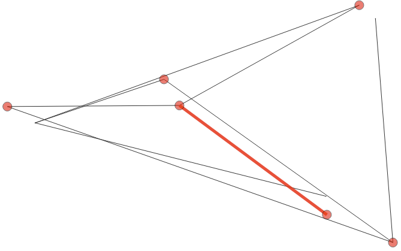

Optimal Power Flow
==================

The operation of power systems relies on a number of optimization tasks known
as Optimal Power Flow (OPF) problems. The objective of a standard OPF problem is
to minimize operational costs such that the underlying grid constraints on
generation, demand, and voltage limits are satisfied.

This Mod considers the Alternating Current (AC) and Direct Current (DC) OPF
formulations. The ACOPF problem, in its natural form, requires the introduction
of complex numbers to formulate voltage constraints. This Mod uses a
cartesian-coordinates formulation of ACOPF that reformulates complex-valued
terms via nonconvex quadratic relationships. The DCOPF problem approximates the
ACOPF problem by making additional assumptions to produce linear constraints.
While the additional assumptions result in a potential loss of solution
accuracy, they make the DCOPF problem much easier to solve. This is especially
useful if the solution accuracy can be neglected in favour of solution time and
problem size. Please refer to the :doc:`opf_specification` for full details of
the formulations.

Here we assume basic familiarity with concepts such as *voltage* (potential
energy), *current* (charge flow), and *power* (instantaneous energy generation
or consumption). The engineering community also uses the terms *bus* to refer to
nodes in a network and branch to refer to arcs in a network (a connection
between two buses, typically a line or a transformer). Please refer to the
`Recommended Literature`_ section for more details and comprehensive
descriptions of power systems and the underlying problems.

MATPOWER Case Input Format
--------------------------

This Mod has multiple API functions, each of which accepts a dictionary as input
describing an OPF case. This case dictionary follows the `MATPOWER Case Format
conventions <https://matpower.org/docs/ref/matpower7.1/lib/caseformat.html>`_
and holds all essential information about the underlying network: buses, branch
connections, and generators. Several pre-defined MATPOWER cases can be loaded
directly using the ``gurobi_optimods.datasets`` module. The following code loads
an example case with 9 buses and displays the key fields:

.. tabs::

    .. tab:: ``baseMVA``

        ``baseMVA`` holds the base units of voltage for this case.

        .. doctest:: opf
            :options: +NORMALIZE_WHITESPACE

            >>> from gurobi_optimods import datasets
            >>>
            >>> case = datasets.load_opf_example("case9")
            >>> case['baseMVA']
            100.0

    .. tab:: ``bus``

        Each entry in the list ``case['bus']`` represents a bus in the network.

        .. doctest:: opf
            :options: +NORMALIZE_WHITESPACE

            >>> from pprint import pprint
            >>> from gurobi_optimods import datasets
            >>>
            >>> case = datasets.load_opf_example("case9")
            >>> pprint(case['bus'][0])  # The first bus
            {'Bs': 0.0,
             'Gs': 0.0,
             'Pd': 0.0,
             'Qd': 0.0,
             'Va': 0.0,
             'Vm': 1.0,
             'Vmax': 1.1,
             'Vmin': 0.9,
             'area': 1.0,
             'baseKV': 345.0,
             'bus_i': 1,
             'type': 3,
             'zone': 1.0}

    .. tab:: ``branch``

        Each entry in the list ``case['branch']`` represents a branch in the
        network. Note that the ``fbus`` and ``tbus`` fields must refer to a bus
        by its ``bus_i`` value.

        .. doctest:: opf
            :options: +NORMALIZE_WHITESPACE

            >>> from pprint import pprint
            >>> from gurobi_optimods import datasets
            >>>
            >>> case = datasets.load_opf_example("case9")
            >>> pprint(case['branch'][0])  # The first branch
            {'angle': 0.0,
             'angmax': 360.0,
             'angmin': -360.0,
             'b': 0.0,
             'fbus': 1,
             'r': 0.0,
             'rateA': 250.0,
             'rateB': 250.0,
             'rateC': 250.0,
             'ratio': 0.0,
             'status': 1.0,
             'tbus': 4,
             'x': 0.0576}

    .. tab:: ``gen``

        Each entry in the list ``case['gen']`` represents a generator in the
        network. Note that the ``bus`` field must refer to a bus by its
        ``bus_i`` value.

        .. doctest:: opf
            :options: +NORMALIZE_WHITESPACE

            >>> from pprint import pprint
            >>> from gurobi_optimods import datasets
            >>>
            >>> case = datasets.load_opf_example("case9")
            >>> pprint(case['gen'][0])  # The first generator
            {'Pc1': 0,
             'Pc2': 0,
             'Pg': 0,
             'Pmax': 250,
             'Pmin': 10,
             'Qc1max': 0,
             'Qc1min': 0,
             'Qc2max': 0,
             'Qc2min': 0,
             'Qg': 0,
             'Qmax': 300,
             'Qmin': -300,
             'Vg': 1,
             'apf': 0,
             'bus': 1,
             'mBase': 100,
             'ramp_10': 0,
             'ramp_30': 0,
             'ramp_agc': 0,
             'ramp_q': 0,
             'status': 1}

    .. tab:: ``gencost``

        Each entry in the list ``case['gencost']`` corresponds to the generator
        at the same position in ``case['gen']``, and defines the cost function
        of that generator.

        .. doctest:: opf
            :options: +NORMALIZE_WHITESPACE

            >>> from pprint import pprint
            >>> from gurobi_optimods import datasets
            >>>
            >>> case = datasets.load_opf_example("case9")
            >>> pprint(case['gencost'][0])  # Cost function for the first generator
            {'costtype': 2.0,
             'costvector': [0.11, 5.0, 150.0],
             'n': 3.0,
             'shutdown': 0.0,
             'startup': 1500.0}

        .. warning::

            The Mod only supports generator costs with ``costtype = 2`` and ``n
            <= 3`` (i.e. linear and quadratic cost functions) in the ``gencost``
            structure, as these are the most commonly used settings in practice.
            If a different costtype or larger value of ``n`` value is provided,
            an error will be issued.

Cases can also be read directly from MATPOWER format using
:func:`~gurobi_optimods.opf.read_case_matpower`. This function reads a standard
MATLAB ``.mat`` data file holding the case data into the native Python format
accepted by the Mod. For example::

    case = opf.read_case_matpower("my_case.mat")

Solving an OPF Problem
----------------------

After reading in or otherwise generating a MATPOWER case in the format described
above, we can solve an OPF problem defined by the given network data. For this
task, we use the :func:`~gurobi_optimods.opf.solve_opf` function. We can define
the type of the OPF problem that we want to solve by defining the ``opftype``
argument when calling the function. Currently, the available options are
``ACPlocal``, ``ACRlocal``, ``ACPglobal``, ``ACRglobal``, ``ACrelax``, and ``DC``.

- The ``ACPlocal`` setting solves the :ref:`polar ACOPF <polar-label>` problem
  formulation using adjusted settings to quickly find a good quality local
  solution, without attempting to solve to global optimality. This is the
  default setting when solving ACOPF problems.

- The ``ACRlocal`` setting solves the  :ref:`rectangular ACOPF<qcqp-label>`
  problem formulation using adjusted settings to quickly find a good quality
  local solution, without attempting to solve to global optimality.

- The ``ACPglobal`` setting solves the :ref:`polar ACOPF <polar-label>`
  to global optimality. In addition to a feasible point, this setting also
  tries to prove global optimality. This problem is harder to solve
  and thus usually leads to very long runtimes.

- The ``ACRglobal`` setting solves the  :ref:`rectangular ACOPF<qcqp-label>
  to global optimality. In addition to a feasible point, this setting also
  tries to prove global optimality. This problem is harder to solve
  and thus usually leads to very long runtimes.

- The ``ACrelax`` setting solves a Second Order Cone (SOC) relaxation of the
  nonconvex bilinear ACOPF problem formulation defined by the given network
  data. The relaxation is constructed by dropping nonconvex bilinear terms but
  simultaneously keeping the convex JABR inequalities, see :ref:`JABR Relaxation
  <jabr-label>` for more details. This setting often yields a good approximation
  of the physical power system and is of moderate difficulty.

- The ``DC`` setting solves a DCOPF problem defined by the given network data.
  The DCOPF problem is a linear approximation of the ACOPF problem, see
  :ref:`DCOPF <dcopf-label>` section of the :doc:`opf_specification` for more
  details. This setting only yields a crude approximation of the physical power
  system, but is usually an easy problem that can be solved very quickly even
  for large networks.

The ``solve_opf`` function solves an ``ACPlocal`` problem unless the ``opftype``
argument specifies otherwise.

.. testcode:: opf

    from gurobi_optimods import opf
    from gurobi_optimods import datasets

    case = datasets.load_opf_example("case9")
    result = opf.solve_opf(case, opftype="ACRGLOBAL")

.. testoutput:: opf
    :options: +NORMALIZE_WHITESPACE +ELLIPSIS

    ...
    Optimize a model with 18 rows, 106 columns and 24 nonzeros...
    ...
    Optimal solution found...
    ...
    Objective value = 5296...
    ...

ACOPF and `Branch Switching`_ models are most often very hard to solve to
optimality. For this reason, it is recommended to specify a solver time limit
using the ``time_limit`` parameter. If the problem has not been solved to
optimality within the time limit, the best known solution will be returned.

.. testcode:: opf

    result = opf.solve_opf(case, opftype="ACRGLOBAL", time_limit=60)

.. testoutput:: opf
    :hide:
    :options: +NORMALIZE_WHITESPACE +ELLIPSIS

    Set parameter TimeLimit to value 60
    ...
    Optimal solution found...
    ...

Solution Format
---------------

The Mod returns the result as a dictionary, following the same `MATPOWER Case
Format conventions
<https://matpower.org/docs/ref/matpower7.1/lib/caseformat.html>`_ as the case
dictionary. However, in the result dictionary some object entries are modified
compared to the input case dictionary. These modified fields hold the solution
values of the optimization. There are also additional fields to store the
solution information, as specified below.

.. tabs::

    .. tab:: Buses

        The ``bus`` entries ``result['bus'][i]['Vm']`` and
        ``result['bus'][i]['Va']`` store the voltage magnitude (Vm) and voltage
        angle (Va) values in the OPF solution for bus `i`.

        If a DCOPF problem was solved, additional fields
        ``result['bus'][i]['mu']`` hold the shadow prices for balance
        constraints at bus `i`.

        .. doctest:: opf
            :options: +NORMALIZE_WHITESPACE

            >>> result['bus'][0]
            {... 'Vm': 1.09..., 'Va': 0.0, ...}

    .. tab:: Branches

        The additional ``branch`` entries populated in the solution data are:

        * ``Pf``: real power injection at the "from" end of the branch,
        * ``Pt``: real power injection at the "to" end of the branch,
        * ``Qf``: reactive power injection at the "from" end of the branch, and
        * ``Qt``: reactive power injection at the "to" end of the branch.

        The ``switching`` field defines whether a branch is turned on (1) or off
        (0) in the given result.

        .. doctest:: opf
            :options: +NORMALIZE_WHITESPACE

            >>> result['branch'][1]
            {... 'Pf': 35.2..., 'Pt': -35.0..., 'Qf': -3.8..., 'Qt': -13.8..., ...}

    .. tab:: Generators

        Then ``gen`` entries ``result['gen'][i]['Pg']`` and
        ``result['gen'][i]['Qg']`` hold the real and reactive power injection
        values, respectively, for the :math:`i^{th}` generator.

        .. doctest:: opf
            :options: +NORMALIZE_WHITESPACE

            >>> result['gen'][2]
            {... 'Pg': 94.1..., 'Qg': -22.6..., ...}

Plotting Feasible Solutions
---------------------------

In addition to solving an OPF problem, this Mod also provides plotting functions
to display graphical representation of the network and the OPF result. There are
already very involved graphical tools to represent OPF solutions provided by
other packages such as:

- `MATPOWER <https://matpower.org>`_
- `PyPSA <https://pypsa.org/>`_
- `pandapower <http://www.pandapower.org/>`_

thus the graphical representation provided by this Mod is kept intentionally
simple. In order to use this functionality, it is necessary to install the
``plotly`` package as follows::

    pip install plotly

In order to plot a previously obtained result, you must provide :math:`(x, y)`
coordinates for all buses in the network. Coordinates are provided as a
dictionary mapping bus IDs to coordinates. The OptiMods datasets module provides
an example set of coordinates for plotting the 9 bus test case:

.. TODO is it mapping bus IDs? Or positions in the bus list of the case?

.. doctest:: opf
    :options: +NORMALIZE_WHITESPACE

    >>> coordinates = datasets.load_opf_extra("case9-coordinates")
    >>> from pprint import pprint
    >>> pprint(coordinates)
    {1: (44.492, -73.208),
     2: (41.271, -73.953),
     3: (41.574, -73.966),
     4: (40.814, -72.94),
     5: (43.495, -76.451),
     6: (42.779, -78.427),
     7: (44.713, -73.456),
     8: (43.066, -76.214),
     9: (43.048, -78.854)}

Given a solution and a coordinate mapping, the plotting functions return plotly
figures which can be displayed in a web browser. In the following code, we solve
the DCOPF problem for a real-world dataset for the city of New York and produce
a solution plot::

    case = datasets.load_opf_example("caseNY")
    solution = opf.solve_opf(case, opftype='DC')
    coordinates = datasets.load_opf_extra("caseNY-coordinates")
    fig = opf.solution_plot(case, coordinates, solution)
    fig.show()  # open plot in a browser window

.. NB: we cannot do this in a doctest as the model is large and requires a
.. license. So it's tricky to ensure this code stays working ...

.. figure:: ../figures/opf.png

    DCOPF solution for the New York power grid example dataset

The above image shows the grid solution generated from the given network data,
plotted using the provided coordinates. The colored circles depict generators
and the amount of power they generate:

- Black bus: Power generation :math:`\leq 75` and load :math:`< 50`
- Blue bus: Power generation :math:`\leq 75` and load :math:`\geq 50`
- Purple bus: Power generation :math:`> 75`
- Orange bus: Power generation :math:`> 150`
- Red bus: Power generation :math:`> 500`

Branch Switching
----------------

An important extension of the OPF problem is Branch Switching, where branches
may be turned off. Note that already turning off a single branch changes the
whole power flow through the network. Thus in practice, it is rare that branches
are turned off at all, even if this option is enabled. If any are turned off,
then it is usually only a small fraction of the overall power grid. For the
mathematical formulation, please refer to the :ref:`Branch Switching
<branchswitching-label>` subsection of the :doc:`opf_specification`.

To enable branch switching in a given OPF problem, set the ``branch_switching``
argument to ``True`` when calling :func:`gurobi_optimods.opf.solve_opf`. The Mod
additionally offers the possibility to control the number of branches that must
remain switched on via the ``min_active_branches`` argument. In practice, it is
expected that only a very small fraction of branches are turned off. Thus, the
default value of the ``min_active_branches`` argument is 0.9 (90%). In the
following example, we solve a modified version of the 9 bus network to see
whether branch switching allows a better solution.

.. testcode:: opf

    case = datasets.load_opf_example("case9-switching")
    result = opf.solve_opf(
        case, opftype="ACRGLOBAL",
        branch_switching=True,
        min_active_branches=0.1,
        time_limit=60,
    )

.. testoutput:: opf
    :hide:
    :options: +NORMALIZE_WHITESPACE +ELLIPSIS

    ...
     Optimize a model with 211 rows, 184 columns and 420 nonzeros...
    ...

Plotting the resulting solution shows that one branch has been turned off in the
optimal solution. Please note, that the used examplary network has been
artificially adjusted to achieve this result and this is **not** the usual
behavior in a realistic power grid of such small size.

.. figure:: ../figures/switching_opf.png

    Branch switching solution. The plot highlighted the switched-off branch in
    red

Violations for Pre-defined Voltage Values
-----------------------------------------

In practice we may have voltage magnitudes and voltage angles for each bus at
hand and would like to know whether these values are actually feasible within a
given network. To tackle this problem, we can use the
:func:`gurobi_optimods.opf.compute_violations` function. This function takes a
set of bus voltages in addition to the case data and returns the computed
violations in this voltage solution.

Bus voltages are provided as a dictionary mapping the Bus ID to a pair
:math:`(V_m, V_a)` where :math:`V_m` is the voltage magnitude and :math:`V_a` is
the voltage angle. An example is provided for the 9 bus case:

.. doctest:: opf

    >>> voltages = datasets.load_opf_extra("case9-voltages")
    >>> pprint(voltages)
    {1: (1.089026, 0.0),
     2: (1.099999, 20.552543),
     3: (1.090717, 16.594399),
     4: (1.084884, -2.408447),
     5: (1.096711, 2.43001),
     6: (1.099999, 11.859651),
     7: (1.072964, 9.257936),
     8: (1.066651, 11.200108),
     9: (1.08914, 2.847507)}

Using this voltage data, we can check for possible model violations by calling
the :func:`gurobi_optimods.opf.compute_violations` function. The function
returns a dictionary which follows the `MATPOWER Case Format
<https://matpower.org/docs/ref/matpower7.1/lib/caseformat.html>`_ with
additional fields storing the violations for particular buses and branches.

The following fields in the violations dictionary are added to store violations
data:

- ``violation['bus'][i]['Vmviol']`` Voltage magnitude violation at bus `i`
- ``violation['bus'][i]['Pviol']`` real power injection violation at bus `i`
- ``violation['bus'][i]['Qviol']`` reactive power injection violation at bus `i`
- ``violation['branch'][i]['limitviol']`` branch limit violation at branch `i`

.. testcode:: opf

    volts_dict = datasets.load_opf_extra("case9-voltages")
    case = datasets.load_opf_example("case9")
    violations = opf.compute_violations(case, volts_dict)

.. testoutput:: opf
    :hide:
    :options: +NORMALIZE_WHITESPACE +ELLIPSIS

    ...
    Checking flow balance constraints.
    ...

.. doctest:: opf

    >>> print(violations['branch'][6]['limitviol'])
    66.33435...
    >>> print(violations['bus'][3]['Pviol'])
    -318.8997...

In this case, the limit at branch 6 and the real power injection at bus 3 are
violated by the given input voltages.

Plotting Violations
-------------------

Similar to generating a graphical representation of a feasible solution, it is
also possible to generate a figure representing the violations within a given
power grid. We can use the :func:`gurobi_optimods.opf.violation_plot` for this.
The violations result is provided as input, along with the case and coordinate
data, to produce this plot.

.. testcode:: opf

    voltages = datasets.load_opf_extra("case9-voltages")
    case = datasets.load_opf_example("case9")
    coordinates = datasets.load_opf_extra("case9-coordinates")
    violations = opf.compute_violations(case, voltages)
    fig = opf.violation_plot(case, coordinates, violations)

.. testoutput:: opf
    :hide:
    :options: +NORMALIZE_WHITESPACE +ELLIPSIS

    ...
    Warning: branch # 7 has 'from' flow magnitude...
    ...

The above image shows the power grid generated from the given network data
together with coordinate and violation data. The red circles depict buses where
the voltage magnitude or real or reactive power injections are violated. Red
marked branches depict branches with violated limits.

Recommended Literature
----------------------

.. _recommended-label:

Power systems and the optimal power flow problem are well studied. For a more comprehensive descrition, we recommend the following literature.

- G. Andersson. *Modelling and Analysis of Electric Power Systems*. Power Systems Laboratory,
  ETH Zürich, 2004.
- A.R. Bergen and V. Vittal. *Power Systems Analysis*. Prentice-Hall, 1999.
- D. Bienstock. *Electrical Transmission Systems Cascades and Vulnerability, an Operations Research
  viewpoint*. SIAM, 2015. ISBN 978-1-61197-415-7.
- D.K. Molzahn and I.A. Hiskens. *A survey of relaxations and approximations of the power flow
  equations*. Foundations and Trends in Electric Energy Systems, 4:1–221, 2019.
- J.D. Glover, M.S. Sarma, and T.J. Overbye. *Power System Analysis and Design*. CENGAGE
  Learning, 2012.

Formulation Details
-------------------

Full details of the formulations used in the OPF Mod are given in the following
sections:

.. toctree::

    opf_specification
