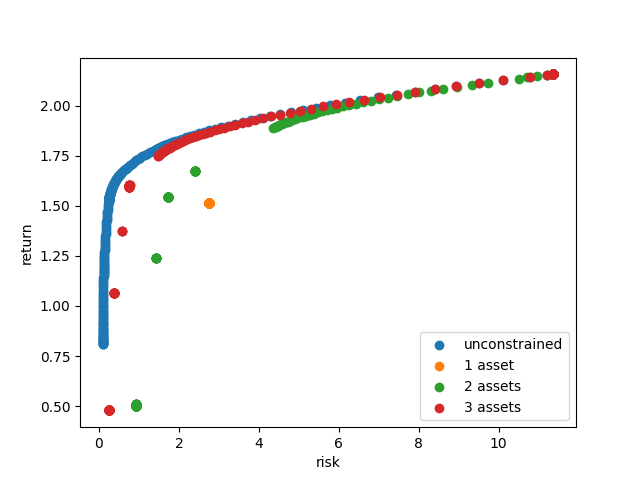

Mean-Variance Portfolio
=======================

Portfolio optimization involves the strategic allocation of wealth across various
assets, including stocks, bonds, commodities, and other investment instruments.
The objective of portfolio optimization is to construct portfolios that strike an
optimal balance between expected returns and risk.

To achieve this, portfolio optimization can take into consideration several factors,
including historical data, market trends, and the investor's risk tolerance.
Expected returns and variances play a crucial role in the process. Expected returns
estimate the potential gains an investor anticipates from holding a particular asset,
while variances measure the volatility or fluctuation in the asset's returns.

The efficient frontier is a key concept in portfolio optimization. It represents the
set of portfolios that offer the highest expected returns for a given level of risk.
This mod returns portfolios on the
efficient frontier given expected returns and variances.

Problem Specification
---------------------

.. tabs::

    .. tab:: Description

        We consider a single-period portfolio optimization problem where want
        to allocate wealth into :math:`n` risky assets. The returned portfolio
        :math:`x` is an efficient mean-variance portfolio for given returns
        :math:`\mu`, covariance matrix :math:`\Sigma` and risk aversion
        :math:`\gamma`.

    .. tab:: Mathematical Formulation

        .. math::

            \begin{alignat}{2}
            \max \quad        & \mu^\top x - \tfrac12 \gamma\ x^\top\Sigma x \\
            \mbox{s.t.} \quad & 1^\top x = 1 \\
            \end{alignat}

        * :math:`\mu` is the vector of expected returns.
        * :math:`\Sigma` is the return covariance matrix.
        * :math:`x` is the portfolio where :math:`x_i` denotes the fraction of
          wealth invested in the risky asset :math:`i`.
        * :math:`\gamma\geq0` is the risk aversion coefficient.

This description refers only to the simple base model.  Further down in
`Enforcing more portfolio features`_ we explain how to enforce additional
features, such as leverage or transaction fees.

Data Specification
------------------

The mean-variance portfolio optimization model takes the following inputs:

* The covariance matrix :math:`\Sigma` can be given as a pandas DataFrame or a
  numpy array.
* The return estimator :math:`\mu` can be given as a pandas Series or a numpy
  array.

The returned allocation vector :math:`x` is a pandas Series or a numpy ndarray
(depending on the input types).

Example
-------

Here we derive the matrix :math:`\Sigma` and the vector :math:`\mu` from a time
series of logarithmic historic returns:

.. testsetup:: mod

    # Set pandas options for displaying DataFrames, if needed
    import math
    import pandas as pd
    pd.options.display.max_rows = 10
    pd.options.display.max_columns = 7

.. doctest:: mod
    :options: +NORMALIZE_WHITESPACE

    >>> from gurobi_optimods import datasets
    >>> data = datasets.load_portfolio()
    >>> data
                AA        BB        CC  ...        HH        II        JJ
    0   -0.000601  0.002353 -0.075234  ...  0.060737 -0.012869 -0.022137
    1    0.019177  0.050008  0.041345  ... -0.026674  0.009876  0.012809
    2   -0.020333  0.026638 -0.038999  ... -0.023153 -0.007007 -0.038034
    3    0.001421 -0.053813 -0.013347  ... -0.012348  0.018736 -0.058373
    4    0.008648  0.114836  0.003617  ...  0.064090 -0.011153  0.024333
    ..        ...       ...       ...  ...       ...       ...       ...
    240  0.007382 -0.000724 -0.002444  ... -0.007654  0.018015 -0.017135
    241 -0.003362 -0.106913 -0.082365  ...  0.040787 -0.023020 -0.067792
    242  0.004359 -0.029763 -0.041986  ...  0.014522 -0.017109 -0.060247
    243 -0.018402 -0.054211 -0.075788  ... -0.013557  0.022576 -0.036793
    244 -0.016237  0.015580 -0.026970  ... -0.005893 -0.013456 -0.032203
    <BLANKLINE>
    [245 rows x 10 columns]

The columns of this DataFrame represent the individual assets ("AA", "BB", ...,
"JJ") while the rows represent the historic time steps. We use pandas
functionality to compute a simple mean estimator and corresponding covariance
from this DataFrame:

.. testcode:: mod

    import pandas as pd

    from gurobi_optimods.datasets import load_portfolio
    from gurobi_optimods.portfolio import MeanVariancePortfolio

    data = load_portfolio()
    cov_matrix = data.cov()
    mu = data.mean()
    gamma = 100.0

    mvp = MeanVariancePortfolio(mu, cov_matrix)
    pf = mvp.efficient_portfolio(gamma)

.. testoutput:: mod
    :hide:

    ...
    Optimize a model with 82 rows, 91 columns and 190 nonzeros
    ...
    Model has 55 quadratic objective terms
    ...
    Presolved: 1 rows, 10 columns, 10 nonzeros
    ...

Solution
--------

The return value of the ``efficient_portfolio`` method is a dict containing
information on the computed portfolio.

.. doctest:: mod
    :options: +NORMALIZE_WHITESPACE

    >>> pf.keys()
    dict_keys(['x', 'return', 'risk'])

The data returned is as follows:

* ``x`` : The relative investments :math:`x` for each asset
* ``return`` : The estimated return :math:`\mu^T x`
* ``risk`` : The estimated risk :math:`x^T \Sigma x`

In this example the solution suggests to spread the investments over five
positions (AA, DD, GG, HH, II).  The other allocations are negligible.

.. doctest:: mod
    :options: +NORMALIZE_WHITESPACE

    >>> pf["x"]
    AA    4.236507e-01
    BB    1.743570e-07
    CC    7.573610e-10
    DD    2.430104e-01
    EE    1.017732e-07
    FF    2.760531e-09
    GG    2.937307e-02
    HH    2.350833e-01
    II    6.888222e-02
    JJ    1.248442e-08
    dtype: float64

The estimated risk and return are:
positions (AA, DD, GG, HH, II).  The other allocations are negligible.

.. doctest:: mod
    :options: +NORMALIZE_WHITESPACE

    >>> round(pf["risk"], ndigits=8)
    0.00017552
    >>> round(pf["return"], ndigits=8)
    0.00365177

.. _factor models:

Using factor models as input
----------------------------

In the preceding discussion we have assumed that we the covariance matrix
:math:`\Sigma` was explicitly given.  In many cases, however, the covariance is
naturally given through a *factor model*.  Mathematically this means that a
decomposition

.. math::

    \begin{align*}
    \Sigma = F_1 F_1^T + F_2 F_2^T + \cdots + F_l F_l^T
    \end{align*}

is known.  Examples for this are single- or multi-factor models that divide the
individual covariances into a general market movement, and an idiosyncratic
risk component for each asset.  See `Efficient frontier(s) with cardinality
constraints`_ for an example.

Rather than computing the covariance matrix explcitly from the decomposition,
it is adivised to input the individual factor matrices directly through the
``cov_factors`` keyword argurment as in the following example, which mimicks a
single-factor model:

.. testcode:: mod

    import numpy as np
    from gurobi_optimods.portfolio import MeanVariancePortfolio

    mu = np.array([0.23987036, 0.24402181, 0.15069203])
    market_variance = 0.25
    # Factors relating market variance to assets
    beta = np.array([[0.93797928], [1.71942161], [1.15652896]])
    # Idiosyncratic risk
    asset_risk = np.array([0.23745675, 0.19140259, 0.34325066])

    # Full covariance matrix according to single factor model
    Sigma = beta @ beta.T * market_variance**2 + np.diag(asset_risk**2)
    mvp_matrix = MeanVariancePortfolio(mu, cov_matrix=Sigma)
    x_matrix = mvp_matrix.efficient_portfolio(20)["x"]

    # Better use known factorization
    F1 = beta * market_variance
    F2 = np.diag(asset_risk)
    mvp_factors = MeanVariancePortfolio(mu, cov_factors=(F1, F2))
    x_factors = mvp_factors.efficient_portfolio(20)["x"]

.. testoutput:: mod
    :hide:

    ...
    Optimize a model with 26 rows, 28 columns and 57 nonzeros
    ...
    Model has 6 quadratic objective terms
    ...
    Presolved: 1 rows, 3 columns, 3 nonzeros
    ...
    Optimize a model with 30 rows, 32 columns and 67 nonzeros
    ...
    Model has 4 quadratic objective terms
    ...
    Presolved: 2 rows, 4 columns, 6 nonzeros
    ...

The two computed portfolios are the same, up to numerical noise.

.. doctest:: mod
    :options: +NORMALIZE_WHITESPACE

    >>> pd.DataFrame(data={'matrix': x_matrix, 'factors': x_factors})
                 matrix       factors
        0  7.792530e-01  7.792530e-01
        1  1.677210e-09  3.696123e-09
        2  2.207470e-01  2.207470e-01

.. _portfolio features:

Enforcing more portfolio features
---------------------------------

A number of additional restrictions can be placed on the returned optimal
portfolio, such as transaction fees or limiting the number of trades.

Working with leverage
~~~~~~~~~~~~~~~~~~~~~

By default, all traded positions will be long positions. You can allow
allocations in short positions (where assets are borrowed and sold with
the intention of repurchasing them later at a lower price)
by defining a nonzero limit on the total short
allocations via the keyword parameter ``max_total_short``.
For example, to allow short positions to take up to 30% of the
portfolio value (130-30 strategy), you can do:

.. testcode:: mod

    import pandas as pd
    from gurobi_optimods.datasets import load_portfolio
    from gurobi_optimods.portfolio import MeanVariancePortfolio
    data = load_portfolio()
    cov_matrix = data.cov()
    mu = data.mean()
    gamma = 100.0
    mvp = MeanVariancePortfolio(mu, cov_matrix)
    x = mvp.efficient_portfolio(gamma, max_total_short=0.3)["x"]

.. testoutput:: mod
    :hide:

    ...
    Optimize a model with 82 rows, 91 columns and 200 nonzeros
    ...
    Model has 55 quadratic objective terms
    ...
    Presolved: 62 rows, 70 columns, 160 nonzeros
    ...

By incorporating leverage, we now obtain an optimal portfolio with three short
positions, totaling to about 14% of the wealth:

.. doctest:: mod
    :options: +NORMALIZE_WHITESPACE +ELLIPSIS

    >>> x
        AA    0.437482
        BB    0.020704
        CC   -0.080789
        DD    0.271877
        EE    0.019897
        FF   -0.029849
        GG    0.083466
        HH    0.240992
        II    0.066809
        JJ   -0.030588
    dtype: float64

    >>> x[x<0].sum()
    -0.141226...

One-time transaction fees
~~~~~~~~~~~~~~~~~~~~~~~~~

In order to take into account fixed costs per transaction suggested by the
optimal portfolio :math:`x`, you can use the keyword parameters ``fees_buy``
(for buy trades) and ``fees_sell`` (for sell trades):

.. testcode:: mod

    import pandas as pd

    from gurobi_optimods.datasets import load_portfolio
    from gurobi_optimods.portfolio import MeanVariancePortfolio

    data = load_portfolio()
    cov_matrix = data.cov()
    mu = data.mean()
    gamma = 100.0

    mvp = MeanVariancePortfolio(mu, cov_matrix)
    x = mvp.efficient_portfolio(gamma, fees_buy=0.005)["x"]

.. testoutput:: mod
    :hide:

    ...
    Optimize a model with 82 rows, 91 columns and 200 nonzeros
    ...
    Model has 55 quadratic objective terms
    ...
    Presolved: 26 rows, 25 columns, 65 nonzeros
    ...

Transaction fees can be provided either as a constant fee, applying the
same amount uniformly to all assets, or as numpy array or pandas Series
to specify distinct fees for individual assets.

Note that these parameters prescribe the transaction fees *relative* to the
total portfolio value.  In the above example we used ``fees_buy=0.005``,
meaning that each buy transaction has a fixed-cost of 0.5% of
the total portfolio value.

All transaction fees are assumed to be covered by the portfolio itself,
thus reducing the total sum of the returned optimal portfolio:

.. doctest:: mod
   :options: +NORMALIZE_WHITESPACE

    >>> round(x.sum(), ndigits=6)
    0.95

.. testcode:: mod
    :hide:

    assert math.isclose(x.sum(), 0.95)

Proportional transaction costs
~~~~~~~~~~~~~~~~~~~~~~~~~~~~~~

You can define transaction costs *proportional to the transaction value* by
using the ``costs_buy`` (for buy trades) and ``costs_sell`` (for sell
trades) keyword parameters as follows:

.. testcode:: mod

    import pandas as pd

    from gurobi_optimods.datasets import load_portfolio
    from gurobi_optimods.portfolio import MeanVariancePortfolio

    data = load_portfolio()
    cov_matrix = data.cov()
    mu = data.mean()
    gamma = 100.0

    mvp = MeanVariancePortfolio(mu, cov_matrix)
    x = mvp.efficient_portfolio(gamma, costs_buy=0.0025)["x"]

.. testoutput:: mod
    :hide:

    ...
    Optimize a model with 82 rows, 91 columns and 200 nonzeros
    ...
    Model has 55 quadratic objective terms
    ...
    Presolved: 1 rows, 10 columns, 10 nonzeros
    ...

Transaction costs can be provided either as a constant value, applying
the same cost uniformly to all assets, or as a numpy array or pandas Series,
allowing for asset-specific costs.

Note that these parameters prescribe the transaction costs relative to the
trade value.  In the above example we used ``costs_buy=0.0025``, meaning that
each buy transaction incurs transaction costs of 0.25% of
the traded value.

All transaction costs are assumed to be covered by the portfolio itself,
thus reducing the total sum of the returned optimal portfolio:

.. doctest:: mod
   :options: +NORMALIZE_WHITESPACE

    >>> round(x.sum(), ndigits=6)
    0.997506

.. testcode:: mod
    :hide:

    assert math.isclose(x.sum(), 1/(1+0.0025))

Minimum position constraints
~~~~~~~~~~~~~~~~~~~~~~~~~~~~

A minimum fraction of investment can be enforced upon each individual position,
preventing trades at negligible volume.  Use the keyword parameters
``min_long`` and ``min_short`` to set thresholds for trading long and short
positions.  For example, here we enforce that at least 5% of the wealth are
allocated to each trade:

.. testcode:: mod

    import pandas as pd
    from gurobi_optimods.datasets import load_portfolio
    from gurobi_optimods.portfolio import MeanVariancePortfolio
    data = load_portfolio()
    cov_matrix = data.cov()
    mu = data.mean()
    gamma = 100.0
    mvp = MeanVariancePortfolio(mu, cov_matrix)
    x_plain = mvp.efficient_portfolio(gamma, max_total_short=0.3)["x"]
    x_minpos = mvp.efficient_portfolio(gamma, max_total_short=0.3, min_long=0.05, min_short=0.05)["x"]

.. testoutput:: mod
    :hide:

    ...
    Optimize a model with 82 rows, 91 columns and 200 nonzeros
    ...
    Model has 55 quadratic objective terms
    ...
    Presolved: 62 rows, 70 columns, 160 nonzeros
    ...
    Optimize a model with 102 rows, 91 columns and 240 nonzeros
    ...
    Model has 55 quadratic objective terms
    ...
    Presolved: 82 rows, 70 columns, 210 nonzeros
    ...

Comparing the two portfolios ``x_plain``, which has no minimum position
constraints set with ``x_minpos``, which defines these constraints, we see that
the latter portfolio is free of "tiny" transactions.

.. doctest:: mod
    :options: +NORMALIZE_WHITESPACE

    >>> pd.concat([x_plain, x_minpos], keys=["plain", "minpos"], axis=1)
           plain    minpos
    AA  0.437482  0.431366
    BB  0.020704  0.000000
    CC -0.080789 -0.070755
    DD  0.271877  0.284046
    EE  0.019897  0.000000
    FF -0.029849 -0.050000
    GG  0.083466  0.097149
    HH  0.240992  0.244677
    II  0.066809  0.063517
    JJ -0.030588  0.000000

Restricting the number of open positions
~~~~~~~~~~~~~~~~~~~~~~~~~~~~~~~~~~~~~~~~

It is possible to compute an optimal portfolio under the additional restriction
that only a limited number of positions can be open.  This can be set through
the ``max_positions`` keyword parameter.  For example, restricting the
total number of open positions to three can be achieved as follows:

.. testcode:: mod

    import pandas as pd

    from gurobi_optimods.datasets import load_portfolio
    from gurobi_optimods.portfolio import MeanVariancePortfolio

    data = load_portfolio()
    cov_matrix = data.cov()
    mu = data.mean()
    gamma = 100.0

    mvp = MeanVariancePortfolio(mu, cov_matrix)
    x = mvp.efficient_portfolio(gamma, max_positions=3)["x"]

.. testoutput:: mod
    :hide:

    ...
    Optimize a model with 83 rows, 91 columns and 210 nonzeros
    ...
    Model has 55 quadratic objective terms
    ...
    Presolved: 27 rows, 25 columns, 65 nonzeros
    ...

The returned solution now suggests to trade only the assets "AA", "DD", "HH".

.. doctest:: mod
    :options: +NORMALIZE_WHITESPACE

    >>> x
        AA    0.482084
        BB    0.000000
        CC    0.000000
        DD    0.282683
        EE    0.000000
        FF    0.000000
        GG    0.000000
        HH    0.235233
        II    0.000000
        JJ    0.000000
    dtype: float64

Restricting the number of trades
~~~~~~~~~~~~~~~~~~~~~~~~~~~~~~~~

It is possible to compute an optimal portfolio under the additional restriction
that only a limited number of positions can be traded.  This can be set through
the ``max_trades`` keyword parameter.  Without a starting portfolio (see
`Starting portfolio & rebalancing`_) this is equivalent to limiting the number
of positions (via ``max_positions``).  But with a starting portfolio defined,
this parameter will limit the number of trades changing it.

Including a risk-free asset
~~~~~~~~~~~~~~~~~~~~~~~~~~~

A risk-free asset can be included in the optimal choice of portfolio through
the ``rf_return`` parameter.  Its value specifies the risk-free return rate.
For example, here we compute an efficient portfolio under the assumption that
the risk-free return rate is 0.25%:

.. testcode:: mod

    import pandas as pd

    from gurobi_optimods.datasets import load_portfolio
    from gurobi_optimods.portfolio import MeanVariancePortfolio

    data = load_portfolio()
    cov_matrix = data.cov()
    mu = data.mean()
    gamma = 12.5

    mvp = MeanVariancePortfolio(mu, cov_matrix)
    pf = mvp.efficient_portfolio(gamma, rf_return=0.0025)

.. testoutput:: mod
    :hide:

    ...
    Optimize a model with 82 rows, 91 columns and 191 nonzeros
    ...
    Model has 55 quadratic objective terms
    ...
    Presolved: 1 rows, 11 columns, 11 nonzeros
    ...

If a risk-free return rate has been specified, the returned portfolio
information has an additional key ``x_rf`` that tells the proportion of
investment into the risk-free asset.  In this example the optimal portfolio
allocates about 17% into the risk-free asset:

.. testcode:: mod

   print(f"risky     investment: {100*pf['x'].sum():.2f}%")
   print(f"risk-less investment: {100*pf['x_rf']:.2f}%")

.. testoutput:: mod

   risky     investment: 83.18%
   risk-less investment: 16.82%

Note that the contribution of ``rf_return * x_rf`` to the portfolio's expected
value is already included in ``pf["return"]``.

Starting portfolio & rebalancing
~~~~~~~~~~~~~~~~~~~~~~~~~~~~~~~~

Alternatively to computing an optimal portfolio out of an all-cash position,
one can specify a *starting portfolio*, referred to as :math:`x^0` in the
following, via the ``initial_holdings`` keyword parameter.  In this case, an
optimal *rebalancing* of the given portfolio is computed.

Each entry :math:`x^0_i` indicates the fraction of wealth that is currently
invested in asset :math:`i`.  Consequently the initial holdings :math:`x^0`
need to satisfy :math:`\sum_i x^0_i \leq 1`.

When specifying a starting portfolio, the following constraints target the
*difference* :math:`x - x^0` instead of the optimal portfolio :math:`x`:

* `One-time transaction fees`_ through the ``fees_buy`` and ``fees_sell``
  parameters

* `Proportional transaction costs`_ through the ``costs_buy`` and ``costs_sell``
  parameters

* `Minimum position constraints`_ through the ``min_short`` and ``min_long``
  parameters

* `Restricting the number of trades`_ through the ``max_trades`` parameter

Note that without any additional constraints on the portfolio or trades, it
does not make a difference whether or not you specify a starting portfolio: In
that case any given portfolio will be changed to match the optimal allocations
(no *sunk-cost-fallacy*).

In the following example we ask for rebalancing a given starting portfolio
using at most two trades:

.. testcode:: mod

    import pandas as pd
    import numpy as np
    from gurobi_optimods.datasets import load_portfolio
    from gurobi_optimods.portfolio import MeanVariancePortfolio
    data = load_portfolio()
    cov_matrix = data.cov()
    mu = data.mean()
    gamma = 100.0
    mvp = MeanVariancePortfolio(mu, cov_matrix)

    # A random starting portfolio
    x0 = pd.Series(
        [0.06, 0.0, 0.0, 0.23, 0.37, 0.18, 0.0, 0.09, 0.07, 0.0],
        index=mu.index
    )

    x = mvp.efficient_portfolio(gamma, initial_holdings=x0, max_trades=2,
        fees_buy=0.001, fees_sell=0.002)["x"]

.. testoutput:: mod
    :hide:

    ...
    Optimize a model with 83 rows, 91 columns and 230 nonzeros
    ...
    Model has 55 quadratic objective terms
    ...
    Presolved: 37 rows, 43 columns, 125 nonzeros
    ...

.. doctest:: mod
    :options: +NORMALIZE_WHITESPACE

    >>> pd.concat([x0, x, (x-x0).abs() > 1e-8], keys=["start", "optimal", "traded"], axis=1)
        start  optimal  traded
    AA   0.06    0.427    True
    BB   0.00    0.000   False
    CC   0.00    0.000   False
    DD   0.23    0.230   False
    EE   0.37    0.000    True
    FF   0.18    0.180   False
    GG   0.00    0.000   False
    HH   0.09    0.090   False
    II   0.07    0.070   False
    JJ   0.00    0.000   False

The traded positions are "AA" and "EE", resulting in one-time fees for one
long, and one short transaction (in sum 0.3% of the total investment).  As
explained in `One-time transaction fees`_, these fees are accounted by the
portfolio itself, reducing the total portfolio value as needed:

.. doctest:: mod
    :options: +NORMALIZE_WHITESPACE

    >>> print(round(x.sum(), ndigits=6))
    0.997

Efficient frontier(s) with cardinality constraints
--------------------------------------------------

In classical mean-variance portfolio theory, the *efficient frontier*
comprises all portfolios that achieve an optimal balance between risk and
return for varying values of :math:`\gamma` (see `Problem Specification`_).
Plotted in the risk-return plane, the result is a smooth curve, depicting
the trade-off between risk and expected return, see `efficient frontiers`_.

In this example we will explore the impact of restricting the number of open
positions on the efficient frontier.

Multiple-Factor Data Model
~~~~~~~~~~~~~~~~~~~~~~~~~~

For this example we will use synthetic data from a random *multiple-factor
model*.  In this setting the excess returns are supposed to follow the linear
model

.. math::

    \begin{equation*}
      r = Bf + u
    \end{equation*}

where

* :math:`r \in \mathbf{R}^n` are the excess returns,
* :math:`B \in \mathbf{R}^{n,k}` are the asset exposures to the market factors,
* :math:`f \in \mathbf{R}^k` are the factor return rates, and
* :math:`u \in \mathbf{R}^n` are the residual returns of the assets (uncorrelated).

So this excess return of each asset can be attributed to two factors: its weighted correlation
with general market movement (:math:`Bf`), which includes macroeconomic influences, and its
intrinsic, uncorrelated returns that are independent of market fluctuations (:math:`u`).

These model quantities allow for structured estimates of the first and second
moments (return and risk); for details of the derivation we refer to
:footcite:t:`cornuéjols_peña_tütüncü_2018`, Sect. 6.6.  The important effect on the input
data for the mean-variance model we want to point out though is that the
covariance matrix decomposes algebraically as follows:

.. math::

    \begin{equation*}
      \Sigma = F F^T + \mbox{cov}(u)
    \end{equation*}

That is, :math:`\Sigma` is given by the sum of a low-rank term and a diagonal
term; we will take advantage of this structure further below.  The following
code snippet generates synthetic data based on a multiple-factor model
incorporating this particular structure:

.. code-block:: Python

    import numpy as np
    np.random.seed(0xacac)  # Fix seed for reproducibility

    num_assets = 16
    num_factors = 4
    timesteps = 24

    # Generate random factor model parameters
    sigma_factor = np.diag(np.sqrt(1 + np.arange(num_factors) + np.random.rand(num_factors)))
    B = np.random.normal(size=(num_assets, num_factors))
    alpha = np.random.normal(loc=1, size=(num_assets, 1))
    u = np.random.multivariate_normal(np.zeros(num_assets), np.eye(num_assets), timesteps).T

    # Time series in factor space
    TS_factor = np.random.multivariate_normal(np.zeros(num_factors), sigma_factor**2, timesteps).T

    # Estimate mu from time series in full space
    mu = np.mean(alpha + B @ TS_factor + u, axis=1)

    # Final covariance data
    F = B @ sigma_factor
    risk_specific = np.diag(np.sqrt(np.diag(np.cov(u))))

Note that the matrices ``F`` and ``risk_specific`` are already in the format for the
optimization model as described in `Using factor models as input`_.

Computing frontiers
~~~~~~~~~~~~~~~~~~~

To compute the efficient frontier(s), we simple range over a series of values
for :math:`\gamma` and compute various optimal portfolios with different
cardinality constraints::

    from gurobi_optimods.portfolio import MeanVariancePortfolio
    gammas = np.logspace(-1, 1, 256)**2
    rr_pairs_unc = []
    rr_pairs_con = {1: [], 2: [], 3: []}

    for g in gammas:
        mvp = MeanVariancePortfolio(mu, cov_factors=(F, risk_specific))
        # Optimal portfolio w/o cardinality constraints
        pf = mvp.efficient_portfolio(g, verbose=False)
        rr_pairs_unc.append((pf["risk"], pf["return"]))
        for max_positions in [1, 2, 3]:
            # Optimal portfolio with cardinality constraints
            pf = mvp.efficient_portfolio(g, max_positions=max_positions, verbose=False)
            rr_pairs_con[max_positions].append((pf["risk"], pf["return"]))

Comparison
~~~~~~~~~~

All risk/return pairs are now recorded in ``rr_pairs_unc`` (unconstrained
portfolios) and ``rr_pairs_con`` (constrained portfolios). The corresponding
efficient frontiers look like this:

.. code-block:: python

    from matplotlib import pyplot as plt
    fig, ax = plt.subplots()

    risk, ret = zip(*rr_pairs_unc)
    ax.scatter(risk, ret, label="unconstrained")
    for k in rr_pairs_con:
        risk, ret = zip(*rr_pairs_con[k])
        ax.scatter(risk, ret, label=f"{k:d} asset{'' if k==1 else 's':s}")
        ax.legend(loc='lower right')
        plt.xlabel("risk")
        plt.ylabel("return")

    plt.show()

.. _efficient frontiers:

   Efficient frontiers for various cardinality constraints

Of course all cardinality constrained portfolios are dominated by the
unconstrained ones, but restricting the portfolio to three open
positions already yields points very close to the unconstrained efficient frontier.
The discontinuity of the constrained frontiers is a consequence of the discrete
decision of holding a position or not, preventing a smooth progression from one
efficient portfolio to another for varying values of :math:`\gamma`.

.. footbibliography::
