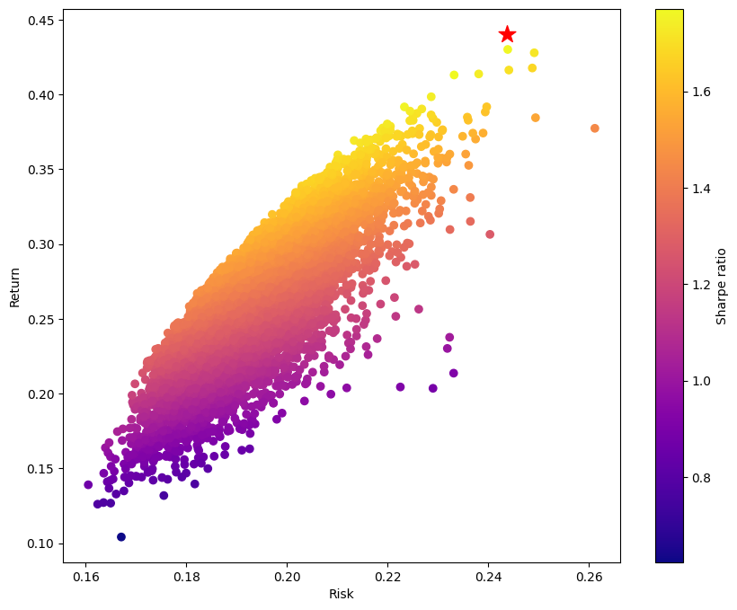

Maximum Sharpe Ratio
====================

The Sharpe ratio, named after Nobel laureate William F. Sharpe, measures the risk-adjusted performance of a portfolio. It is calculated by subtracting the risk-free rate of return from a portfolio's expected return and dividing the result by the portfolio's standard deviation. Thus, a higher Sharpe ratio corresponds to more attractive risk-adjusted performance, as the portfolio's returns are higher relative to the portfolio's risk.

This mod computes the portfolio that maximizes the Sharpe ratio for the given expected returns and variances.

Problem Specification
---------------------

.. tabs::

    .. tab:: Description

        Our goal is to find an investment portfolio that maximizes

        .. math::
            \begin{align*}
                \textrm{Sharpe ratio} &= \frac{\textrm{Expected return} - \textrm{Risk-free rate}}{\textrm{Standard deviation}}.
            \end{align*}

    .. tab:: Mathematical Formulation

        Consider `n` assets. Let :math:`r_f \geq 0` be the risk-free rate. Let :math:`\mu \in \mathbb{R}^n` be the vector of expected returns and let :math:`\Sigma \in \mathbb{R}^{n \times n}` be the positive semidefinite covariance matrix. We there exists :math:`i \in \{1, \ldots, n\}` such that :math:`\mu_i > r_f`. If not, the portfolio that maximizes the Sharpe ratio is the one consisting entirely of the risk-free asset.

        We seek a portfolio of weights :math:`x` that maximizes

        .. math::
            \begin{alignat*}{2}
                \max_x\ && \frac{\mu^\top x - r_f}{\sqrt{x^\top \Sigma x}} & \\
                \textrm{s.t.}\ && \sum_{i=1}^n x_i ={} &1 \qquad \textbf{(1)} \\
                && x \geq {} &0.
            \end{alignat*}

        Model \textbf{(1)} can be reformulated as follows:

        .. math::
            \begin{alignat*}{2}
                \max_y\ && \frac{1}{\sqrt{y^\top \Sigma y}} \qquad & \\
                \textrm{s.t.}\enspace && (\mu - r_f)^\top y = {} &1 \qquad \textbf{(2)} \\
                && y \geq {} &0.
            \end{alignat*}

        :math:`\textbf{(1)}` and :math:`\textbf{(2)}` are equivalent in the sense that given a solution to either problem, we can construct a solution to the other of equal or better objective value. In particular, any solution :math:`\bar{y}` of :math:`\textbf{(2)}` can be mapped to a solution :math:`\bar{x}` of :math:`\textbf{(1)}` using the transformation :math:`\bar{x}_i := \bar{y}_i / \sum_{j = 1}^n \bar{y}_j` for `j = 1, \ldots, n`. Conversely, any solution :math:`\bar{x}` of :math:`\textbf{(1)}` can be mapped to a solution :math:`\bar{y}` of :math:`\textbf{(2)}` using the transformation :math:`\bar{y}_ := \bar{x}_i / \mu^\top \bar{x}`.

        Like :math:`\textbf{(1)}`, model :math:`\textbf{(2)}` is non-convex. However, because :math:`\Sigma` is positive semidefinite, the optimal solution of :math:`\textbf{(2)}` is equivalent to the optimal solution of the following model:

        .. math::
            \begin{alignat*}{2}
                \min_y\ && y^\top \Sigma y \qquad \quad & \\
                \textrm{s.t.}\enspace && (\mu - r_f)^\top y = {} &1 \qquad \textbf{(3)} \\
                && y \geq {} &0.
            \end{alignat*}

        In this mod, we solve the convex quadratic program :math:`\textbf{(3)}`, then map the optimal solution :math:`y^*` back to the original problem :math:`\textbf{(3)}` via the transformation :math:`x^*_i := y^*_i / \sum_{j=1}^n y^*_j`.

Interface
---------

The ``max_sharpe_ratio`` function requires the following arguments:

* ``cov_matrix``: The covariance matrix :math:`\Sigma`, given as a numpy ndarray or pandas DataFrame (e.g., returned by the `pandas.DataFrame.cov <https://pandas.pydata.org/docs/reference/api/pandas.DataFrame.cov.html>`_ method).
* ``mu``: The vector of expected returns :math:`\mu`, given as a numpy ndarray or pandas Series.

One can optionally pass in ``rf_rate``, the non-negative risk-free return rate :math:`r_f`. By default, the risk-free rate is 0.

.. tabs::

    .. tab:: ``cov_matrix``

        The covariance matrix :math:`\Sigma`. In the example data, ``cov_matrix`` is provided as a pandas DataFrame:

        .. doctest:: sharpe-ratio-sigma
            :options: +NORMALIZE_WHITESPACE

            >>> from gurobi_optimods.datasets import load_sharpe_ratio
            >>> data = load_sharpe_ratio()
            >>> data.cov_matrix
                      A         B         C         D         E         F
            A  0.082270  0.019868  0.028524  0.042358  0.028701  0.030124
            B  0.019868  0.026618  0.021043  0.023734  0.018816  0.020539
            C  0.028524  0.021043  0.071772  0.026417  0.027282  0.026499
            D  0.042358  0.023734  0.026417  0.078290  0.044323  0.032523
            E  0.028701  0.018816  0.027282  0.044323  0.114622  0.025116
            F  0.030124  0.020539  0.026499  0.032523  0.025116  0.048444

        If the ``cov_matrix`` and ``mu`` passed to the ``max_sharpe_ratio`` function are both pandas objects, their indices should be identical.

        The ``max_sharpe_ratio`` function also accepts ``cov_matrix`` in the form of a numpy ndarray.

        .. doctest:: sharpe-ratio-sigma
            :options: +NORMALIZE_WHITESPACE

            >>> data.cov_matrix.to_numpy()
            array([[0.08227043, 0.01986814, 0.02852358, 0.04235823, 0.02870146,
                    0.03012354],
                   [0.01986814, 0.02661788, 0.02104262, 0.02373354, 0.01881621,
                    0.02053921],
                   [0.02852358, 0.02104262, 0.07177223, 0.02641692, 0.0272818 ,
                    0.02649857],
                   [0.04235823, 0.02373354, 0.02641692, 0.07828953, 0.04432265,
                    0.0325231 ],
                   [0.02870146, 0.01881621, 0.0272818 , 0.04432265, 0.11462156,
                    0.02511627],
                   [0.03012354, 0.02053921, 0.02649857, 0.0325231 , 0.02511627,
                    0.04844418]])

    .. tab:: ``mu``
        The expected returns :math:`\mu`. In the example data, ``mu`` is provided as a pandas Series.

        .. doctest:: sharpe-ratio-mu
            :options: +NORMALIZE_WHITESPACE

            >>> from gurobi_optimods.datasets import load_sharpe_ratio
            >>> data = load_sharpe_ratio()
            >>> data.mu
            A    0.387394
            B    0.022102
            C    0.233651
            D    0.212704
            E    0.522495
            F    0.174672
            dtype: float64

        If the ``cov_matrix`` and ``mu`` passed to the ``max_sharpe_ratio`` function are both pandas objects, their indices should be identical.

        The ``max_sharpe_ratio`` function also accepts ``mu`` in the form a numpy ndarray.

        .. doctest:: sharpe-ratio-mu
            :options: +NORMALIZE_WHITESPACE

            >>> data.mu.to_numpy()
            array([0.38739382, 0.02210171, 0.2336505 , 0.21270397, 0.52249502,
                   0.17467246])

The ``max_sharpe_ratio`` function returns two objects:

1. The portfolio that maximizes the Sharpe ratio. If either the covariance matrix or expected returns were given as pandas object, the portfolio is a pandas Series. Otherwise, the portfolio is a numpy ndarray.
2. The Sharpe ratio of the optimal portfolio.

Example code
------------

The example code below solves the Sharpe ratio problem for the simple example dataset comprised of six assets.

.. testcode:: sharpe-ratio

    from gurobi_optimods.datasets import load_sharpe_ratio
    from gurobi_optimods.sharpe_ratio import max_sharpe_ratio

    # Load example data
    data = load_sharpe_ratio()

    # Get optimal portfolio and corresponding Sharpe ratio
    # Can pass risk-free rate as third argument; default is 0
    portfolio, ratio = max_sharpe_ratio(data.cov_matrix, data.mu)

.. testoutput:: sharpe-ratio
    :hide:

    ...
    Optimize a model with 1 rows, 6 columns and 6 nonzeros
    ...
    Optimal objective ...

.. collapse:: View Gurobi log for solving this example

    .. code-block:: text

        Gurobi Optimizer version 10.0.1 build v10.0.1rc0 (mac64[arm])

        CPU model: Apple M1 Pro
        Thread count: 8 physical cores, 8 logical processors, using up to 8 threads

        Optimize a model with 1 rows, 6 columns and 6 nonzeros
        Model fingerprint: 0x8a64724c
        Model has 21 quadratic objective terms
        Coefficient statistics:
          Matrix range     [2e-02, 5e-01]
          Objective range  [0e+00, 0e+00]
          QObjective range [5e-02, 2e-01]
          Bounds range     [0e+00, 0e+00]
          RHS range        [1e+00, 1e+00]
        Presolve time: 0.04s
        Presolved: 1 rows, 6 columns, 6 nonzeros
        Presolved model has 21 quadratic objective terms
        Ordering time: 0.00s

        Barrier statistics:
         Free vars  : 5
         AA' NZ     : 1.500e+01
         Factor NZ  : 2.100e+01
         Factor Ops : 9.100e+01 (less than 1 second per iteration)
         Threads    : 1

                          Objective                Residual
        Iter       Primal          Dual         Primal    Dual     Compl     Time
           0   2.36907424e+05 -2.36907424e+05  2.89e+03 4.81e-06  9.99e+05     0s
           1   5.46637227e+04 -5.63293162e+04  1.97e+02 3.28e-07  8.14e+04     0s
           2   2.41513966e+03 -4.80064244e+03  7.50e+00 1.25e-08  3.99e+03     0s
           3   4.26418722e+01 -2.29684466e+03  7.50e-06 1.27e-14  3.90e+02     0s
           4   4.15350414e+01 -5.23960479e+01  2.68e-07 4.44e-16  1.57e+01     0s
           5   3.02551672e+00 -5.57323733e+01  2.70e-13 2.22e-16  9.79e+00     0s
           6   1.68620039e+00 -8.66364122e-01  2.89e-15 6.22e-15  4.25e-01     0s
           7   5.59068804e-01 -1.76548882e-01  4.44e-16 1.11e-16  1.23e-01     0s
           8   3.38521711e-01  2.85826427e-01  2.78e-16 2.12e-16  8.78e-03     0s
           9   3.08810219e-01  3.05102830e-01  3.44e-15 5.55e-17  6.18e-04     0s
          10   3.06219030e-01  3.06149821e-01  2.22e-15 4.86e-17  1.15e-05     0s
          11   3.06155606e-01  3.06155537e-01  2.64e-14 5.55e-17  1.15e-08     0s
          12   3.06155542e-01  3.06155542e-01  3.06e-14 5.55e-17  1.15e-11     0s

        Barrier solved model in 12 iterations and 0.08 seconds (0.00 work units)
        Optimal objective 3.06155542e-01

    Note that the optimal objective reported in the log is the Sharpe ratio raised to the :math:`-\frac{1}{2}` power. In this example, the optimal Sharpe ratio is :math:`1.80729454311`. See the mathematical formulation provided in the `Problem Specification`_ section for additional details.

|

The model is solved as a QP by Gurobi.

Solution
--------

For the example data, the optimal portfolio is to invest in three assets (A, C, and E). The solution suggests allocating an extremely small proportion (1e-6) of the total investment budget to the other three assets; these investment amounts are negligible and can be ignored. The Sharpe ratio of the optimal portfolio is 1.8109:

.. doctest:: sharpe-ratio
    :options: +NORMALIZE_WHITESPACE

    >>> portfolio
    A    4.358499e-01
    B    6.958381e-11
    C    8.004452e-02
    D    2.970516e-10
    E    4.841056e-01
    F    2.824517e-08
    dtype: float64
    >>> ratio
    1.8109060196861502

Comparison to Monte Carlo simulation
------------------------------------

We can compare this optimal portfolio compares to portfolios acquired via Monte Carlo simulation. In Monte Carlo simluation, a large number of random portfolios are generated. Then, the expected return and standard deviation of the return is calculated for each portfolio using the covariance matrix :math:`\Sigma` and vector of expected returns :math:`\mu`. The portfolio with the highest Sharpe ratio (expected return divided by standard deviation of return) is used to guide investment decisions. The hope is that with enough randomly generated portfolios, at least one of them will have a Sharpe ratio close to optimal.

In the code below, we randomly generate 10000 portfolios (non-negative vectors of length six whose elements sum to 1). We plot each portfolio to visualize the tradeoff between portfolio risk and return. We plot the portfolio returned by the ``max_sharpe_ratio`` function as well using a red star.

.. testcode:: sharpe-ratio

    import numpy as np
    import matplotlib.pyplot as plt

    num_portfolios = 10000
    num_assets = data.mu.size

    # Generate random portfolios with weights summing to 1
    wts = np.random.random((num_portfolios, num_assets))
    wts = wts / wts.sum(axis=1, keepdims=1)

    # Calculate return, risk, and Sharpe ratio of each random portfolio
    risks = np.array([np.sqrt(wts[i] @ data.cov_matrix @ wts[i]) for i in range(num_portfolios)])
    returns = wts @ data.mu
    sharpe_ratios = returns / risks

    # Calculate return and risk for portfolio that maximizes Sharpe ratio
    opt_risk = np.sqrt(portfolio @ data.cov_matrix @ portfolio)
    opt_return = portfolio @ data.mu

    # Plot the random portfolios and the optimal portfolio
    plt.figure(figsize=(10, 8))
    plt.scatter(risks, returns, c=sharpe_ratios, cmap="plasma")
    plt.colorbar(label="Sharpe ratio")
    plt.xlabel("Risk")
    plt.ylabel("Return")
    plt.scatter(opt_risk, opt_return, marker="*", c="red", s=200)

    plt.show()

As the number of investible assets increases, the likelihood of the Monte Carlo simulation method finding a portfolio with a Sharpe ratio close to optimal decreases. More scalable and precise approaches like the one implemented in the ``max_sharpe_ratio`` function become more desirable.
