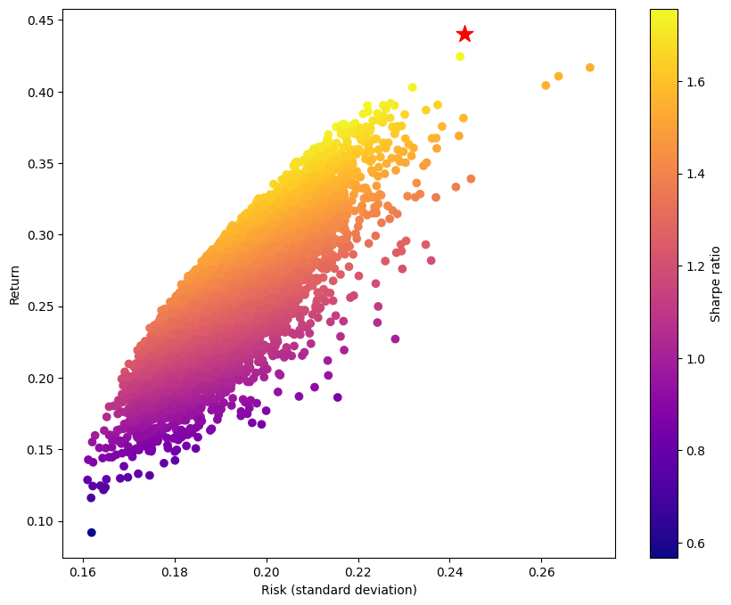

Maximum Sharpe Ratio
====================

The Sharpe ratio, named after Nobel laureate William F. Sharpe, measures the risk-adjusted performance of a portfolio. It is calculated by subtracting the risk-free rate of return from a portfolio's expected return and dividing the result by the portfolio's standard deviation. Thus, a higher Sharpe ratio corresponds to more attractive risk-adjusted performance, as the portfolio's returns are higher relative to the portfolio's risk.

This OptiMod computes the portfolio that maximizes the Sharpe ratio for the given expected returns and variances.

Problem Specification
---------------------

Our goal is to find an investment portfolio that maximizes

.. math::
    \begin{align*}
        \textrm{Sharpe ratio} &= \frac{\textrm{Expected return} - \textrm{Risk-free rate}}{\textrm{Standard deviation}}.
    \end{align*}

.. dropdown:: Background: Mathematical Model

    Consider :math:`n` assets. Let :math:`r_f \geq 0` be the risk-free rate. Let :math:`\mu \in \mathbb{R}^n` be the vector of expected returns and let :math:`\Sigma \in \mathbb{R}^{n \times n}` be the positive semidefinite covariance matrix. We assume there exists :math:`i \in \{1, \ldots, n\}` such that :math:`\mu_i > r_f`. If not, the portfolio that maximizes the Sharpe ratio is the one consisting entirely of the risk-free asset.

    We seek a portfolio of weights :math:`x` that maximizes the Sharpe ratio :math:`(\mu^\top x - r_f) / \sqrt{x^\top \Sigma x}`:

    .. math::
        \begin{alignat*}{2}
            \max_x\ && \frac{\mu^\top x - r_f}{\sqrt{x^\top \Sigma x}} & \\
            \textrm{s.t.}\ && \sum_{i=1}^n x_i ={} &1 \qquad \textbf{(1)} \\
            && x \geq {} &0.
        \end{alignat*}

    Model :math:`\textbf{(1)}` is non-convex. In general, non-convex problems are very difficult to solve. Fortunately, there exists a convex reformulation of :math:`\textbf{(1)}`. As a step towards that convex reformulation, we first reformulate :math:`\textbf{(1)}` as follows:

    .. math::
        \begin{alignat*}{2}
            \max_y\ && \frac{1}{\sqrt{y^\top \Sigma y}} \qquad & \\
            \textrm{s.t.}\enspace && (\mu - r_f)^\top y = {} &1 \qquad \textbf{(2)} \\
            && y \geq {} &0.
        \end{alignat*}

    Models :math:`\textbf{(1)}` and :math:`\textbf{(2)}` are equivalent in the sense that given a solution to either problem, we can construct a solution to the other of equal or better objective value. In particular, any solution :math:`\bar{x}` of :math:`\textbf{(1)}` can be mapped to a solution :math:`\bar{y}` of :math:`\textbf{(2)}` of equivalent objective value using the transformation :math:`\bar{y}_i := \bar{x}_i / \mu^\top \bar{x}` for :math:`i = 1, \ldots, n`. Conversely, any solution :math:`\bar{y}` of :math:`\textbf{(2)}` can be mapped to a solution :math:`\bar{x}` of :math:`\textbf{(1)}` of equivalent objective value using the transformation :math:`\bar{x}_i := \bar{y}_i / \sum_{j = 1}^n \bar{y}_j` for :math:`i = 1, \ldots, n`.

    Like :math:`\textbf{(1)}`, model :math:`\textbf{(2)}` is non-convex. However, because :math:`\Sigma` is positive semidefinite, maximizing :math:`1 / \sqrt{y^\top \Sigma y}` is equivalent to minimizing :math:`y^\top \Sigma y`. Thus, the optimal solution of :math:`\textbf{(2)}` is equivalent to the optimal solution of the following model:

    .. math::
        \begin{alignat*}{2}
            \min_y\ && y^\top \Sigma y \qquad \quad & \\
            \textrm{s.t.}\enspace && (\mu - r_f)^\top y = {} &1 \qquad \textbf{(3)} \\
            && y \geq {} &0.
        \end{alignat*}

    Model :math:`\textbf{(3)}` is convex. In this OptiMod, we solve the convex quadratic program (QP) :math:`\textbf{(3)}`, then map the optimal solution :math:`y^*` back to the original problem :math:`\textbf{(1)}` via the transformation

    .. math::
        \begin{align*}
            x^*_i &:= \frac{y^*_i}{\sum_{j=1}^n y^*_j} \qquad i = 1, \ldots, n.
        \end{align*}

Interface
---------

The ``max_sharpe_ratio`` function requires the following arguments:

* ``cov_matrix``: The covariance matrix :math:`\Sigma`, given as a :class:`numpy.ndarray` or :class:`pandas.DataFrame` (e.g., returned by the :meth:`pandas.DataFrame.cov` method).
* ``mu``: The vector of expected returns :math:`\mu`, given as a :class:`numpy.ndarray` or :class:`pandas.Series`.

One can optionally pass in ``rf_rate``, the non-negative risk-free return rate :math:`r_f`. By default, the risk-free rate is 0.

.. tabs::

    .. tab:: ``cov_matrix``

        The covariance matrix :math:`\Sigma`. In the example data, ``cov_matrix`` is provided as a :class:`pandas.DataFrame`:

        .. doctest:: sharpe-ratio-sigma
            :options: +NORMALIZE_WHITESPACE

            >>> from gurobi_optimods.datasets import load_sharpe_ratio
            >>> data = load_sharpe_ratio()
            >>> data.cov_matrix
                      A         B         C         D         E         F
            A  0.082270  0.019868  0.028524  0.042358  0.028701  0.030124
            B  0.019868  0.026618  0.021043  0.023734  0.018816  0.020539
            C  0.028524  0.021043  0.071772  0.026417  0.027282  0.026499
            D  0.042358  0.023734  0.026417  0.078290  0.044323  0.032523
            E  0.028701  0.018816  0.027282  0.044323  0.114622  0.025116
            F  0.030124  0.020539  0.026499  0.032523  0.025116  0.048444

        If the ``cov_matrix`` and ``mu`` arguments passed to the ``max_sharpe_ratio`` function are both pandas objects, their indices should be identical.

        The ``max_sharpe_ratio`` function also accepts the ``cov_matrix`` argument in the form of a :class:`numpy.ndarray`:

        .. doctest:: sharpe-ratio-sigma
            :options: +NORMALIZE_WHITESPACE

            >>> data.cov_matrix.to_numpy()
            array([[0.08227043, 0.01986814, 0.02852358, 0.04235823, 0.02870146,
                    0.03012354],
                   [0.01986814, 0.02661788, 0.02104262, 0.02373354, 0.01881621,
                    0.02053921],
                   [0.02852358, 0.02104262, 0.07177223, 0.02641692, 0.0272818 ,
                    0.02649857],
                   [0.04235823, 0.02373354, 0.02641692, 0.07828953, 0.04432265,
                    0.0325231 ],
                   [0.02870146, 0.01881621, 0.0272818 , 0.04432265, 0.11462156,
                    0.02511627],
                   [0.03012354, 0.02053921, 0.02649857, 0.0325231 , 0.02511627,
                    0.04844418]])

    .. tab:: ``mu``
        The expected returns :math:`\mu`. In the example data, ``mu`` is provided as a :class:`pandas.Series`.

        .. doctest:: sharpe-ratio-mu
            :options: +NORMALIZE_WHITESPACE

            >>> from gurobi_optimods.datasets import load_sharpe_ratio
            >>> data = load_sharpe_ratio()
            >>> data.mu
            A    0.387394
            B    0.022102
            C    0.233651
            D    0.212704
            E    0.522495
            F    0.174672
            dtype: float64

        If the ``cov_matrix`` and ``mu`` arguments passed to the ``max_sharpe_ratio`` function are both pandas objects, their indices should be identical.

        The ``max_sharpe_ratio`` function also accepts the ``mu`` argument in the form a :class:`numpy.ndarray`:

        .. doctest:: sharpe-ratio-mu
            :options: +NORMALIZE_WHITESPACE

            >>> data.mu.to_numpy()
            array([0.38739382, 0.02210171, 0.2336505 , 0.21270397, 0.52249502,
                   0.17467246])

The ``max_sharpe_ratio`` function returns a :class:`~gurobi_optimods.sharpe_ratio.SharpeRatioResult` instance. This object contains information about the computed portfolio. It features the following attributes:

* ``x``: The portfolio that maximizes the Sharpe ratio. The values in the portfolio represent the relative weights that should be allocated to each asset. These weights sum to 1. If ``cov_matrix`` and/or ``mu`` were given as a pandas object, the portfolio is a :class:`pandas.Series`. Otherwise, the portfolio is a :class:`numpy.ndarray`.
* ``sharpe_ratio``: The Sharpe ratio of the optimal portfolio.
* ``ret``: The estimated return of the optimal portfolio.
* ``risk``: The estimated risk of the optimal portfolio.

Example code
------------

The example code below solves the problem of maximizing the Sharpe ratio for the simple example dataset comprised of six assets.

.. testcode:: sharpe-ratio

    from gurobi_optimods.datasets import load_sharpe_ratio
    from gurobi_optimods.sharpe_ratio import max_sharpe_ratio

    # Load example data
    data = load_sharpe_ratio()

    # Compute portfolio that maximizes Sharpe ratio
    # Can pass risk-free rate as third argument; default is 0
    portfolio = max_sharpe_ratio(data.cov_matrix, data.mu)

.. testoutput:: sharpe-ratio
    :hide:

    ...
    Optimize a model with 1 rows, 6 columns and 6 nonzeros
    ...
    Optimal objective 3...

Solution
--------

For the example data, the portfolio that maximizes the Sharpe ratio is obtained by investing in three assets (A, C, and E). The optimal solution suggests allocating an extremely small proportion (less than 1e-6) of the total investment budget to the other three assets; these investment amounts are negligible and can be ignored. The Sharpe ratio of the optimal portfolio is approximately 1.810906:

.. doctest:: sharpe-ratio
    :options: +NORMALIZE_WHITESPACE

    >>> portfolio.x
    A    4.358499e-01
    B    6.958381e-11
    C    8.004452e-02
    D    2.970516e-10
    E    4.841056e-01
    F    2.824517e-08
    dtype: float64
    >>> portfolio.sharpe_ratio
    1.810906...
    >>> portfolio.ret
    0.440490...
    >>> portfolio.risk
    0.059167...

Comparison to Monte Carlo simulation
------------------------------------

We can compare this optimal portfolio to portfolios acquired via Monte Carlo simulation. In Monte Carlo simluation, a large number of random portfolios are generated. Then, the expected return and standard deviation of the return is calculated for each portfolio using the covariance matrix :math:`\Sigma` and vector of expected returns :math:`\mu`. The portfolio with the highest Sharpe ratio (expected return divided by standard deviation of return) is chosen. The hope is that with enough randomly generated portfolios, at least one of them will have a Sharpe ratio close to optimal.

In the code below, we randomly generate 10,000 portfolios for the six assets from the example. Each portfolio is a non-negative vector of length six whose elements sum to 1. We plot each portfolio to visualize the tradeoff between risk and return. To compare these randomly generated portfolios with the one obtained by this OptiMod, we additionally plot the portfolio returned by the ``max_sharpe_ratio`` function using a red star.

.. code-block:: Python

    import numpy as np
    import matplotlib.pyplot as plt

    num_portfolios = 10000
    num_assets = data.mu.size

    # Generate random portfolios with weights summing to 1
    wts = np.random.random((num_portfolios, num_assets))
    wts = wts / wts.sum(axis=1, keepdims=1)

    # Calculate return, risk, and Sharpe ratio of each random portfolio
    risks = np.array([np.sqrt(wts[i] @ data.cov_matrix @ wts[i]) for i in range(num_portfolios)])
    returns = wts @ data.mu
    sharpe_ratios = returns / risks

    # Plot the random portfolios and the optimal portfolio
    plt.figure(figsize=(10, 8))
    plt.scatter(risks, returns, c=sharpe_ratios, cmap="plasma")
    plt.colorbar(label="Sharpe ratio")
    plt.xlabel("Risk")
    plt.ylabel("Return")
    plt.scatter(portfolio.risk, portfolio.ret, marker="*", c="red", s=200)

    plt.show()

Even for this small six-asset example, only a small number of the randomly generated portfolios have Sharpe ratios close to the maximal Sharpe ratio returned by the ``max_sharpe_ratio`` function. As the number of assets increases, it can become more difficult for Monte Carlo simulation to find portfolios with Sharpe ratios close to optimal.
