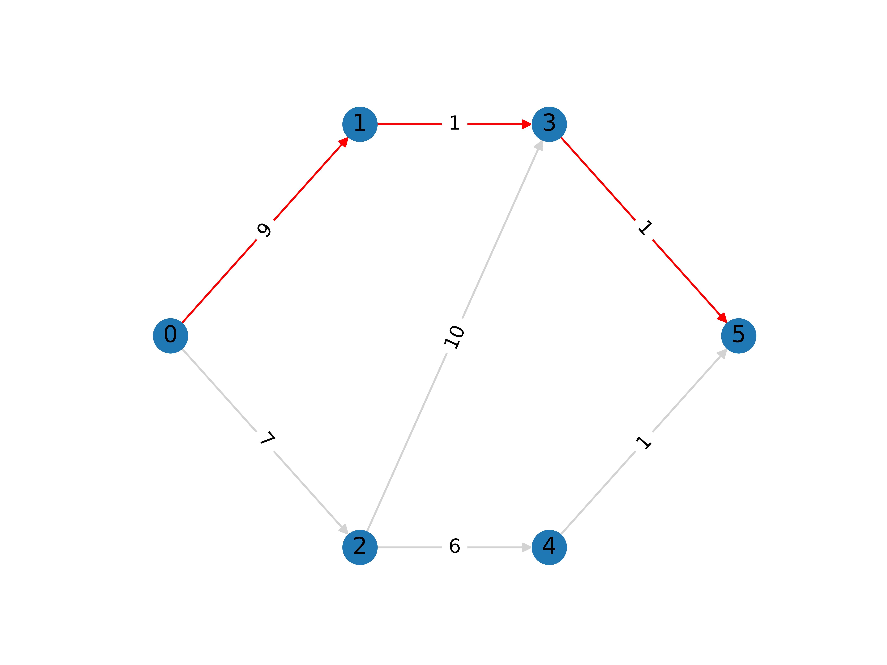

.. This template should be copied to docs/source/mods/<mod_name>.rst

Shortest Path
=============

The shortest path is a problem in graph theory where the aim is to find a path
between two nodes with the lowest cost.

This problem can be solved efficiently using the famous algorithm by
:footcite:t:`dijkstra1959graph`. This particular algorithm belongs to the field
of dynamic programming, however, we can also solve this problem using other
methods, including mathematical programming.

Problem Specification
---------------------

We provide two specifications of the problem using graph theory and using
mathematical programming.

.. tabs::

    .. tab:: Graph Theory

        For a given graph :math:`G` with set of vertices :math:`V` and edges
        :math:`E`. Each edge :math:`(i,j)\in E` has a cost: :math:`c_{ij}\in
        \mathbb{R}`;

        The problem can be stated as finding a path between two nodes, say
        source :math:`s` and sink :math:`t`, that minimises the total cost.

    .. tab:: Optimization Model

        Let us define a set of continuous variables :math:`x_{ij}` to represent
        the amount of non-negative (:math:`\geq 0`) flow going through an edge
        :math:`(i,j)\in E`.

        The mathematical formulation can be stated as follows:

        .. math::

            \begin{alignat}{2}
              \min \quad        & \sum_{(i, j) \in E} c_{ij} x_{ij} \\
              \mbox{s.t.} \quad & \sum_{j \in \delta^+(i)} x_{ij} - \sum_{j \in \delta^-(i)} x_{ji} = b_i & \forall i \in V \\
                                & 0 \leq x_{ij} \le 1 & \forall (i, j) \in E \\
            \end{alignat}

        Where :math:`\delta^+(\cdot)` (:math:`\delta^-(\cdot)`) denotes the
        outgoing (incoming) neighours, and :math:`b_i` is equal to :math:`-1` if
        :math:`i=s`, :math:`1` if :math:`i=t`, and :math:`0` otherwise.

        The objective minimises the total cost over all edges.

        The first constraints ensure flow balance for all vertices. That is, for
        a given node, the incoming flow (sum over all incoming edges to this
        node) minus the outgoing flow (sum over all outgoing edges from this
        node) is equal to :math:`b_i`. As defined above, for most nodes, this
        value is 0, so, the outgoing flow must be equal to the incoming flow,
        (hence the use of the term "flow balance").

        At the source node (:math:`s`), this value is :math:`-1`, so the flow
        must begin here (outgoing term must be :math:`1`). At the sink node
        (:math:`t`), this value is :math:`+1` so flow must end here (incoming
        term must be :math:`1`).

        The last constraints ensure non-negativity of the variables and that the
        flow per edge is at most :math:`1`.

|

Code and Inputs
---------------

For this mod, one can use input graphs of different types:

* pandas: using a ``pd.DataFrame``;
* NetworkX: using a ``nx.DiGraph`` or ``nx.Graph``;
* SciPy.sparse: using a ``sp.sparray`` matrix.

An example of these inputs with their respective requirements is shown below.

.. tabs::

  .. group-tab:: pandas

      .. doctest:: load_graph
          :options: +NORMALIZE_WHITESPACE

          >>> from gurobi_optimods import datasets
          >>> edge_data, _ = datasets.load_graph(capacity=False, demand=False)
          >>> edge_data
                         cost
          source target
          0      1          9
                 2          7
          1      3          1
          2      3         10
                 4          6
          3      5          1
          4      5          1

      The ``edge_data`` DataFrame is indexed by ``source`` and ``target`` nodes
      and contains a single column labelled ``cost`` with the edge attribute.

      We assume that nodes labels are integers from :math:`0,\dots,|V|-1`.

  .. group-tab:: NetworkX

      .. doctest:: load_graph_networkx
          :options: +NORMALIZE_WHITESPACE

          >>> from gurobi_optimods import datasets
          >>> G = datasets.load_graph_networkx(capacity=False, demand=False)
          >>> for e in G.edges(data=True):
          ...     print(e)
          ...
          (0, 1, {'cost': 9})
          (0, 2, {'cost': 7})
          (1, 3, {'cost': 1})
          (2, 3, {'cost': 10})
          (2, 4, {'cost': 6})
          (3, 5, {'cost': 1})
          (4, 5, {'cost': 1})

      Edges have an attribute ``cost``.

      We assume that nodes labels are integers from :math:`0,\dots,|V|-1`.
      NetworkX has a handy function for this
      `nx.convert_node_labels_to_integers`_.

      .. _nx.convert_node_labels_to_integers: https://networkx.org/documentation/stable/reference/generated/networkx.relabel.convert_node_labels_to_integers.html

  .. group-tab:: scipy.sparse

      .. doctest:: load_graph_scipy
          :options: +NORMALIZE_WHITESPACE

          >>> from gurobi_optimods import datasets
          >>> G, _, cost, _ = datasets.load_graph_scipy(capacity=False, demand=False)
          >>> G
          <5x6 sparse matrix of type '<class 'numpy.int64'>'
                  with 7 stored elements in COOrdinate format>
          >>> print(G)
            (0, 1)        1
            (0, 2)        1
            (1, 3)        1
            (2, 3)        1
            (2, 4)        1
            (3, 5)        1
            (4, 5)        1
          >>> print(cost)
            (0, 1)        9
            (0, 2)        7
            (1, 3)        1
            (2, 3)        10
            (2, 4)        6
            (3, 5)        1
            (4, 5)        1

      Two separate sparse matrices including the adjacency matrix and edge cost.

|

Solution
--------

Depending on the input of choice, the solution also comes with different
formats.

.. tabs::

  .. group-tab:: pandas

      Let's find the shortest path for the example graph between the source
      (node 0) and sink (node 5).

      .. doctest:: shortest_path
          :options: +NORMALIZE_WHITESPACE

          >>> from gurobi_optimods import datasets
          >>> from gurobi_optimods.shortest_path import shortest_path
          >>> edge_data, _ = datasets.load_graph(capacity=False, demand=False)
          >>> obj, sol = shortest_path(edge_data, 0, 5, silent=True)
          >>> obj
          11.0
          >>> sol[sol > 0]
          source  target
          0       1         1.0
          1       3         1.0
          3       5         1.0
          dtype: float64

      The ``shortest_path`` function returns the cost of the solution as well as
      ``pd.Series`` with the edges in the path. Similarly as the input DataFrame
      the resulting series is indexed by ``source`` and ``target``.

      We can see, the solution contains the non-zero edges forming the path
      `0->1->3->5` with a total cost of 11.

  .. group-tab:: NetworkX

      .. doctest:: shortest_path_networkx
          :options: +NORMALIZE_WHITESPACE

          >>> from gurobi_optimods import datasets
          >>> from gurobi_optimods.shortest_path import shortest_path
          >>> G = datasets.load_graph_networkx(capacity=False, demand=False)
          >>> obj, sol = shortest_path(G, 0, 5, silent=True)
          >>> obj
          11.0
          >>> sol.edges()
          EdgeView([(0, 1), (1, 3), (3, 5)])

      The ``shortest_path`` function returns the cost of the solution as well as
      ``pd.Series`` with the edges in the path. Similarly as the input DataFrame
      the resulting series is indexed by ``source`` and ``target``.

      We can see, the solution contains the non-zero edges forming the path
      `0->1->3->5` with a total cost of 11.

  .. group-tab:: scipy.sparse

      .. doctest:: shortest_path_networkx
          :options: +NORMALIZE_WHITESPACE

          >>> from gurobi_optimods import datasets
          >>> from gurobi_optimods.shortest_path import shortest_path
          >>> G, _, cost, _ = datasets.load_graph_scipy(capacity=False, demand=False)
          >>> G.data = cost.data
          >>> obj, sol = shortest_path(G, 0, 5, silent=True)
          >>> obj
          11.0
          >>> sol
          <5x6 sparse matrix of type '<class 'numpy.int64'>'
              with 3 stored elements in COOrdinate format>
          >>> print(sol)
            (0, 1)        1
            (1, 3)        1
            (3, 5)        1

      The ``shortest_path`` function returns the cost of the solution as
      well as a ``sp.sparray`` with the edges where the data is the amount of
      non-zero flow in the solution.

      We can see, the solution contains the non-zero edges forming the path
      `0->1->3->5` with a total cost of 11.

The solution for this example is shown in the figure below. The edge labels
denote the edge cost (:math:`c_{ij}`). Edges in the shortest path are
highlighted in red.

In all these cases, the model is solved as an LP by Gurobi.

.. collapse:: View Gurobi Logs

    .. code-block:: text

      Solving min-cost flow with 6 nodes and 7 edges
      Gurobi Optimizer version 10.0.1 build v10.0.1rc0 (mac64[arm])

      CPU model: Apple M1
      Thread count: 8 physical cores, 8 logical processors, using up to 8 threads

      Optimize a model with 6 rows, 7 columns and 14 nonzeros
      Model fingerprint: 0x524fc954
      Coefficient statistics:
        Matrix range     [1e+00, 1e+00]
        Objective range  [1e+00, 1e+01]
        Bounds range     [1e+00, 1e+00]
        RHS range        [1e+00, 1e+00]
      Presolve removed 4 rows and 4 columns
      Presolve time: 0.00s
      Presolved: 2 rows, 3 columns, 6 nonzeros

      Iteration    Objective       Primal Inf.    Dual Inf.      Time
             0    1.1000000e+01   0.000000e+00   0.000000e+00      0s
             0    1.1000000e+01   0.000000e+00   0.000000e+00      0s

      Solved in 0 iterations and 0.00 seconds (0.00 work units)
      Optimal objective  1.100000000e+01

----

.. footbibliography::
